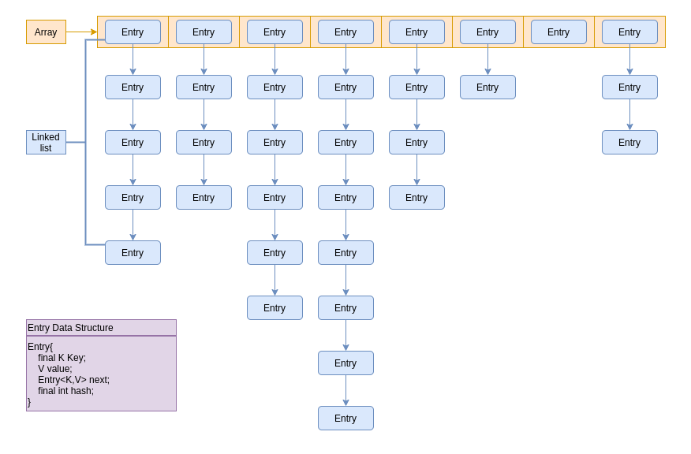
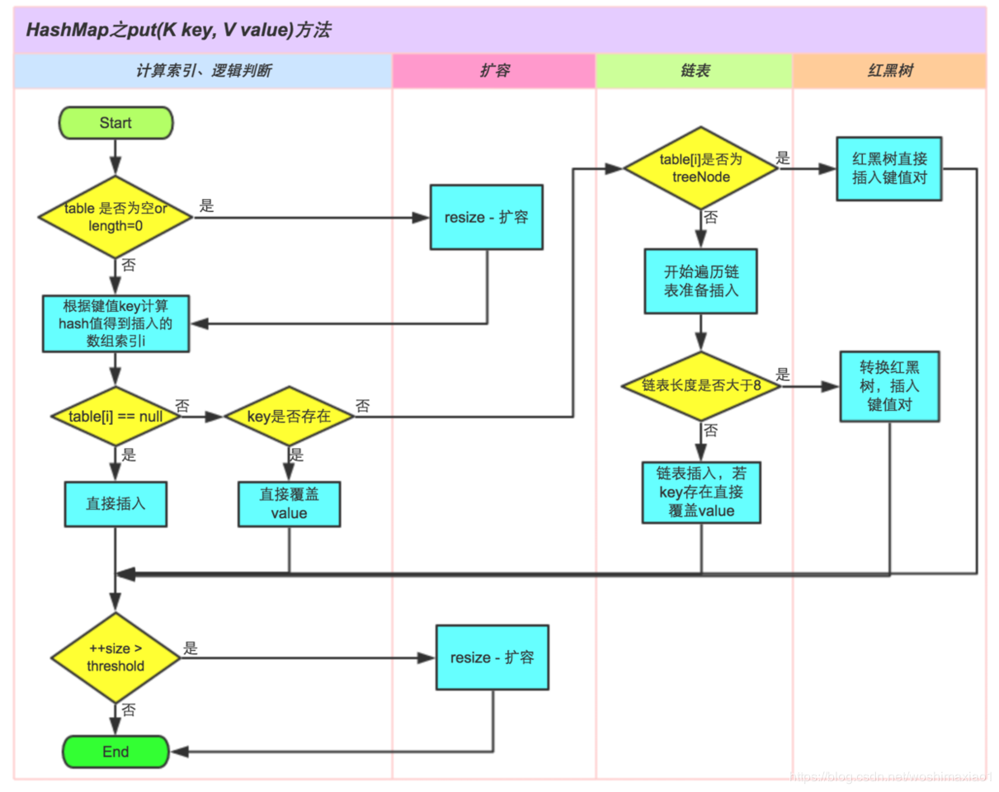

# Java小饭桌
> --  记录java相关的琐碎知识。附有leetcode经典题目代码解析，和一些经典算法的代码实现。


## 基础运算符

1. 运算符 &和&&、|和||的区别

   - &与（AND）运算（0 AND任何都是0，只有1AND1才是1）
   - |或（OR）运算（1OR任何都是1，只有0OR0才是0）
   - &&和||称为短路运算符（short-circuit operator）
     - &是两边都运算，而&&先算左边，若左边为false那么右边就不算了。语句判断中通常使用&&，提高效率。
     - |是两边都运算，而||先算左边，若左边为true，那么右边就不算了。

   > 这有一个知识点，假设一个数字n，n&(n-1)可以消除数字n对应的二级制中的最后一个1.
   >
   > ```java
   > 比如：int n = 6; //6 = 0110
   > n&(n-1)=4  //0110&0101 = 0100
   > ```

   

2. 数据移位：左移( << )、右移( >> ) 、无符号右移( >>> )

   - 左移( << )：带符号左移。num << 1,意思是num的二进制向左移移位，用0补齐。相当于num乘以2。位运算是CPU直接支持的，所以效率高。

     ```java
     常见JDK中的常量很多都是用位移定义的，效率高。
     比如：常见的JDK源码里面HashMap的默认容量16
     int DEFAULT_INITIAL_CAPACITY = 1 << 4; // aka 16
     ```

   - 右移( >> )：带符号右移，每移动一位，相当于num除以2.

   - 无符号右移( >>> )：无符号右移，符号位也在移动。注意，java中没有无符号左移。

     

3. ^(异或XOR)符号

   - 相同为0，不同为1: 0^0=0, 0^1=1。

   - 一个数与另一个数异或两次是其本身， 一个数和自身异或结果是0 

     ```java
     想要把a，b两个值交换，可以这样：
          a = a^b;   // a' = a^b
          b = b^a;   // b = b^a^b
          a = a^b;   // a = a'^b = a^b^a
     ```

     


## Java数据类型


1. Java中的数据类型分为两种：
    * 原生数据类型/基础数据类型（Primitive Date Type）: byte, short, int, long, float, double, char, boolean
      
    * 引用类型（对象类型）（Reference Type）： 所有其他的都是引用类型（String和Enum都是引用类型）
      
        
    
2. 运算： `return i++；` 和 `return ++i`。 i++先运行i再++，++i是先++再运行i。

    

3. ==和equals区别

    * 基础数据类型的比较，要用==来判断
    * 引用数据类型：==比较的是内存地址是否一样，不同对象的内存地址不一样。equals比较的是具体的内容，可以让让开发者重写equals方法来自定义条件判断
    * 对于Enum，它是一个引用数据类型，但是在java中，枚举有严格的实例化控制，一个枚举只能有一个实力，因此Enum可以使用==判断。在枚举源码中，equals函数也是使用==判断的。


## try-catch-finally

1. 在try-catch-finally中，finally语句是一定会被执行的。如果try-catch中有return语句，那么会先记录return的值，等待finally执行完成之后，再return。 这个时候，一旦finally中也有return，那么会直接returnfinally中的return。工作中，尽量不要写这样有歧义的代码。
2. 新版JDK对于try-with-resource进行了改良。从JDK7开始，可以在try后面加()，JDK9以后，可以在()里面定义多个资源变量。在try后面的（）里面定义的资源，只要该资源实现了java.lang.AutoCloseable接口，JDK会自动关闭。try()⾥⾯可以定义多个资源，它们的关闭顺序是最后在try()定义的资源先关闭。


## File API

1. Java中常见API：File

   ```java
   File file = new File("/path/to/file"); //创建File文件
   File[] files = file.listFiles(); //返回当前文件夹下的所有文件
   file.getPath; //返回file的路径
   file.isDirectory; //检测file是不是文件夹
   ```


## 字符串基础

> 这里涉及到JVM内存存储的基础，详情参见：[JVMBasic文档](./docs/JVMBasic.md)

**Java字符串基础重点总结：**

1. JVM储存分为堆（heap）和栈（stack），变量（variable）的声名在栈中，基础数据类型的值直接存在栈里面。对象和常量（constant）的实体存在堆里，栈中存的是实体的引用。

2. 在堆中，有一个特殊的字符串常量池（String Constant Pool），JVM对String会有特殊处理。每一个String在底层实现的时候都是final的，并存在常量池里面。JVM还针对常量池中的+运算进行了优化，及创建新的常量。

   ```java
   String s = "abc"; //这里s是变量，存的是“abc”的指针。“abc”是常量，存在于常量池里面。
   String a = "abc"+"bcd"; //"abc"和"bcd"都是常量，JVM会对+运算进行优化。
   String b = s+"bcd"; //这里JVM没有进行优化，因为是变量+常量。JVM只针对常量+常量进行优化。
   ```


**String、StringBuffer与StringBuilder:**

1. 三者都是final，不允许被继承。本质都是用字符数组char[]来实现的
2. String是创建的final char[]，创建对象不可改变。另外两个创建的是char[]，是可以改变的。
3. StringBuilder效率更快，因为它不需要加锁，但是线程不安全。单线程下操作大量字符串建议使用。
4. StringBuffer里面用Synchronized加锁，是线程安全的，但是效率相对低一些。多线程下操作大量字符串建议使用。


**字符串拼接：+，concat，StringBuilder，StringBuffer，StringUtils.join**

- +：将String转成了StringBuilder后，使用其append方法进行处理的
- concat：concat方法，其实是new了一个新的String
- StringBuilder：线程不安全
- StringBuffer：线程安全
- StringUtils.join：通过StringBuilder来实现的

- 效率：

  ```java
  StringBuilder < StringBuffer < concat < + < StringUtils.join
  ```

  `StringBuffer`在`StringBuilder`的基础上，做了同步处理，所以在耗时上会相对多一些。

  StringUtils.join也是使用了StringBuilder，并且其中还是有很多其他操作，所以耗时较长，这个也容易理解。其实StringUtils.join更擅长处理字符串数组或者列表的拼接。

  +操作是在`for`循环中，每次都是`new`了一个`StringBuilder`，然后再把`String`转成`StringBuilder`，再进行`append`。所以效率相对更低。

- 总结：
  1. 如果不是在循环体中进行字符串拼接的话，直接使用`+`就好了。
  2. 循环体内，字符串的连接方式，使用 `StringBuilder` 的 `append` 方法进行扩展。
  3. 如果在并发场景中进行字符串拼接的话，要使用`StringBuffer`来代替`StringBuilder`。


## 面向对象编程（**Object-oriented** programming  OOP）

面向对象的四大特性：

> 建议结合参与过的项目给出具体的例子

- 抽象（Abstraction）

  抽象类和接口*（引用：https://blog.csdn.net/qq_43668570/article/details/98339299）*

  ```java
  抽象类（abstract）
  	1. 如果一个类暂时有方法未实现，需要被定义为抽象类（方法只有方法名，形参列表，没有方法体（未实现方法），则所在类被定义为抽象类）
      2. 关键词abstract声明的类叫作抽象类，abstract声明的⽅法叫抽象⽅法。如果有抽象方法，一定要声明定义抽象类。
      3. 抽象类也是类，一个类继承于抽象类，就不能继承于其他的（抽象）类
      4. 子类可以继承于抽象类，但是一定要实现父类们所有的abstract方法。如果不能全部实现，那么子类也必须被定义为抽象类。只有实现父类的所有抽象方法，才能变成完整类，才可以被new出来一个object。
  
  接口（interface）
      1. 接口设计是为了弥补单根继承的不足。单根继承下，一个类只能遵循另外一个类的标准。
      2. 类只可以继承（extends）一个类（被继承的类可以是抽象类也可以是普通类），但是可以实现（implements）多个接口。
      3. 实现一个或多个接口，必须实现接口中所定义的所有方法。如果没有全部实现，那么只能成为一个抽象类。
      4. 接口不算类，或者说是“特殊类”,所以定义接口不需要class
  
  两者区别：
      1. 抽象类可以有部分方法实现，接口所有方法不能有实现（jdk8以后，引入default和static方法，接口中可以有默认的实现方法）
      2. 一个类只能继承（extends）一个（抽象）类，实现（implements）多个接口
      3. 抽象类有构造函数，接口没有构造函数
      4. 抽象类可以有main，也能运行，接口没有main函数
      5. 抽象类方法可以有private/protected，接口方法都是public
  ```

  ```java
  JDK8以后新特性：
      1. 接口可以继承自另一个接口，也支持接口的多继承。（注意：类只能单继承）。
      2. 接口中可以有static⽅法，且必须有⽅法实现体。该⽅法只属于该接⼝，用接⼝名直接调⽤该⽅法。
      3. 接⼝中新增default关键字修饰的⽅法，且default定义的⽅法必须有⽅法体。default⽅法只能定义在接⼝中，可以在⼦类或⼦接⼝中被重写。
  ```

  

- 封装（Encapsulation）

  ```java
  1. 封装是把过程和数据包围起来，对数据的访问只能通过已定义的接⼝即⽅法。例如把变量都定义成private，然后用get和set函数来对外进行操作。
  2. 在java中通过关键字private，protected和public实现封装。
  3. 封装可以让代码更容易理解和维护，也加强了代码的安全性。
  ```

  

- 继承（Inheritance）

  ```java
  ⼦类继承⽗类的特征和⾏为，使得⼦类对象具有⽗类的⽅法和属性，⽗类也叫基类，具有公共的⽅法和属性
  ```

  

- 多态（Polymorphism）

  ```java
  同⼀个⾏为具有多个不同表现形式的能⼒
  优点：减少耦合、灵活可拓展
  ⼀般是继承类或者重写⽅法实现，java中常见的是同一个方法名和返回类型，但是有不同的形式参数。
  ```

  ```java
  Overload和Override：
  Overload（重载）：一个类中可以有多个名称相同的方法，但是参数不同
  Override（重写）：子类重写父类中的某个方法。子类中的方法与父类中的方法的名称和参数完全相同
  ```


## 对象的排重、比较、排序

**hashCode()和equals()方法的应用与重写**

- hashcode（）
  - 顶级类Object里面的方法，返回int
  - 根据一定的hash规则，计算出的一个数（根据储存地址，字段，长度等）
- equals（）
  - 顶级类Object里面的方法，返回boolean
  - 用于匹配两个对象是否一样，可以重写来自定义对象一样的逻辑，通常逻辑如下：
    1. 判断地址是否一样
    2. 判断非空和Class类型
    3. 强制转换
    4. 对象里面的字段一一匹配

**手写一个User对象，重写里面的hashcode（）和equals（）方法**

参见文档[User](./src/main/java/sample/User.java)。


## Java集合框架List

**ArrayList、LinkedList和Vector**

- 线程安全
  - ArrayList：底层是数组，线程不安全，增加和删除慢，修改和查询快
  - LinkedList: 底层是双向链表，线程不安全，增加和删除快，修改和查询慢
  - Vector: 底层是数组，线程安全的，操作的时候使用synchronized进行加锁
- 使用场景
  - Vector已经很少用了
  - 增加和删除场景多则用LinkedList
  - 查询和修改多则用ArrayList

**如何用ArrayList实现线程安全**

1. 自己写个包装类，根据业务一般是add/update/remove加锁

2. 使用Collections.synchronizedList(new ArrayList<>()); 这里面的大部分方法都默认用synchronized加锁

3. 使用CopyOnWriteArrayList<>() 。这里面使用ReentrantLock加锁（不了解ReentrantLock可以参见[ReentrantLock文档](./docs/ReentrantLock.md)）。

   ```java
   这里的CopyOnWriteArrayList源自包java.util.concurrent。除了CopyOnWriteArrayList可以用来实现ArrayList加锁外，还有给其他数据类型用的相应工具，常用的包括：
   	ConcurrentSkipListMap
   	ConcurrentSkipListSet
   	CopyOnWriteArrayList
   	CopyOnWriteArraySet
   	ArrayBlockingQueue
   	CountDownLatch
   ```

**CopyOnWriteArrayList和Collections.synchronizedList两种实现线程安全方法的比较**

- CopyOnWriteArrayList：执行修改操作时，会拷贝一份新的数组进行操作（add、set、remove等)，代价十分昂贵，在执行完修改后将原来集合指向新的集合来完成修改操作，源码里面用ReentrantLock可重入锁来保证不会有多个线程同时拷贝一份数组
  - 场景：读高性能，适用读操作远远大于写操作的场景中使用(读的时候是不需要加锁的，直接获取，删除和增加是需要加锁的, 读多写少)
- Collections.synchronizedList：线程安全的原因是因为它几乎在每个方法中都使用了synchronized同步锁
  - 场景：写操作性能比CopyOnWriteArrayList好，读操作性能并不如CopyOnWriteArrayList

**CopyOnWriteArrayList的设计思路**

设计思想：读写分离+最终一致（与很多主流数据库设计思路一致，及在写操作没有commit前，其他线程读取的都是原先的数据）

缺点：内存占用问题,写时复制机制,内存里会同时驻扎两个对象的内存，旧的对象和新写入的对象,如果对象大则容易发生Yong GC和Full GC（关于GC，参见[JAVAGC文档](./docs/JVMGC.md)）。

**ArrayList扩容机制**

> JDK1.8之前，ArrayList默认大小是10。JDK1.8之后是0

- 在ArrayList初始化的时候，若未指定容量，默认是0。若指定了，则为指定值。
- 当ArrayList第一次添加元素时，集合大小扩容为10
- 当新添加元素超过其容量时，需要为ArrayList 扩容，新的容量=原始容量+原始容量/2

**手写一个简单的ArrayList**

手写的ArrayList参见文档[MyArrayList](./src/main/java/sample/MyArrayList.java)。


## Java集合框架Map

**HashMap和Hashtable 的区别**

- HashMap：底层基于数组+链表，非线程安全，默认容量是16，键和值允许有null
- HashTable：基于哈系表实现，线程安全，默认容量是11，键和值不允许有null

**HashMap和TreeMap的区别**

- HashMap：底层是数组+链表，可以实现快速的存储和检索，但是储存的元素是无序的，方便在Map中插入，删除，和定位元素。
- TreeMap：底层储存结构是一个平衡二叉树（红黑树），可以自定义排序规则。通过实现Comparator接口可以轻松实现内部元素的各种排序。性能比HashMap差，适用于自然排序或者自定义排序规则。（其中一个应用是微信支付签名工具类）

**HashMap和HashSet的区别**

- HashMap：是实现Map<K,V>接口的一个实体类，它对键值做了一对一的映射关系，当然里面键值不能重复。
- HashSet：是实现Set<E>接口的一个实体类，数据是以哈希表的形式存放的，里面的不能包含重复数据。Set是一种不包含重复的元素的Collection，即任意的两个元素e1和e2都有e1.equals(e2)=false，Set最多有一个null元素。HashSet中的每一个元素其实是对HashMap的一种封装。HashSet内部就是使用HashMap实现，只不过HashSet里面的HashMap的Key储存的是要储存的元素，所有的value都是同一个Object。HashSet也是非线程安全的。

**常见Map的排序规则**

```java
按照添加顺序使用LinkedHashMap，按照自然排序使用TreeMap，自定义排序 TreeMap(Comparetor c)
```

**如何用HashMap实现线程安全**

1. 使用Collections.synchronizedMap， 这里面的大部分方法都默认用synchronized加锁

2. 使用java.util.concurrent包下的ConcurrentHashMap。ConcurrentHashMap是线程安全，而且效率比Hashtable要高很多。

**HashMap底层结构**

HashMap底层是用数组+链表+红黑树（JDK8以后引入红黑树）实现的。



HashMap用一个Node<K,V>[] table的数组来储存数据，数组中的每一个元素其实是链表的第一个元素Entry（Node继承Entry）。每个Entry 包含一个key-value的键值对和一个指向下一个Entry的引用。在JDK8以后，当链表的长度大于8时，链表会转化为红黑树。

那么给定一个键值对，怎么确定它应该放在数组的哪一个bucket里面呢？及怎样根据Key-value来找到数组对应的index？JDK中是这样实现的。首先根据Key算出一个hash值（int值），再用这个hash值跟数组的长度-1做一次“与”运算（&）就得到了index值。当数组长度为2的n次幂的时候，2^n-1的值的binary code都是1（不如2^4-1算成二进制是1111），这样的话与key的“与”运算（&）算得得index相同的几率较小，那么数据在数组上分布就比较均匀，也就是说碰撞的几率小，相对的，查询的时候就不用遍历某个位置上的链表，这样查询效率也就较高了。

所以hashmap中默认的数组大小是16。其实在存储大容量数据的时候，最好预先指定hashmap的size为2的整数次幂次方。就算指定的数不是2的整数次幂次方，也会以大于且最接近指定值大小的2次幂来初始化的，代码如下(HashMap的构造方法中)：

```java
// Find a power of 2 >= initialCapacity  
int capacity = 1;  
while (capacity < initialCapacity)   
    capacity <<= 1;  
```

**Hash碰撞**

hash碰撞是指不同key计算得到的Hash值相同，需要放到数组的同个一个位置bucket中。通常的解决办法有链表法、开发地址法、再哈希法等。HashMap采用的是链表法。

**HashMap的扩容（resize）**

当hashmap中的元素越来越多的时候，碰撞的几率也就越来越高（因为数组的长度是固定的），所以为了提高查询的效率，就要对hashmap的数组进行扩容，这时最消耗性能的点就出现了：原数组中的数据必须重新计算其在新数组中的位置，并放进去，这就是resize。

那么hashmap什么时候进行扩容呢？hashmap中有一个threadhold和loadFactor，这个threadhold=loadFactortableSize。当HashMap中元素个数超过了threadshold后，会先把元素添加进Hashmap，然后对HashMap进行扩容。loadFactor的默认值为0.75，也就是说，默认情况下，数组大小为16，那么当hashmap中元素个数超过16×0.75=12的时候，就把数组的大小扩展为2×16=32，即扩大一倍，然后重新计算每个元素在数组中的位置。所以如果我们已经预知hashmap中元素的个数，那么预设元素的个数能够有效的提高hashmap的性能。比如说，我们有1000个元素new HashMap(1000), 但是理论上来讲new HashMap(1024)更合适，不过上面annegu已经说过，即使是1000，hashmap也自动会将其设置为1024。 但是new HashMap(1024)还不是更合适的，因为0.75×1000 < 1000, 也就是说为了让0.75 × size > 1000, 我们必须这样new HashMap(2048)才最合适，既考虑了&的问题，也避免了resize的问题。

**HashMap重写equals方法需同时重写hashCode方法**

如果没有重写hashCode方法，put操作时，key(hashcode1)–>hash–>indexFor–>最终索引位置 ，而通过key取出value的时候 key(hashcode2)–>hash–>indexFor–>最终索引位置，由于hashcode1不等于hashcode2，导致没有定位到一个同样的数组位置而返回逻辑上的错误的值。所以，在重写equals的方法的时候，必须注意重写hashCode方法，同时还要保证通过equals判断相等的两个对象，调用hashCode方法要返回同样的整数值。而如果equals判断不相等的两个对象，其hashCode可以相同（只不过会发生哈希冲突，应尽量避免）。

**JDK8使用红黑书优化链表查询**

假如一个数组槽位上链上数据过多（即拉链过长的情况）导致性能下降该怎么办？JDK1.8在JDK1.7的基础上针对增加了红黑树来进行优化。即当链表超过8时，链表就转换为红黑树，利用红黑树快速增删改查的特点提高HashMap的性能，其中会用到红黑树的插入、删除、查找等算法。主要是查询性能的提升，从原来的O(n)到O(logn)。

为什么不用二叉查找树？二叉查找树在特殊情况下也会变成一条线性结构，和原先的链表存在一样的深度遍历问题，查找性能就会慢，使用红黑树主要是提升查找数据的速度，红黑树是平衡二叉树的一种，插入新数据后会通过左旋，右旋、变色等操作来保持平衡，解决单链表查询深度的问题。

**HashMap put逻辑图**（引用自：https://blog.csdn.net/woshimaxiao1/article/details/83661464）



**ConcurrentHashMap**

- ConcurrentHashMap采用了分段锁的来提高性能，锁的粒度更加细化。而Hashtable基本上所有方法都使用synchronized加锁。所以ConcurrentHashMap比Hashtable效率更高。
- JDK8之前，ConcurrentHashMap是将数据分成一段一段（segment）储存，每个数据段配置一把锁。每个数据段是一个segment类，该类继承了ReentrantLock来保证数据安全。
- JDK8之后，取消了Segment的设计，底层也采用了Node数组+链表+红黑树的结构。用CAS（Compare And Swap）+Synchronized实现每一段数据进行加锁，减少并发冲突。

**ConcurrentHashMap put逻辑**

1. 根据Key值算出hash值，再进行一步重哈希`spread(key.hashCode())`来减少冲突

2. 对当前的table数组进行无条件循环：

   2.1. 判断table是否有初始化，如果没有，进行初始化

   2.2. 根据上面算出来的hash值，判断有无哈希冲突。如果没有哈希冲突，直接用CAS插入新节点，然后退出循环到Step3

   2.3. 通过一个flag，及`(fh = f.hash) == MOVED`来判断是否存在其他线程正在进行Step3扩容操作，如果有，那么等待其操作结束

   2.4. 如果存在哈希冲突，先用`synchronized (f)`加锁来保证线程安全

   2.5. 判断当前节点是链表还是红黑树，如果是链表，则直接遍历插入或更新。然后判断链表长度是否大于8，如果大于则转换成红黑树

   2.6. 如果节点是红黑树，怎按照红黑树规则插入。

3. 检查table是否需要扩容`addCount()`


**未完待续。。**

>  **Copyright © 2020 Java Diner. All Rights Reserved. Kyle studio produced. **
>
> **由KyleStudio工作室维护管理 合作邮箱：singledoggy008@gmail.com**

