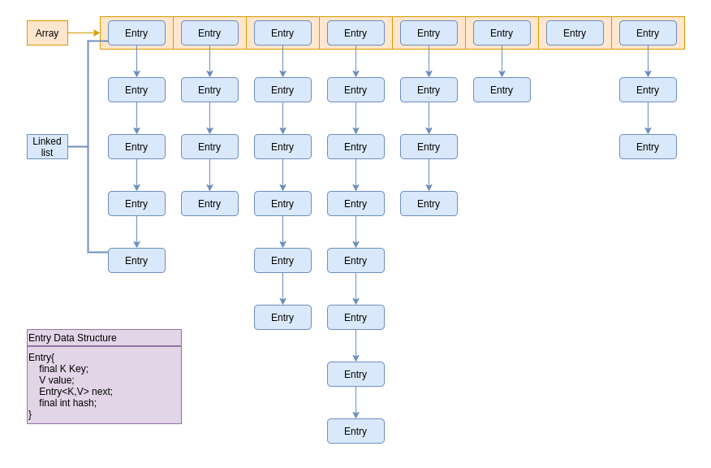
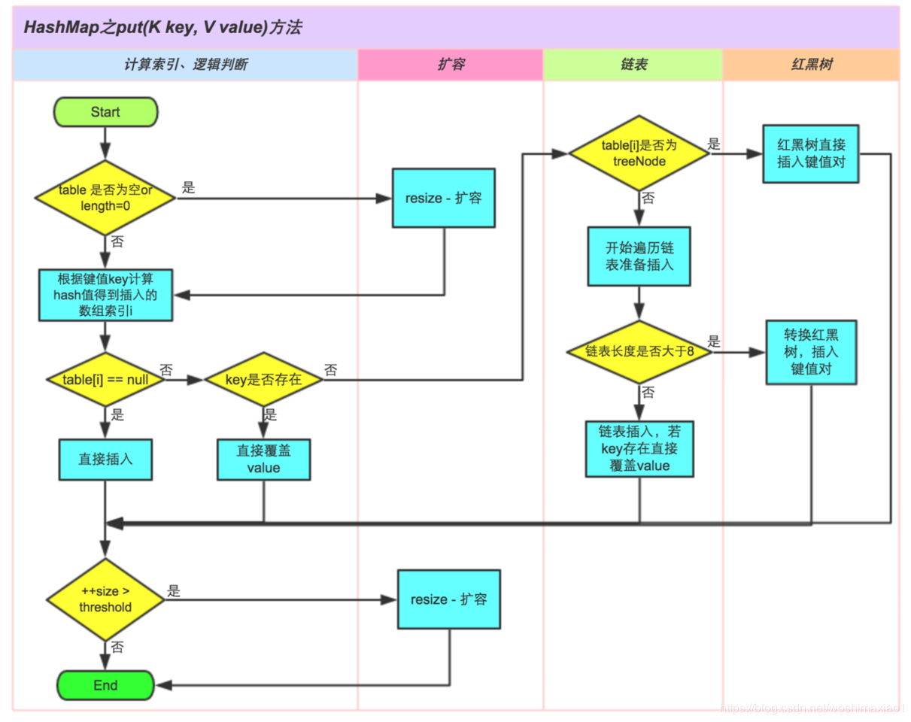

# 2.2 对Map框架了解多少？

> Map和List差不多？那你可能天真了。你知道HashMap，HashTable，TreeTable的区别嘛？了解HashMap的底层结构（Entry+LinkedList）嘛？JDK8以后为何用红黑树取代链表结构？高并发下HashMap是怎么put的？

## HashMap，HashTable，TreeTable，HashSet

**HashMap和Hashtable 的区别**

- HashMap：底层基于数组+链表，非线程安全，默认容量是16，键和值允许有null
- HashTable：基于哈系表实现，线程安全，默认容量是11，键和值不允许有null

**HashMap和TreeMap的区别**

- HashMap：底层是数组+链表，可以实现快速的存储和检索，但是储存的元素是无序的，方便在Map中插入，删除，和定位元素。
- TreeMap：底层储存结构是一个平衡二叉树（红黑树），可以自定义排序规则。通过实现Comparator接口可以轻松实现内部元素的各种排序。性能比HashMap差，适用于自然排序或者自定义排序规则。（其中一个应用是微信支付签名工具类）

**HashMap和HashSet的区别**

- HashMap：是实现Map<K,V>接口的一个实体类，它对键值做了一对一的映射关系，当然里面键值不能重复。
- HashSet：是实现Set<E>接口的一个实体类，数据是以哈希表的形式存放的，里面的不能包含重复数据。Set是一种不包含重复的元素的Collection，即任意的两个元素e1和e2都有e1.equals(e2)=false，Set最多有一个null元素。HashSet中的每一个元素其实是对HashMap的一种封装。HashSet内部就是使用HashMap实现，只不过HashSet里面的HashMap的Key储存的是要储存的元素，所有的value都是同一个Object。HashSet也是非线程安全的。

**常见Map的排序规则**

```java
按照添加顺序使用LinkedHashMap，按照自然排序使用TreeMap，自定义排序 TreeMap(Comparetor c)
```


## **如何用HashMap实现线程安全**

1. 使用Collections.synchronizedMap， 这里面的大部分方法都默认用synchronized加锁

2. 使用java.util.concurrent包下的ConcurrentHashMap。ConcurrentHashMap是线程安全，而且效率比Hashtable要高很多。


## **HashMap底层结构**

HashMap底层是用数组+链表+红黑树（JDK8以后引入红黑树）实现的。



HashMap用一个Node<K,V>[] table的数组来储存数据，数组中的每一个元素其实是链表的第一个元素Entry（Node继承Entry）。每个Entry 包含一个key-value的键值对和一个指向下一个Entry的引用。在JDK8以后，当链表的长度大于8时，链表会转化为红黑树。

那么给定一个键值对，怎么确定它应该放在数组的哪一个bucket里面呢？及怎样根据Key-value来找到数组对应的index？JDK中是这样实现的。首先根据Key算出一个hash值（int值），再用这个hash值跟数组的长度-1做一次“与”运算（&）就得到了index值。当数组长度为2的n次幂的时候，2^n-1的值的binary code都是1（不如2^4-1算成二进制是1111），这样的话与key的“与”运算（&）算得得index相同的几率较小，那么数据在数组上分布就比较均匀，也就是说碰撞的几率小，相对的，查询的时候就不用遍历某个位置上的链表，这样查询效率也就较高了。

所以hashmap中默认的数组大小是16。其实在存储大容量数据的时候，最好预先指定hashmap的size为2的整数次幂次方。就算指定的数不是2的整数次幂次方，也会以大于且最接近指定值大小的2次幂来初始化的，代码如下(HashMap的构造方法中)：

```java
// Find a power of 2 >= initialCapacity  
int capacity = 1;  
while (capacity < initialCapacity)   
    capacity <<= 1;  
```

**Hash碰撞**

hash碰撞是指不同key计算得到的Hash值相同，需要放到数组的同个一个位置bucket中。通常的解决办法有链表法、开发地址法、再哈希法等。HashMap采用的是链表法。

**HashMap的扩容（resize）**

当hashmap中的元素越来越多的时候，碰撞的几率也就越来越高（因为数组的长度是固定的），所以为了提高查询的效率，就要对hashmap的数组进行扩容，这时最消耗性能的点就出现了：原数组中的数据必须重新计算其在新数组中的位置，并放进去，这就是resize。

那么hashmap什么时候进行扩容呢？hashmap中有一个threadhold和loadFactor，这个threadhold=loadFactortableSize。当HashMap中元素个数超过了threadshold后，会先把元素添加进Hashmap，然后对HashMap进行扩容。loadFactor的默认值为0.75，也就是说，默认情况下，数组大小为16，那么当hashmap中元素个数超过16×0.75=12的时候，就把数组的大小扩展为2×16=32，即扩大一倍，然后重新计算每个元素在数组中的位置。所以如果我们已经预知hashmap中元素的个数，那么预设元素的个数能够有效的提高hashmap的性能。比如说，我们有1000个元素new HashMap(1000), 但是理论上来讲new HashMap(1024)更合适，不过上面annegu已经说过，即使是1000，hashmap也自动会将其设置为1024。 但是new HashMap(1024)还不是更合适的，因为0.75×1000 < 1000, 也就是说为了让0.75 × size > 1000, 我们必须这样new HashMap(2048)才最合适，既考虑了&的问题，也避免了resize的问题。

**HashMap重写equals方法需同时重写hashCode方法**

如果没有重写hashCode方法，put操作时，key(hashcode1)–>hash–>indexFor–>最终索引位置 ，而通过key取出value的时候 key(hashcode2)–>hash–>indexFor–>最终索引位置，由于hashcode1不等于hashcode2，导致没有定位到一个同样的数组位置而返回逻辑上的错误的值。所以，在重写equals的方法的时候，必须注意重写hashCode方法，同时还要保证通过equals判断相等的两个对象，调用hashCode方法要返回同样的整数值。而如果equals判断不相等的两个对象，其hashCode可以相同（只不过会发生哈希冲突，应尽量避免）。

**JDK8使用红黑书优化链表查询**

假如一个数组槽位上链上数据过多（即拉链过长的情况）导致性能下降该怎么办？JDK1.8在JDK1.7的基础上针对增加了红黑树来进行优化。即当链表超过8时，链表就转换为红黑树，利用红黑树快速增删改查的特点提高HashMap的性能，其中会用到红黑树的插入、删除、查找等算法。主要是查询性能的提升，从原来的O(n)到O(logn)。

为什么不用二叉查找树？二叉查找树在特殊情况下也会变成一条线性结构，和原先的链表存在一样的深度遍历问题，查找性能就会慢，使用红黑树主要是提升查找数据的速度，红黑树是平衡二叉树的一种，插入新数据后会通过左旋，右旋、变色等操作来保持平衡，解决单链表查询深度的问题。

**HashMap put逻辑图**（引用自：https://blog.csdn.net/woshimaxiao1/article/details/83661464）




## **ConcurrentHashMap**

- ConcurrentHashMap采用了分段锁的来提高性能，锁的粒度更加细化。而Hashtable基本上所有方法都使用synchronized加锁。所以ConcurrentHashMap比Hashtable效率更高。
- JDK8之前，ConcurrentHashMap是将数据分成一段一段（segment）储存，每个数据段配置一把锁。每个数据段是一个segment类，该类继承了ReentrantLock来保证数据安全。
- JDK8之后，取消了Segment的设计，底层也采用了Node数组+链表+红黑树的结构。用CAS（Compare And Swap）+Synchronized实现每一段数据进行加锁，减少并发冲突。

**ConcurrentHashMap put逻辑**

1. 根据Key值算出hash值，再进行一步重哈希`spread(key.hashCode())`来减少冲突

2. 对当前的table数组进行无条件循环：

   2.1. 判断table是否有初始化，如果没有，进行初始化

   2.2. 根据上面算出来的hash值，判断有无哈希冲突。如果没有哈希冲突，直接用CAS插入新节点，然后退出循环到Step3

   2.3. 通过一个flag，及`(fh = f.hash) == MOVED`来判断是否存在其他线程正在进行Step3扩容操作，如果有，那么等待其操作结束

   2.4. 如果存在哈希冲突，先用`synchronized (f)`加锁来保证线程安全

   2.5. 判断当前节点是链表还是红黑树，如果是链表，则直接遍历插入或更新。然后判断链表长度是否大于8，如果大于则转换成红黑树

   2.6. 如果节点是红黑树，怎按照红黑树规则插入。

3. 检查table是否需要扩容`addCount()`

