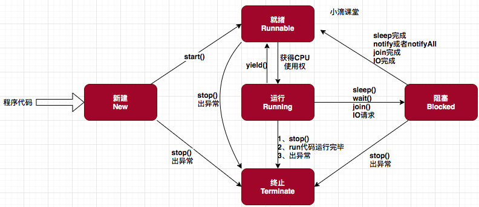

# 3.2 线程状态转换

> 线程都有哪几种状态？常见的影响线程状态的API都有那些？能画出转换流程图么？

## 线程有哪几种状态

JDK中对线程状态分为了6种（及定义了6个Enum来记录线程状态），JVM中则有9种。我们一般说的都是JDK的线程状态。JDK的6种状态分别是：`NEW`, `RUNNABLE`, `BLOCKED`, `WAITING`, `TIMED_WAITING`, `TERMINATED`。

在广义的线程理解当中，可以把线程状态看为5种：

```
//引用自于小滴课堂

创建(NEW): 生成线程对象，但是并没有调用该对象start(), 及new Thread()的时候。

就绪(Runnable)：当调用线程对象的start()方法，线程就进入就绪状态，但是此刻线程调度还没把该线程设置为当前线程，就是没获得CPU使用权。如果线程运行后，从等待或者睡眠中回来之后，也会进入就绪状态
	注意:有些文档把就绪和运行两种状态统一称为 “运行中”

运行(Running)
	程序将处于就绪状态的线程设置为当前线程，即获得CPU使用权，这个时候线程进入运行状态，开始运行run里面的逻辑。 这里广义的Runnable和Running对应JDK中的RUNNABLE状态。

阻塞(Blocked)
	阻塞状态是线程因为某种原因暂时停止CPU的使用。阻塞的线程要再次被运行，一定要从就绪状态开始，然后才是运行，不能直接从阻塞到运行。
	
	等待阻塞：进入该状态的线程需要等待其他线程作出一定动作(通知或中断)，这种状态的话CPU不会分配过来，他们需要被唤醒，可能也会无限等待下去。比如调用wait(状态就会变成WAITING状态)，也可能通过调用sleep(状态就会变成TIMED_WAITING), join或者发出IO请求，阻塞结束后线程重新进入就绪状态
	
	同步阻塞：线程在获取synchronized同步锁失败，即锁被其他线程占用，它就会进入同步阻塞状态，则JVM会把该线程放入锁池中。
	
	备注：相关资料会用细分下面的状态
		等待(WAITING)：进入该状态的线程需要等待其他线程做出一些特定动作（通知或中断）。
        超时等待(TIMED_WAITING)：该状态不同于WAITING，它可以在指定的时间后自行返回

死亡(TERMINATED):一个线程run方法执行结束，该线程就死亡了，不能进入就绪状态
```


## 影响线程的方法

- sleep/yield/join wait/notify/notifyAll

```
//引用自于小滴课堂

sleep
	属于线程Thread的方法
	让线程暂缓执行，等待预计时间之后再恢复
	交出CPU使用权，不会释放锁
	进入阻塞状态TIME_WAITGING，睡眠结束变为就绪Runnable
	
yield
	属于线程Thread的方法
	t1/t2/t3
	暂停当前线程的对象，去执行其他线程
	交出CPU使用权，不会释放锁，和sleep类似
	作用：让相同优先级的线程轮流执行，但是不保证一定轮流
	注意：不会让线程进入阻塞状态，直接变为就绪Runnable，只需要重新获得CPU使用权
	
join  
	属于线程Thread的方法
	在主线程上运行调用该方法，会让主线程休眠，不会释放已经持有的对象锁
	让调用join方法的线程先执行完毕，在执行其他线程
	类似让救护车警车优先通过
	
	
wait
	属于Object的方法
	当前线程调用对象的wait方法，会释放锁，进入线程的等待队列
	需要依靠notify或者notifyAll唤醒，或者wait(timeout)时间自动唤醒
	
notify
	属于Object的方法
	唤醒在对象监视器上等待的单个线程，选择是任意的
	
notifyAll
	属于Object的方法
	唤醒在对象监视器上等待的全部线程
```


## 线程的状态转换图

