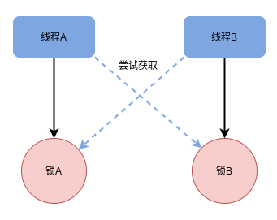

# 4.2 线程锁

> Java中锁的分类有那些？写一个死锁的列子并解决它？可重入锁和不可重入锁的设计？
>
> 文章引用自小滴课堂（https://xdclass.net/）


## Java中锁的分类有哪些

### 悲观锁、乐观锁

- 悲观锁：当线程去操作数据的时候，总认为别的线程会去修改数据，所以它每次拿数据的时候都会上锁，别的线程去拿数据的时候就会阻塞，比如synchronized。
- 乐观锁：每次去拿数据的时候都认为别人不会修改，更新的时候会判断是别人是否回去更新数据，通过版本来判断，如果数据被修改了就拒绝更新，比如CAS是乐观锁，但严格来说并不是锁，通过原子性来保证数据的同步，比如说数据库的乐观锁，通过版本控制来实现，CAS不会保证线程同步，乐观的认为在数据更新期间没有其他线程影响。

悲观锁适合写操作多的场景，乐观锁适合读操作多的场景，乐观锁的吞吐量会比悲观锁多。

### 公平锁、非公平锁

- 公平锁：指多个线程按照申请锁的顺序来获取锁，简单来说，如果一个线程组里，能保证每个线程都能拿到锁。比如ReentrantLock(底层是同步队列FIFO:First Input First Output来实现)
- 非公平锁：获取锁的方式是随机获取的，保证不了每个线程都能拿到锁，也就是存在有线程饿死,一直拿不到锁，比如synchronized、ReentrantLock（这里ReentrantLock可以通过构造函数指定参数来构造公平锁或非公平锁）

非公平锁性能高于公平锁，更能重复利用CPU的时间。

### 可重入锁、不可重入锁

- 可重入锁：也叫递归锁，在外层使用锁之后，在内层仍然可以使用，并且不发生死锁
- 不可重入锁：若当前线程执行某个方法已经获取了该锁，那么在方法中尝试再次获取锁时，就会获取不到被阻塞

可重入锁能一定程度的避免死锁。synchronized、ReentrantLock默认都是可重入锁。

### 自旋锁

自旋锁：一个线程在获取锁的时候，如果锁已经被其它线程获取，那么该线程将循环等待，然后不断的判断锁是否能够被成功获取，直到获取到锁才会退出循环,任何时刻最多只能有一个执行单元获得锁。

自旋锁不会发生线程状态的切换，一直处于用户态，减少了线程上下文切换的消耗，缺点是循环会消耗CPU。常见的自旋锁：TicketLock,CLHLock,MSCLock。

### 共享锁

共享锁：也叫S锁/读锁，能查看但无法修改和删除的一种数据锁，加锁后其它用户可以并发读取、查询数据，但不能修改，增加，删除数据，该锁可被多个线程所持有，用于资源数据共享。

### 互斥锁

互斥锁：也叫X锁/排它锁/写锁/独占锁/独享锁/ 该锁每一次只能被一个线程所持有,加锁后任何线程试图再次加锁的线程会被阻塞，直到当前线程解锁。例子：如果 线程A 对 data1 加上排他锁后，则其他线程不能再对 data1 加任何类型的锁,获得互斥锁的线程即能读数据又能修改数据

### 死锁

死锁：两个或两个以上的线程在执行过程中，由于竞争资源或者由于彼此通信而造成的一种阻塞的现象，若无外力作用，它们都将无法让程序进行下去。

例子



### 偏向锁、轻量级锁、重量级锁

这三种是JVM为了提高锁的获取与释放效率而做的优化，针对Synchronized的锁升级，锁的状态是通过对象监视器在对象头中的字段来表明，是不可逆的过程，

- 偏向锁：一段同步代码一直被一个线程所访问，那么该线程会自动获取锁，获取锁的代价更低，
- 轻量级锁：当锁是偏向锁的时候，被其他线程访问，偏向锁就会升级为轻量级锁，其他线程会通过自旋的形式尝试获取锁，但不会阻塞，且性能会高点
- 重量级锁：当锁为轻量级锁的时候，其他线程虽然是自旋，但自旋不会一直循环下去，当自旋一定次数的时候且还没有获取到锁，就会进入阻塞，该锁升级为重量级锁，重量级锁会让其他申请的线程进入阻塞，性能也会降低。


## 手写死锁

死锁经常会导致很多诡异的情况，不一定能100%复现，也很难排查！！！

### 死锁例子

```
线程在获得了锁A并且没有释放的情况下去申请锁B，
这时另一个线程已经获得了锁B，在释放锁B之前又要先获得锁A
因此闭环发生，陷入死锁循环
```

[DeadLock1.java](../src/main/java/sample/DeadLock1.java)


### 死锁的四个必要条件
只要发生死锁，这四个条件都成立。反之只要一个不满足，就不会发生死锁。

- 互斥条件：资源不能共享，只能由一个线程使用
- 请求与保持条件：线程已经获得一些资源，但因请求其他资源发生阻塞，对已经获得的资源保持不释放
- 不可抢占：有些资源是不可强占的，当某个线程获得这个资源后，系统不能强行回收，只能由线程使用完自己释放
- 循环等待条件：多个线程形成环形链，每个都占用对方申请的下个资源

### 解决死锁

- 调整申请锁的范围
- 调整申请锁的顺序

例子：[DeadLock2.java](../src/main/java/sample/DeadLock2.java)

## 手写不可重入锁

[UnreentrantLock](../src/main/java/sample/UnreentrantLock.java)

## 手写可重入锁

[ReentrantLock](../src/main/java/sample/ReentrantLock.java)