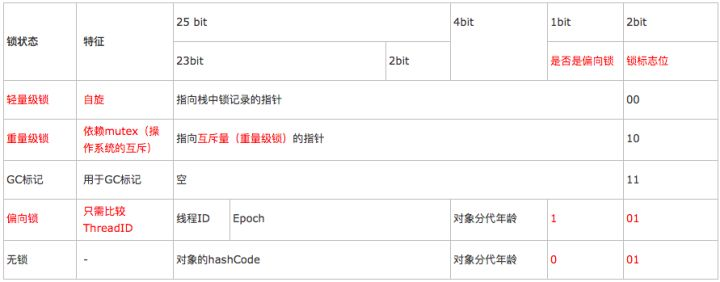

# 4.3 Synchronized关键字和CAS

> 多线程的synchronized了解不？新版JDS有什么优化？高性能的Compare and Swap了解不？CAS有什么问题？


## Synchronized关键字用法

**Synchronized**关键字实现的是非公平、可重入锁。通常用在普通方法、代码块或静态方法上。每个对象有一个锁和一个等待队列，锁只能被一个线程持有，其他需要锁的线程需要阻塞等待。锁被释放后，对象会从队列中取出一个并唤醒，唤醒哪个线程是不确定的，不保证公平性。

- 用在方法上：

  ```java
  public synchronized void method(){
    // 
  }
  ```

  这时synchronized锁定的是调用这个同步方法的**对象**。也就是说，当一个对象P1在不同的线程中执行这个同步方法时，他们之间会形成互斥，达到同步的效果。同时如果该对象中有多个同步方法，则当一个线程获执行对象中的一个synchronized方法，则该对象中其它同步方法也不允许别的线程执行。但是这个对象所属的Class所产生的另一对象P2却能够任意调用这个被加了synchronized关键字的方法。

  上边的示例代码等同于如下代码：

  ```java
  public void method()  {  
    synchronized (this)   
    {  
      //..  
    }  
  }
  ```

  实现原理：生成的字节码文件中会多一个 ACC_SYNCHRONIZED 标志位，当一个线程访问方法时，会去检查是否存在ACC_SYNCHRONIZED标识，如果存在，执行线程将先获取monitor，获取成功之后才能执行方法体，方法执行完后再释放monitor。在方法执行期间，其他任何线程都无法再获得同一个monitor对象，也叫隐式同步。

- 用在代码块上：

  ```java
  private int p;
  public void method() { 
  	synchronized (p) 
  	{ 
  		//.. 
  	} 
  }
  ```

  这时，锁就是锁住`p`这个对象，每个对象对应一个唯一的锁，所以哪个线程拿到这个对象锁谁就能够运行他所控制的那段代码。当有一个明确的对象作为锁时，就能够这样写程式，但当没有明确的对象作为锁，只是想让一段代码同步时，能够创建一个特别的instance变量（他得是个对象）来充当锁：

  ```java
  private byte[] lock = new byte[0]; 
   Public void method(){  
       synchronized(lock) 
       { 
         // 
       }
   }
  ```

  > 注：零长度的byte数组对象创建起来将比任何对象都经济――查看编译后的字节码：生成零长度的byte[]对象只需3条操作码，而Object lock = new Object()则需要7行操作码。

  实现原理：加了synchronized 关键字的代码段，生成的字节码文件会多出 monitorenter 和 monitorexit 两条指令，每个monitor维护着一个记录着拥有次数的计数器, 未被拥有的monitor的该计数器为0，当一个线程获执行monitorenter后，该计数器自增1;当同一个线程执行monitorexit指令的时候，计数器再自减1。当计数器为0的时候,monitor将被释放.也叫显式同步。这与上面的实现没有区别，底层都是通过monitor来实现同步, 只是方法的同步是一种隐式的方式来实现，无需通过字节码来完成。

- 用在静态方法上：

  ```java
  Class Foo  
  {  
    public synchronized static void method1()  
   
    {  
      //.  
    }  
    public void method2()  
    {  
      synchronized(Foo.class)  
      //
    }  
  }
  ```

  这两个同步方法都调用这个方法的对象所属的类的类锁（Class，而不再是由这个Class产生的某个具体对象了）。
  能够推断：假如一个类中定义了一个synchronized的static函数A，也定义了一个synchronized 的instance函数B，那么这个类的同一对象Obj在多线程中分别访问A和B两个方法时，不会构成同步，因为他们的锁都不相同。A方法的锁是Obj所属的那个Class，而B的锁是Obj所属的这个对象。

  

监视器锁（Monitor）本质是依赖于底层的操作系统的Mutex Lock（互斥锁）来实现的。每个对象都对应于一个可称为" 互斥锁" 的标记，这个标记用来保证在任一时刻，只能有一个线程访问该对象。

互斥锁：用于保护临界区，确保同一时间只有一个线程访问数据。对共享资源的访问，先对互斥量进行加锁，如果互斥量已经上锁，调用线程会阻塞，直到互斥量被解锁。在完成了对共享资源的访问后，要对互斥量进行解锁。


## Synchronized关键字优化

JDK1.6后对Synchronized做了优化。增加了从偏向锁到轻量级锁再到重量级锁的过渡，但是在最终转变为重量级锁之后，性能仍然较低。


> 图片引用自小滴课堂

Java的没一个对象都有上述图片的结构。其中对象头储存着加锁、释放锁的数据，是sychronized实现的核心。

### 偏向锁、轻量级锁、重量级锁

Synchronized是通过对象内部的一个叫做监视器锁（monitor）来实现的，监视器锁本质又是依赖于底层的操作系统的Mutex Lock（互斥锁）来实现的。而操作系统实现线程之间的切换需要从用户态转换到核心态，这个成本非常高，状态之间的转换需要相对比较长的时间，这就是为什么Synchronized效率低的原因。因此，这种依赖于操作系统Mutex Lock所实现的锁我们称之为“重量级锁”。

Java SE 1.6为了减少获得锁和释放锁带来的性能消耗，引入了“偏向锁”和“轻量级锁”：锁一共有4种状态，级别从低到高依次是：无锁状态、偏向锁状态、轻量级锁状态和重量级锁状态。锁可以升级但不能降级。

在运行期间，对象头Mark Word里存储的数据会随着锁标志位的变化而变化，以32位的JDK为例：



### 其他锁优化

- **锁消除**：锁消除即删除不必要的加锁操作。虚拟机即时编辑器在运行时，对一些“代码上要求同步，但是被检测到不可能存在共享数据竞争”的锁进行消除。根据代码逃逸技术，如果判断到一段代码中，堆上的数据不会逃逸出当前线程，那么可以认为这段代码是线程安全的，不必要加锁。

- **锁粗化**：如果一系列的连续操作都对同一个对象反复加锁和解锁，甚至加锁操作是出现在循环体中的，那即使没有出现线程竞争，频繁地进行互斥同步操作也会导致不必要的性能损耗。如果虚拟机检测到有一串零碎的操作都是对同一对象的加锁，将会把加锁同步的范围扩展（粗化）到整个操作序列的外部。


## CAS

全称是Compare And Swap，即比较再交换，是实现并发应用到的一种技术。CAS这个是属于乐观锁，性能较悲观锁有很大的提高。

### 核心思想

底层通过Unsafe类实现原子性操作操作包含三个操作数 —— 内存地址（V）、预期原值（A）和新值(B)。 

```
比较 A 与 V 是否相等。（比较）
如果比较相等，将 B 写入 V。（交换）
返回操作是否成功。
若果在第一轮循环中，a线程获取地址V里面的值被b线程修改了，那么a线程需要自旋，到下次循环才有可能机会执行。
```

### ABA问题

CAS 由三个步骤组成，分别是“读取->比较->写回”。考虑这样一种情况，线程1和线程2同时执行 CAS 逻辑，两个线程的执行顺序如下：

>  时刻1：线程1执行读取操作，获取原值 A，然后线程被切换走
>  时刻2：线程2执行完成 CAS 操作将原值由 A 修改为 B
>  时刻3：线程2再次执行 CAS 操作，并将原值由 B 修改为 A
>  时刻4：线程1恢复运行，将比较值（compareValue）与原值（oldValue）进行比较，发现两个值相等。
>  然后用新值（newValue）写入内存中，完成 CAS 操作

如上流程，线程1并不知道原值已经被修改过了，在它看来并没什么变化，所以它会继续往下执行流程。

对于 ABA 问题，通常的处理措施是对每一次 CAS 操作设置版本号。在java5中，已经提供了AtomicStampedReference来解决问题，检查当前引用是否等于预期引用，其次检查当前标志是否等于预期标志，如果都相等就会以原子的方式将引用和标志都设置为新值。

### CAS其他问题

- 自旋时间长CPU利用率增加，开销大
- 只能保证一个共享变量的原子操作

### CAS应用

1. Java的concurrent包下就有很多类似的实现类，如Atomic开头那些。
2. 自旋锁
3. 令牌桶限流器