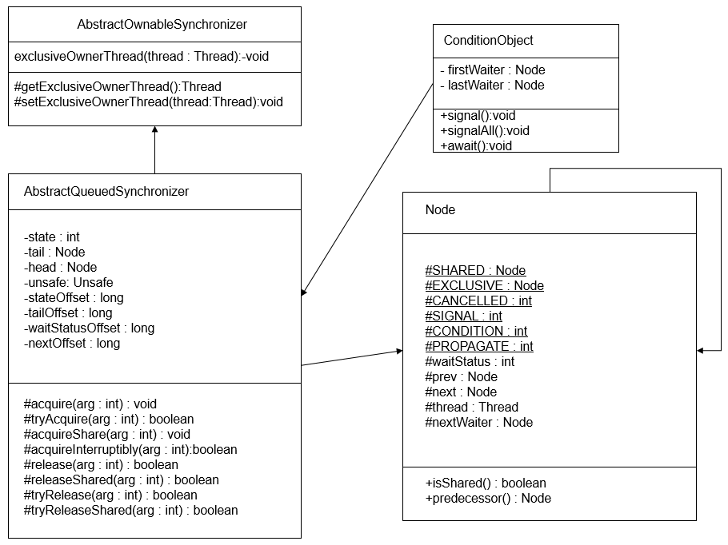
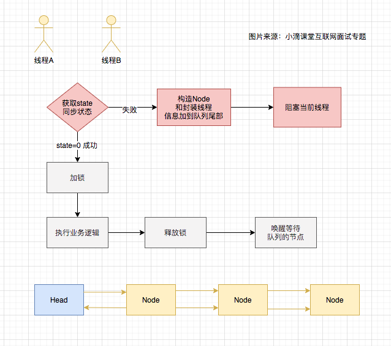

# 5.1 并发编程核心底层AQS

> AQS是什么？AQS的核心逻辑？AQS有几种同步方式？


## AQS概述

所谓AQS，指的是AbstractQueuedSynchronizer，它提供了一种实现阻塞锁和一系列依赖FIFO等待队列的同步器的框架，ReentrantLock、Semaphore、CountDownLatch、CyclicBarrier等并发类均是基于AQS来实现的，具体用法是通过继承AQS实现其模板方法，然后将子类作为同步组件的内部类。只要搞懂了AQS，那么J.U.C中绝大部分的api都能轻松掌握。

> AQS是JDK1.5之后才出现的，由大名鼎鼎的Doug Lea李大爷来操刀设计并开发实现，全部源代码(加注释)2315行.


### AQS的类图



> 图片来自：https://www.cnblogs.com/fsmly/p/11274572.html

### 基本框架


> 图片来自：https://www.cnblogs.com/waterystone/p/4920797.html

AQS维护了一个volatile语义(支持多线程下的可见性)的共享资源变量state和一个FIFO线程等待队列(多线程竞争state被阻塞时会进入此队列)。等待队列是CLH（Craig, Landin, and Hagersten）锁队列。通过节点中的“状态”字段来判断一个线程是否应该阻塞。

简单来说：是用一个int类型的变量（state）表示同步状态，并提供了一系列的CAS操作来管理这个同步状态对象

- 一个是 state（用于计数器，类似gc的回收计数器）
- 一个是线程标记（当前线程是谁加锁的）
- 一个是阻塞队列（用于存放其他未拿到锁的线程)


例子：线程A调用了lock()方法，通过CAS将state赋值为1，然后将该锁标记为线程A加锁。如果线程A还未释放锁时，线程B来请求，会查询锁标记的状态，因为当前的锁标记为 线程A，线程B未能匹配上，所以线程B会加入阻塞队列，直到线程A触发了 unlock() 方法，这时线程B才有机会去拿到锁，但是不一定肯定拿到。

### State

它是int数据类型的，其访问方式有3种：

- getState()
- setState(int newState)
- compareAndSetState(int expect, int update)

上述3种方式均是原子操作，其中compareAndSetState()的实现依赖于Unsafe的compareAndSwapInt()方法，实际上是用CAS来保证原子性。

### 操作流程



> 图片来自：小滴课堂

### 同步方式

资源的共享方式分为2种：

- 独占式(Exclusive)：只有单个线程能够成功获取资源并执行，如ReentrantLock。

- 共享式(Shared)：多个线程可成功获取资源并执行，如Semaphore/CountDownLatch等。

AQS将大部分的同步逻辑均已经实现好，继承的自定义同步器只需要实现state的获取(acquire)和释放(release)的逻辑代码就可以，主要包括下面方法：

- tryAcquire(int)：独占方式。尝试获取资源，成功则返回true，失败则返回false。
- tryRelease(int)：独占方式。尝试释放资源，成功则返回true，失败则返回false。
- tryAcquireShared(int)：共享方式。尝试获取资源。负数表示失败；0表示成功，但没有剩余可用资源；正数表示成功，且有剩余资源。
- tryReleaseShared(int)：共享方式。尝试释放资源，如果释放后允许唤醒后续等待结点返回true，否则返回false。
- isHeldExclusively()：该线程是否正在独占资源。只有用到condition才需要去实现它。

AQS需要子类复写的方法均没有声明为abstract，目的是避免子类需要强制性覆写多个方法，因为一般自定义同步器要么是独占方法，要么是共享方法，只需实现tryAcquire-tryRelease、tryAcquireShared-tryReleaseShared中的一种即可。

当然，AQS也支持子类同时实现独占和共享两种模式，如ReentrantReadWriteLock。

## AQS核心逻辑

### 获取资源

获取资源分为2步：

1. 调用tryAcquire(arg)来尝试获取资源
2. 若获取失败，调用acquireQueued（）把线程放到queue的尾部并使线程在等待队列中获取资源。

> 注意：线程获取锁成功后直接返回，不会进入等待队列里面，只有失败的时候才会

acquire(int)函数:

```java
public final void acquire(int arg) {
    if (!tryAcquire(arg) &&
        acquireQueued(addWaiter(Node.EXCLUSIVE), arg))
        selfInterrupt();
}
```

#### tryAcquire获取资源

tryAcquire(arg)为线程获取资源的方法函数，在AQS中定义如下：

```java
protected boolean tryAcquire(int arg) {
    throw new UnsupportedOperationException();
}
```

该方法是空方法，且由protected修饰，说明该方法需要由子类即自定义同步器来实现。也就是说子类根据自己的需求要重写tryAcquire方法。

acquire()方法至少执行一次tryAcquire(arg)，若返回true，则acquire直接返回，否则进入acquireQueued(addWaiter(Node.EXCLUSIVE), arg)方法。

#### acquireQueued

acquireQueued()使线程在等待队列中获取资源，一直获取到资源后才返回,如果在等待过程中被中断，则返回true，否则返回false。

acquireQueued方法分为3个步骤：

1. addWriter()将当前线程加入到等待队列的尾部
2. acquireQueued()使线程在等待队列中获取资源，直到获取到资源返回，若整个等待过程被中断过，则返回True，否则返回False。
3. 如果线程在等待过程中被中断过，则先标记上，待获取到资源后再进行自我中断selfInterrupt()，将中断响应掉。

其中addWaiter() 根据不同模式将线程加入等待队列的尾部，有Node.EXCLUSIVE互斥模式、Node.SHARED共享模式；如果队列不为空，则以通过compareAndSetTail方法以CAS将当前线程节点加入到等待队列的末尾。否则通过enq(node)方法初始化一个等待队列。

### 释放资源

入口函数为release函数（好比解锁unlock）：

```java
public final boolean release(int arg) {
    if (tryRelease(arg)) {
        // 获取到等待队列的头结点h
        Node h = head;
        // 若头结点不为空且其ws值非0，则唤醒h的后继节点
        if (h != null && h.waitStatus != 0)
            unparkSuccessor(h);
        return true;
    }
    return false;
}
```

逻辑并不复杂，通过tryRelease(arg)来释放资源，和tryAcquire类似，tryRelease也是有继承AQS的自定义同步器来具体实现。

独占模式下线程释放指定量的资源，里面是根据tryRelease()的返回值来判断该线程是否已经完成释放掉资源了；在自义定同步器在实现时，如果已经彻底释放资源(state=0)，要返回true，否则返回false。

unparkSuccessor方法用于唤醒等待队列中下一个线程


##  参考

https://www.jianshu.com/p/0f876ead2846

https://www.cnblogs.com/waterystone/p/4920797.html

https://www.cnblogs.com/fsmly/p/11274572.html

小滴课堂：https://xdclass.net/