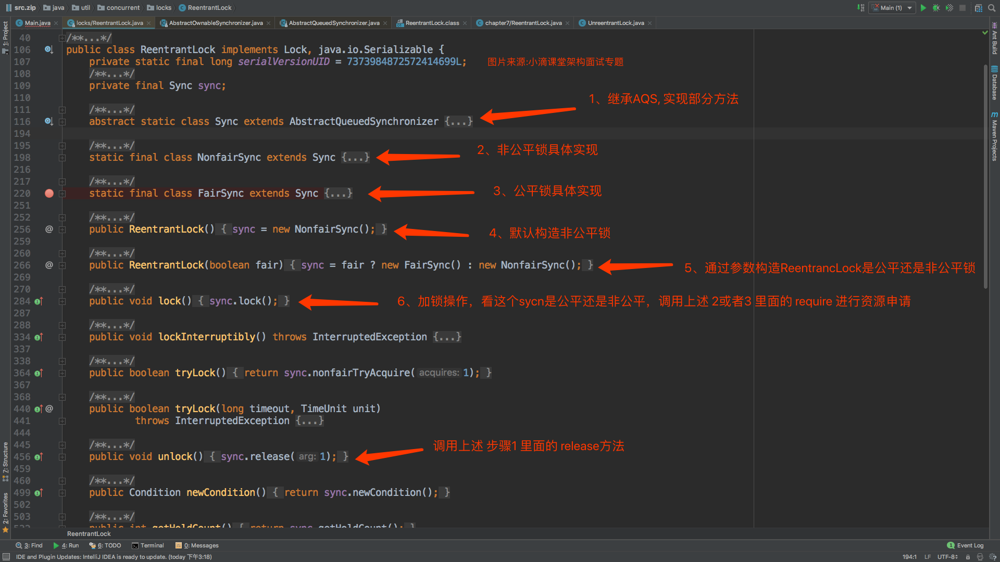
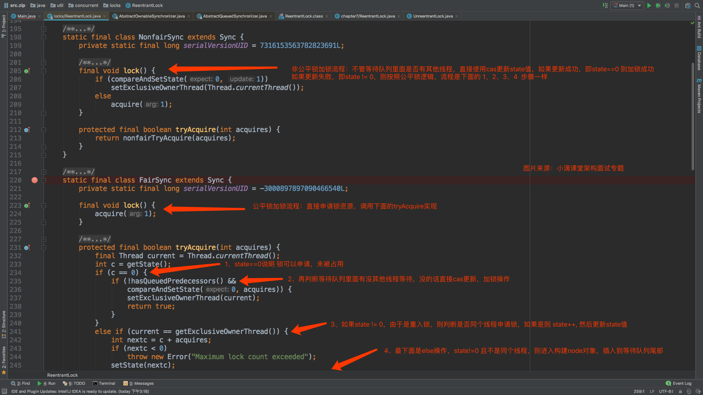

# 5.2 ReentrantLock

> ReentrantLock是什么？看过ReentrantLock源码不？ReentrantLock和synchronized有什么区别？ReentrantReadWriteLock呢？

## ReentrantLock简介

一般情况下，并发编程用synchronized关键字就可以满足大部分业务逻辑了，但是为什么java又引入了reentrantLock呢？原来synchronized只能实现非公平锁，切是依据底层对象的monitor实现的加锁功能。而reentrantLock可以实现公平锁和非公平锁，底层使用AQS的state和FIFO队列来控制加锁。这样使得reentrantLock更加的灵活可用。

关于ReentrantLock的概述，可以参见我找到的一篇博文：[可重入锁(ReentrantLock)的实现原理](ReentrantLock.md).

## ReentrantLock源码解析

> 来自：小滴课堂

## ReentrantLock和synchronized的差别

> 来自：小滴课堂

ReentrantLock和synchronized都是独占锁

synchronized：

1. 是悲观锁会引起其他线程阻塞，java内置关键字
2. 无法判断是否获取锁的状态，锁可重入、不可中断、只能是非公平
3. 加锁解锁的过程是隐式的,用户不用手动操作,优点是操作简单但显得不够灵活
4. 一般并发场景使用足够、可以放在被递归执行的方法上,且不用担心线程最后能否正确释放锁
5. synchronized操作的应该是对象头中mark word，参考原先原理图片

ReentrantLock：

1. 是个Lock接口的实现类，是悲观锁
2. 可以判断是否获取到锁，可重入、可判断、可公平可不公平
3. 需要手动加锁和解锁,且 解锁的操作尽量要放在finally代码块中,保证线程正确释放锁
4. 在复杂的并发场景中使用在重入时要却确保重复获取锁的次数必须和重复释放锁的次数一样，否则可能导致其他线程无法获得该锁。
5. 创建的时候通过传进参数true创建公平锁,如果传入的是false或没传参数则创建的是非公平锁
6. 底层不同是AQS的state和FIFO队列来控制加锁

## 读写锁ReentrantReadWriteLock

1. 读写锁ReentrantReadWriteLock是接口ReadWriteLock接口的一个具体实现，实现了读写锁的分离

2. 支持公平和非公平，底层也是基于AQS实现

3. 允许从写锁降级为读锁

   流程：先获取写锁，然后获取读锁，最后释放写锁；但不能从读锁升级到写锁

4. 重入：读锁后还可以获取读锁；获取了写锁之后既可以再次获取写锁又可以获取读锁		

	核心：读锁是共享的，写锁是独占的。 读和读之间不会互斥，读和写、写和读、写和写之间才会互斥，主要是提升了读写的性能。
	也就是说，一旦变成写锁，就是互斥的了。只有读读读读可以同时进行。

ReentrantReadWriteLock设计初衷：ReentrantLock是独占锁且可重入的，相比synchronized而言功能更加丰富也更适合复杂的并发场景，但是也有弊端，假如有两个线程A/B访问数据，加锁是为了防止线程A在写数据， 线程B在读数据造成的数据不一致； 但线程A在读数据，线程C也在读数据，读数据是不会改变数据没有必要加锁，但是还是加锁了，降低了程序的性能，所以就有了ReadWriteLock读写锁接口

ReentrantReadWriteLock使用场景：读多写少，比如设计一个缓存组件 或 提高Collection的并发性