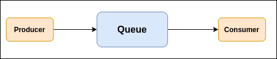

# 5.3 阻塞/非阻塞队列

> 了解阻塞队列BlockingQueue不？常见的阻塞队列有那些？非阻塞队列ConcurrentLinkedQueue呢？

Java里面的队列，有点像目前的消息队列中间件。不过Java中的队列比较基础。差不多遵循下面的逻辑。

有一个或多个生产者把消息放到队列中去，再有一个或多个消费者从队列中取出消息。

这里的核心点在于，要保证生产者不会在缓冲区满时放入数据，消费者也不会在缓冲区空时消耗数据。为此Java中可以有一下几种方法：

1. wait() / notify()方法

2. await() / signal()方法

   用ReentrantLock和Condition实现等待/通知模型

3. Semaphore信号量

4. BlockingQueue阻塞队列

   put方法用来向队尾存入元素，如果队列满，则阻塞

   take方法用来从队首取元素，如果队列为空，则阻塞

   - ArrayBlockingQueue
   - LinkedBlockingQueue

## BlockingQueue

BlockingQueue: j.u.c包下的提供了线程安全的队列访问的接口，并发包下很多高级同步类的实现都是基于阻塞队列实现的。

1. 当阻塞队列进行插入数据时，如果队列已满，线程将会阻塞等待直到队列非满
2. 从阻塞队列读数据时，如果队列为空，线程将会阻塞等待直到队列里面是非空的时候

## 常见BlockingQueue

- ArrayBlockingQueue：基于数组实现的一个阻塞队列，需要指定容量大小，FIFO先进先出顺序
- LinkedBlockingQueue：基于链表实现的一个阻塞队列，如果不指定容量大小，默认 Integer.MAX_VALUE, FIFO先进先出顺序
- PriorityBlockingQueue：一个支持优先级的无界阻塞队列，默认情况下元素采用自然顺序升序排序，也可以自定义排序实现 java.lang.Comparable接口
- DelayQueue：延迟队列，在指定时间才能获取队列元素的功能，队列头元素是最接近过期的元素，里面的对象必须实现 java.util.concurrent.Delayed 接口并实现CompareTo和getDelay方法

## 非阻塞队列ConcurrentLinkedQueue

ConcurrentLinkedQueue是基于链表实现的**无界线**程安全队列，采用FIFO进行排序。

1. 底层结构是Node，链表头部和尾部节点是head和tail，使用节点变量和内部类属性使用volatile声明保证了有序和可见性
2. 插入、移除、更新操作使用CAS无锁操作，保证了原子性
3. 假如多线程并发修改导致 CAS 更新失败，采用for循环插入保证更新操作成功