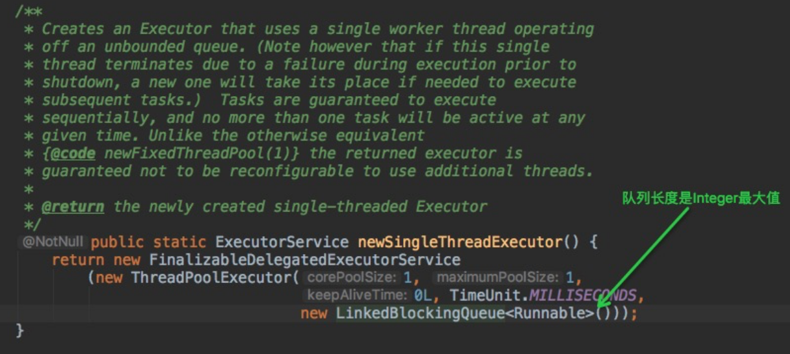
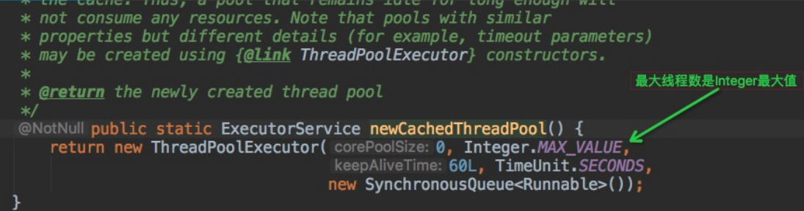

# 5.4 线程池

> 线程池有什么好处？Java里有哪些是常用的线程池？为什么最好要用ThreadPoolExecutor的方式创建线程池？ThreadPoolExecutor参数？

## 多线程编程实践准则

在多线程编程实践中，有很多准则。Follow这些准则可以让程序有更好的可读性，以及方便后期的维护和debug。这里列举了一些：

- 给不同的线程模块起名称，不要用java内置的thread-xxx名称，方便后续排查问题
- 使用同步代码块或者同步方法的时候，尽量减少同步范围
- 多使用并发集合，少用同步集合，提高效率
  - 并发集合：J.U.C下面的类，包括ConcurrentHashMap、CopyOnWriteArrayList
  - 同步集合：Hashtable/Vector/同步工具类包装Collections.synXXX
- 优先考虑使用线程池，方便管理和资源利用。实在不行再手动创建单一线程
  - 好处：重用存在的线程，减少对象创建销毁的开销，有效的控制最大并发线程数，提高系统资源的使用率，同时避免过多资源竞争，避免堵塞，且可以定时定期执行、单线程、并发数控制，配置任务过多任务后的拒绝策略等功能

## Java常见的线程池

- newFixedThreadPool：定长线程池，可控制线程最大并发数
- newCachedThreadPool：可缓存线程池
- newSingleThreadExecutor：单线程化的线程池，用唯一的工作线程来执行任务
- newScheduledThreadPool：定长线程池，支持定时/周期性任务执行

## ThreadPoolExecutor

【阿里巴巴编码规范】 线程池不允许使用 Executors 去创建，要通过 ThreadPoolExecutor的方式。

> 来自：小滴课堂

Executors创建的线程池底层也是调用 ThreadPoolExecutor，只不过使用不同的参数、队列、拒绝策略等,如果使用不当，会造成资源耗尽问题；
直接使用ThreadPoolExecutor让使用者更加清楚线程池允许规则，常见参数的使用，避免风险

常见的线程池问题：
	newFixedThreadPool和newSingleThreadExecutor: 
	队列使用LinkedBlockingQueue，队列长度为 Integer.MAX_VALUE，可能造成堆积，导致OOM

​	newScheduledThreadPool和newCachedThreadPool:
​	线程池里面允许最大的线程数是Integer.MAX_VALUE，可能会创建过多线程，导致OOM





## ThreadPoolExecutor核心参数

ThreadPoolExecutor构造函数：

```java
public ThreadPoolExecutor(int corePoolSize,
                              int maximumPoolSize,
                              long keepAliveTime,
                              TimeUnit unit,
                              BlockingQueue<Runnable> workQueue,
                              ThreadFactory threadFactory,
                              RejectedExecutionHandler handler)
```

- corePoolSize：核心线程数，线程池也会维护线程的最少数量，默认情况下核心线程会一直存活，即使没有任务也不会受存keepAliveTime控制
   坑：在刚创建线程池时线程不会立即启动，到有任务提交时才开始创建线程并逐步线程数目达到corePoolSize

- maximumPoolSize：线程池维护线程的最大数量，超过将被阻塞
   坑：当核心线程满，**且阻塞队列也满时**，才会判断当前线程数是否小于最大线程数，才决定是否创建新线程

- keepAliveTime：非核心线程的闲置超时时间，超过这个时间就会被回收，直到线程数量等于corePoolSize


- unit：指定keepAliveTime的单位，如TimeUnit.SECONDS、TimeUnit.MILLISECONDS


- workQueue:线程池中的任务队列,常用的是 ArrayBlockingQueue、LinkedBlockingQueue、SynchronousQueue


- 
  threadFactory：创建新线程时使用的工厂


- handler: RejectedExecutionHandler是一个接口且只有一个方法,线程池中的数量大于maximumPoolSize，对拒绝任务的处理策略，默认有4种策略AbortPolicy、CallerRunsPolicy、DiscardOldestPolicy、DiscardPolicy