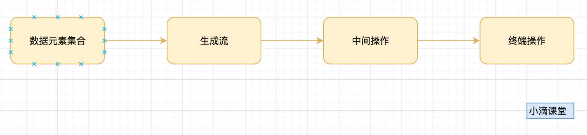

# 7.2 集合框架Stream
> 什么是Stream？Stream里的常用函数有哪些？集合foreach怎么用？
> 引用自小滴课堂: https://xdclass.net/


# 什么是Stream 

- Stream 中⽂称为 “流”，通过将集合转换为这么⼀种叫做 “流”的元素队列，通过声明性⽅式， 能够对集合中的每个元素进⾏⼀系列并⾏或串⾏的流⽔线操作

- 元素是特定类型的对象，所以元素集合看作⼀种流， 流在管道中传输， 且可以在管道的节点 上进⾏处理， ⽐如 排序，聚合，过滤等操作

  

  

操作详情

- 数据元素便是原始集合，如List、Set、Map等
- ⽣成流，可以是串⾏流stream() 或者并⾏流 parallelStream() 
- 中间操作，可以是 排序，聚合，过滤，转换等 
- 终端操作，很多流操作本身就会返回⼀个流，所以多个操作可以直接连接起来，最后统⼀进 ⾏收集 
- 概览stream接⼝源码

例子

```java
List<String> list = Arrays.asList("springboot教程","微服务教程","并发编程","压⼒测试","架构课程");
List<String> resultList = list.stream().map(obj->"在⼩滴课堂学："+obj).collect(Collectors.toList());
System.out.println(resultList);
```


# 并⾏流parallelStream

为什么会有这个并⾏流

- 集合做重复的操作，如果使⽤串⾏执⾏会相当耗时，因此⼀般会采⽤多线程来加快， Java8的 paralleStream⽤fork/join框架提供了并发执⾏能⼒

- 底层原理

  - 线程池(ForkJoinPool)维护⼀个线程队列
  - 可以分割任务，将⽗任务拆分成⼦任务，完全贴合分治思想

- 与Stream区别

  ```java
  //顺序输出
  List<Integer> numbers = Arrays.asList(1, 2, 3, 4, 5, 6, 7, 8, 9);
  numbers.stream().forEach(System.out::println);
  
  //并⾏乱序输出
  List<Integer> numbers = Arrays.asList(1, 2, 3, 4, 5, 6, 7, 8, 9);
  numbers.parallelStream().forEach(System.out::println);
  ```

  

- 问题

  - paralleStream并⾏是否⼀定⽐Stream串⾏快？

    - 错误，数据量少的情况，可能串⾏更快，ForkJoin会耗性能

  - 多数情况下并⾏⽐串⾏快，是否可以都⽤并⾏

    - 不⾏，部分情况会有线程安全问题，parallelStream⾥⾯使⽤的外部变量，⽐如集合⼀ 定要使⽤线程安全集合，不然就会引发多线程安全问题

    - 使用线程安全集合的例子：

      ```java
      for(int i=0;i<10;i++) {
       	List list = new ArrayList();
       	//List list = new CopyOnWriteArrayList();
       	IntStream.range(0, 100).parallel().forEach(list::add);
       	System.out.println(list.size());
      }
      ```

      

# Stream常用操作

Stream常用操作有：**map，filter，limit，sorted，allMatch，anyMatch，max，min，reduce**

## Map函数

- 将流中的每一个元素 T 映射为 R(类似类型转换)
- 上堂课的例子就是,类似遍历集合,对集合的每个对象做处理理
- 场景:转换对象,如javaweb开发中集合里面的DO对象转换为DTO对象

```java
List<String> list = Arrays.asList("springboot教程","微服务教程","并发编程","压力力力测试","架构课程");
List<String> resultList = list.stream().map(obj->"在小小滴课堂学:"+obj).collect(Collectors.toList());
System.out.println(resultList);
```

```java
List<User> list = Arrays.asList(new User(1,"小小东","123"),new User(21,"jack","rawer"), new User(155,"tom","sadfsdfsdfsd"), new User(231,"marry","234324"),new User(100,"小小D","122223"));

List<UserDTO> userDTOList = list.stream().map(obj->{

    UserDTO userDTO = new UserDTO(obj.getId(),obj.getName());

    return userDTO;
    
}).collect(Collectors.toList());

System.out.println(userDTOList);
```

## Filter函数

- 用于通过设置的条件过滤出元素

- 场景:主要用于筛选过滤出符合条件的元素

- 例子：过滤出字符串长度大于5的字符串

  ```java
  List<String> list = Arrays.asList("springboot", "springcloud","redis", "git", "netty", "java", "html", "docker");
  List<String> resultList = list.stream().filter(obj -> obj.length() > 5).collect(Collectors.toList());
  System.out.println(resultList);
  ```

## Sorted函数

- sorted() 对流进⾏⾃然排序, 其中的元素必须实现Comparable 接⼝

  ```java
  List<String> list = Arrays.asList("springboot", "springcloud","redis", "git", "netty", "java", "html", "docker");
  List<String> resultList = list.stream().sorted().collect(Collectors.toList());
  ```

  

- sorted(Comparator comparator) ⽤来⾃定义升降序

  ```java
  List<String> list = Arrays.asList("springboot", "springcloud","redis", "git", "netty", "java", "html", "docker");
  
  //根据⻓度进⾏排序
  List<String> resultList = list.stream().sorted(Comparator.comparing(obj -> obj.length())).collect(Collectors.toList());
  
  List<String> resultList = list.stream().sorted(Comparator.comparing(obj -> obj.length(),Comparator.reverseOrder())).collect(Collectors.toList() );
  
  List<String> resultList = list.stream().sorted(Comparator.comparing(String::length).reversed()).collect(Collectors.toList());
  
  System.out.println(resultList);
  ```

## Limit函数

- 截断流使其最多只包含指定数量的元素

  ```java
  List<String> list = Arrays.asList("springboot", "springcloud", "redis", "git", "netty", "java", "html", "docker");
  
  //limit截取
  List<String> resultList = list.stream().sorted(Comparator.comparing(String::length).reversed()).limit(3).collect(Collectors.toList());
  
  System.out.println(resultList);
  ```

## AllMatch函数

- 检查是否匹配所有元素，只有全部符合才返回true

  ```java
  List<String> list = Arrays.asList("springboot", "springcloud", "redis", "git", "netty", "java", "html", "docker");
  
  boolean flag = list.stream().allMatch(obj->obj.length()>1);
  
  System.out.println(flag);
  ```

## AnyMatch函数

- 检查是否⾄少匹配⼀个元素

  ```java
  List<String> list = Arrays.asList("springboot", "springcloud", "redis", "git", "netty", "java", "html", "docker");
  
  boolean flag = list.stream().anyMatch(obj->obj.length()>18);
  
  System.out.println(flag);
  ```

## Max和min函数

- 最⼤值和最⼩值

  ```java
  List<Student> list = Arrays.asList(new Student(32),new Student(33),new Student(21),new Student(29),new Student(18));
  
  //list.stream().max(Comparator.comparingInt(Student::getAge));
  
  //最⼤
  Optional<Student> optional = list.stream().max((s1, s2)- >Integer.compare(s1.getAge(),s2.getAge()));
  
  //最⼩
  Optional<Student> optional = list.stream().min((s1, s2)- >Integer.compare(s1.getAge(),s2.getAge()));
  
  System.out.println(optional.get().getAge());
  ```

## Reduce

聚合操作，中⽂意思是 “减少” 

根据⼀定的规则将Stream中的元素进⾏计算后返回⼀个唯⼀的值 

**常⽤⽅法⼀**

```java
Optional<T> reduce(BinaryOperator<T> accumulator);
```

- accumulator 计算的累加器

- 例⼦: 第⼀个元素相加和第⼆个元素相加，结果再和第三个元素相加，直到全部相加完 成

  ```java
  int value = Stream.of(1, 2, 3, 4, 5).reduce((item1, item2) -> item1 + item2).get();
  ```

  

- 不⽤lambda的写法

  ```java
  int result = Stream.of(1,2,3,4,5).reduce(new BinaryOperator<Integer>() {
   	@Override
   	public Integer apply(Integer item1, Integer item2) {
   		return item1 + item2;
   	}
   }).get();
  ```

**常⽤⽅法⼆**

```java
T reduce(T identity, BinaryOperator<T> accumulator);
```

- identity ⽤户提供⼀个循环计算的初始值

- accumulator 计算的累加器

- 例⼦： 100作为初始值，然后和第⼀个元素相加，结果在和第⼆个元素相加，直到全部 相加完成

  ```java
  int value = Stream.of(1, 2, 3, 4,5).reduce(100, (sum, item) -> sum + item);
  ```

练习：

- 求最大值

  ```java
  int value = Stream.of(1645, 234345, 32, 44434,564534,435,34343542,212).reduce( (item1, item2) -> item1 > item2 ? item1 : item2 ).get();
  
  System.out.println(value);
  ```


# Foreach操作

集合遍历的⽅式 

- for循环 
- 迭代器 Iterator

Jdk8⾥⾯的新增接⼝foreach

```java
default void forEach(Consumer<? super T> action) {
 	Objects.requireNonNull(action);
 	for (T t : this) {
 		action.accept(t);
 	}
 }
```

```java
List<Student> results = Arrays.asList(new Student(32),new Student(33),new Student(21),new Student(29),new Student(18));

results.forEach(obj->{
 System.out.println(obj.toString());
});
```

注意点：

- 不能修改包含外部的变量的值 
- 不能⽤break或者return或者continue等关键词结束或者跳过循环