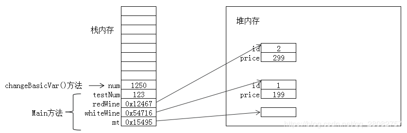
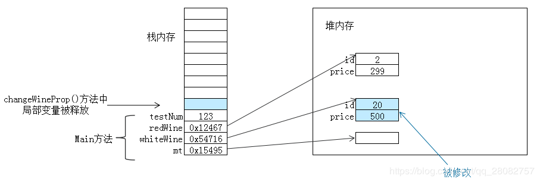

# Java中基础对象以及String字符串对象的内存分配情况

> 所有资料来自网络，出处请参见references，尊重原作者。


## JVM基本内存概述

我们通常把Java内存区分为堆内存（Heap）和栈内存（Stack），这种分法比较粗糙，Java内存区域的划分实际上远比这复杂。这种划分方式的流行只能说明大多数程序员最关注的、与对象内存分配关系最密切的内存区域是这两块。其中所指的“栈”就是虚拟机栈，或者说是虚拟机栈中的局部变量表部分

栈内存（Stack）: 在方法中定义的一些**基本类型的变量**和**对象的引用变量**都是在方法的栈内存中分配，当在一段代码块定义一个变量时，Java就在栈中为这个变量分配内存空间，当超过变量的作用域后，Java会自动释放掉为该变量分配的内存空间，该内存空间可以立即被另作它用。

堆内存（Heap）: 堆内存用来存放由new创建的对象和数组，在堆中分配的内存，由Java虚拟机的自动垃圾回收器来管理。在堆中产生了一个数组或者对象之后，还可以在栈中定义一个特殊的变量，让栈中的这个变量的取值等于数组或对象在堆内存中的首地址，栈中的这个变量就成了数组或对象的引用变量，以后就可以在程序中使用栈中的引用变量来访问堆中的数组或者对象。引用变量是普通的变量，定义时在栈中分配，引用变量在程序运行到其作用域之外后被释放。而数组和对象本身在堆中分配，即使程序运行到使用new产生数组或者对象的语句所在的代码块之外，数组和对象本身占据的内存不会被释放，数组和对象在没有引用变量指向它的时候，才变为垃圾，不能在被使用，但仍然占据内存空间不放，在随后的一个不确定的时间被垃圾回收器收走（释放掉）

## 数据区域

Java虚拟机在执行Java程序的过程中会把它所管理的内存划分为若干个不同的数据区域。这些区域都有各自的用途，以及创建和销毁的时间。Java虚拟机所管理的内存将会包括以下几个运行时数据区。


### 程序计数器

程序计数器是一个比较小的内存区域，用于指示当前线程所执行的字节码执行到了第几行，可以理解为是当前线程的行号指示器。字节码解释器在工作时，会通过改变这个计数器的值来取下一条语句指令。分支、循环、跳转、异常处理、线程恢复等基础功能都需要依赖这个计数器来完成。
由于Java虚拟机的多线程是通过线程轮流切换并分配处理器执行时间的方式来实现的，在任何一个确定的时刻，一个处理器（对于多核处理器来说是一个内核）只会执行一条线程中的指令。因此，为了线程切换后能恢复到正确的执行位置，每条线程都需要有一个独立的程序计数器，各条线程之间的计数器互不影响，独立存储，我们称这类内存区域为“线程私有”的内存。

### 虚拟机栈

描述的是Java方法执行的内存模型：每个方法被执行的时候都会同时创建一个栈帧（Stack Frame）用于存储局部变量表、操作栈、动态链接、方法出口等信息。每一个方法被调用直至执行完成的过程，就对应着一个栈帧在虚拟机栈中从入栈到出栈的过程。局部变量表存放了编译期可知的各种基本数据类型（boolean、byte、char、short、int、float、long、double）、对象引用（reference类型）。

Java虚拟机栈是线程私有的，它的生命周期与线程相同。

### 本地方法栈

本地方法栈在作用，运行机制，异常类型等方面都与虚拟机栈相同，唯一的区别是：虚拟机栈是执行Java方法的，而本地方法栈是用来执行native方法的。很多虚拟机中都会将本地方法栈与虚拟机栈放在一起使用。本地方法栈也是线程私有的。

### 堆区

堆区是理解Java GC机制最重要的区域。在JVM所管理的内存中，堆区是最大的一块，堆区也是Java GC机制所管理的主要内存区域。

堆区由所有线程共享，在虚拟机启动时创建。堆区的存在是为了存储对象实例，原则上讲，所有的对象都在堆区上分配内存。在Java虚拟机规范中的描述是：所有的对象实例以及数组都要在堆上分配，但是随着JIT编译器的发展与逃逸分析技术的逐渐成熟，栈上分配、标量替换优化技术将会导致一些微妙的变化发生，所有的对象都分配在堆上也渐渐变得不是那么“绝对”了。

根据Java虚拟机规范的规定，Java堆可以处于物理上不连续的内存空间中，只要逻辑上是连续的即可，就像我们的磁盘空间一样。在实现时，既可以实现成固定大小的，也可以是可扩展的，不过当前主流的虚拟机都是按照可扩展来实现的。如果在堆中没有内存完成实例分配，并且堆也无法再扩展时，将会抛出OutOfMemoryError异常。

### 方法区

方法区也是各个线程共享的区域，用于存储已经被虚拟机加载的类信息（即加载类时需要加载的信息，包括版本、field、方法、接口等信息）、final常量、静态变量、编译器即时编译的代码等。

虽然Java虚拟机规范把方法区描述为堆的一个逻辑部分，但是它却有一个别名叫做Non-Heap（非堆），目的应该是与Java堆区分开来。方法区在物理上也不需要是连续的，可以选择固定大小或可扩展大小，并且方法区比堆还多了一个限制：可以选择是否执行垃圾收集。

### 运行时常量池

运行时常量池是方法区的一部分。Class文件中除了有类的版本、字段、方法、接口等描述等信息外，还有一项信息是常量池，用于存放编译期生成的各种字面量、符号引用和翻译出来的直接引用，这部分内容将在类加载后存放到方法区的运行时常量池中。

Java语言并不要求常量一定只能在编译期产生，也就是并非预置入Class文件中常量池的内容才能进入方法区运行时常量池，运行期间也可能将新的常量放入池中。

### 直接内存

并不是虚拟机运行时数据区的一部分，也不是Java虚拟机规范中定义的内存区域。

JDK1.4加入了NIO，引入一种基于通道与缓冲区的I/O方式，它可以使用Native函数库直接分配堆外内存，然后通过一个存储在Java堆中的DirectByteBuffer对象作为这块内存的引用进行操作。因为避免了在Java堆和Native堆中来回复制数据，提高了性能。

当各个内存区域总和大于物理内存限制，抛出OutOfMemoryError异常。


## 示例

下面以一个简单示例来分析Java中对象内存分配的情况。

```java
/**
 * 葡萄酒类
 */
public class Wine {
    private int id; // 编号
    private int price; // 价格

    public Wine() {}

    public Wine(int id, int price) {
        this.id = id;
        this.price = price;
    }

    public int getId() {
        return id;
    }

    public void setId(int id) {
        this.id = id;
    }

    public int getPrice() {
        return price;
    }

    public void setPrice(int price) {
        this.price = price;
    }
}

/**
 * 内存分配测试
 */
public class MallocTest {

    public static void main(String[] args) {
        // 创建内存分配测试类对象
        MallocTest mt = new MallocTest();
        // 创建白葡萄酒类，id=1，价格=199
        Wine whiteWine = new Wine(1,199);
        // 创建红葡萄酒类，id=2，价格=299
        Wine redWine = new Wine(2,299);
        // 定义基础变量
        int testNum = 123;

        /* 下面是方法调用 */
        mt.changeBasicVar(testNum);
        mt.changeWineProp(whiteWine);
        mt.changeWine(redWine);
    }

    /**
     * 修改对象属性
     * 疑问：对象属性修改成功吗？
     * @param wine 葡萄酒类
     */
    public void changeWineProp(Wine wine){
        wine.setId(20);
        wine.setPrice(500);
    }

    /**
     * 修改对象引用
     * 疑问：对象引用能修改成功吗？
     * @param wine 葡萄酒类
     */
    public void changeWine(Wine wine){
        wine = new Wine(15,800);
    }

    /**
     * 修改基础类型变量值
     * 疑问：能修改成功吗？
     * @param num 基础类型变量
     */
    public void changeBasicVar(int num){
        num = 1250;
    }

}
```

### 内存分配情况分析

程序从入口方法`main()`进入后，开始为`main`方法中所使用到的变量分配内存空间（引用变量所存储的值其实就是所指对象在堆内存中的首地址）。当执行到定义变量`testNum`后，调用方法前的内存分配情况为：


接着执行`changeBasicVar()`方法调用，转到`changeBasicVar()`方法执行时，该方法中使用到的参数是一个局部变量，我们仍在内存栈中分配空间保存，在进入方法后执行方法体前，此时将`main()`方法中的变量`testNum`副本拷贝到`changeBasicVar()`方法的局部变量`num`中，此时内存分配情况为：


执行`changeBasicVar()`方法体，修改方法中的局部变量值`num`，因为`num`中直接存放的是数值，所以它的修改不会影响到`main()`方法中的`testNum`，此时内存分配情况为：



changeBasicVar()方法调用完毕退出，局部变量num的作用域结束，从栈中回收内存，此时内存分配情况为：


接下来执行调用方法部分代码，首先调用changeWineProp()方法，main()方法中传递的whiteWine作为实际参数，在此处传递的实际上是whiteWine所引用的堆中对象的地址 **（这儿有个参数传递的特点需要引申说明一下，在Java中参数的传递形式只有值传递方式）** ，所以changeWineProp()方法中的wine也指向堆中已经创建的Wine对象，此时内存分配情况为：


转到`changeWineProp()`方法中执行，在方法体中，我们修改了`wine`变量引用的对象的`id`与`price`属性值，因为它与`main()`方法中的`whiteWine`引用的是同一个堆内存中的空间，所以修改后，`main()`方法中的`whiteWine`也受到了影响，此时内存分配情况为：


`changeWineProp()`方法调用结束后，释放掉它在栈中所分配的内存，我们看到，`main()`方法中的`whiteWine`确实受到了影响，此时内存分配情况为：



最后再调用`changeWine()`方法，`main()`方法中传递的`redWine`作为实际参数，与上一个方法调用一样，也是将引用地址传递给`changeWine()`方法的`wine`局部变量保存，此时内存分配情况为：


在`changeWine()`方法中，执行方法体的操作（使用`new`创建了一个新对象）之后，我们在堆中重新分配了一个对象的空间来保存新创建出来的对象，并将重新创建出来的对象首地址引用交给`wine`局部变量保存，所以`wine`中保存的引用就改变了，此时内存分配情况为：


这个时候大家可以观察一下，在`main()`方法中的`redWine`引用及其引用在堆中内存空间中保存的值是否已经改变了？

`changeWine()`方法调用结束，在栈中释放掉其局部变量的空间，那么在堆中刚被引用到的对象空间就变成无引用状态了，没有被引用到的对象在堆中就等待GC来作垃圾回收，此时内存分配情况为：


到此，`main()`方法执行完毕，退出，栈中释放掉`main()`方法中分配的资源，此时内存分配情况为：


在堆中所分配的空间不再引用，则等待GC自动垃圾回收。

根据以上分析，就可以思考一下，在各方法调用前后，变量`testNum`，对象`whiteWine`、`redWIne`各属性的值是什么。


## String字符串对象内存分配情况分析

上边分析了基本数据类型的内存分配，简单的对象内存分配。下面来分析一下String字符串的内存分配，因为字符串是我们在编程过程中需要经常用到的对象。

字符串对象在创建的时候有两种方式：

```java
String str1 = "abc";

String str2 = new String("abc");
```

这两种方式都是经常用到的，尤其是第一种方式。不管是哪一种创建字符串对象的方式，最终在程序中展现出来的效果是一样的。但这两种创建方式有什么不同呢？下面就从内存分析角度说明一下。

这两种实现其实存在着一些性能和内存占用的差别。这一切主要是源于JVM为了减少字符串对象的重复创建，其维护了一个特殊的内存结构，这个内存被称为 字符串常量池。

字符串是常量，我们可以从字符串底层实现来看：

```java
 String 源码
 ... 
 private final char value[];
 ...
```

它使用了一个`final`的`char`型数组保存字符串的每个字符，那么final所修饰的数组引用是不能被改变的，而该`char`型数组中也未提供任何可供修改单个元素的方法，所以一旦确定字符串内容，也就不能再改变底层数组中保存的元素了。

当代码中出现以字面量形式（上述第一种方式）创建字符串对象时，JVM首先会对这个字面量进行检查，如果字符串常量池中存在相同内容的字符串对象的引用，则将这个引用返回，否则新的字符串对象被创建，然后将这个引用放入字符串常量池，并返回该引用。下面示例将详细分析String对象的内存分配情况。

### 示例

```java
String str = "abc"; 
String test = "abc"; 
String strObj = new String("abc"); 
```

当执行第1条语句时，JVM检测 “abc” 这个字面量，这里我们认为没有内容为 “abc” 的对象存在。JVM通过字符串常量池查找不到内容为 “abc” 的字符串对象存在，那么就创建这个字符串对象，然后将刚创建的对象放入到字符串常量池中，并且将引用返回给变量str。

当执行第2条语句时，JVM还是要检测这个字面量，JVM通过查找字符串常量池，发现内容为 “abc” 字符串对象存在，于是将已经存在的字符串对象的引用返回给变量test，这里不会重新创建新的字符串对象，此时内存分配情况为：


我们也可以通过：

```java
 System.out.println(str == test);
```

来验证`str`与`test`是否指向同一个对象，`==`在此判断的是变量`str`与`test`中存放的引用，而不是对象本身的值。

当执行第3条语句时，使用`new`创建了一个字符串对象，会在堆上分配一个存放字符串对象的空间，然后查找常量池中是否存在内容为 “abc” 的字符串对象，如果存在则返回引用，不存在则创建再返回引用，此时内存分配情况为：


实际上现在demo所保存的引用是在堆内存上的地址，我们可以通过：

```java
System.out.println(strObj == test);
```

来验证`strObj` 与`test`是否是指向同一个对象，答案当然是`false`。

字符串的连接中对**运算符“+”作了重载**，即“+”用于字符串运算时是将字符串连接在一起。我们知道，字符串是常量，那么要做字符串连接，不可能在原有字符串对象的后边直接连接，那是如何来实现连接操作的呢？

在字符串连接时，如：

```java
String str = "hello" + "  world";
```

首先会在字符串常量内存区创建”hello”字符串与”world”字符串两个对象，然后再开辟一个空间存放连接后的”hello world”字符串，所以这就造成了在常量内存区中创建了三个对象的现象，最后将连接后的”hello world”字符串的引用赋给变量str，此时内存分配情况为：


那么，当我们需要频繁修改字符串时，如果使用String来操作，则明显会使执行效率受影响，如何解决这个问题呢，请参考StringBuffer和StringBuilder的使用。


## References

https://blog.csdn.net/qq_28082757/article/details/89886132

[https://dslztx.github.io/blog/2016/08/17/Java%E8%AF%AD%E8%A8%80%E4%B9%8B%E5%B8%B8%E9%87%8F%E6%B1%A0/](https://dslztx.github.io/blog/2016/08/17/Java语言之常量池/)

https://www.cnblogs.com/chargeworld/p/11973969.html

https://www.jianshu.com/p/380f004e3c88
