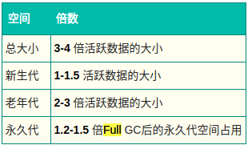

# JVM GC(Garbage Collection) 基础

> 内容来源于网络，原文地址：https://tech.meituan.com/2017/12/29/jvm-optimize.html
>
> （原文中举了大量的GC优化案例，有兴趣的朋友可以去看一下原文）

## 前言

当Java程序性能达不到既定目标，且其他优化手段都已经穷尽时，通常需要调整垃圾回收器来进一步提高性能，称为GC优化。但GC算法复杂，影响GC性能的参数众多，且参数调整又依赖于应用各自的特点，这些因素很大程度上增加了GC优化的难度。即便如此，GC调优也不是无章可循，仍然有一些通用的思考方法。本篇会介绍这些通用的GC优化策略和相关实践案例，主要包括如下内容： 

1. 优化前准备: 简单回顾JVM相关知识、介绍GC优化的一些通用策略，包括但不限于： 
   - GC工作原理
   - 理解新生代、老年代、晋升等术语含义
   - GC日志
2. 优化方法: 介绍调优的一般流程：明确优化目标→优化→跟踪优化结果
3. 优化案例: 简述笔者所在团队遇到的GC问题以及优化方案

注意：**GC优化不能解决一切性能问题，它是最后的调优手段**

## JVM内存结构

简单介绍一下JVM内存结构和常见的垃圾回收器。

当代主流虚拟机（Hotspot VM）的垃圾回收都采用“分代回收”的算法。“分代回收”是基于这样一个事实：对象的生命周期不同，所以针对不同生命周期的对象可以采取不同的回收方式，以便提高回收效率。

Hotspot VM将内存划分为不同的物理区，就是“分代”思想的体现。如图所示，JVM内存主要由新生代、老年代、永久代构成。

- 新生代（Young Generation）：大多数对象在新生代中被创建，其中很多对象的生命周期很短。每次新生代的垃圾回收（又称Minor GC）后只有少量对象存活，所以选用复制算法，只需要少量的复制成本就可以完成回收。

  新生代内又分三个区：一个Eden（伊甸园）区，两个Survivor（幸存者）区（一般而言），大部分对象在Eden区中生成。当Eden区满时，还存活的对象将被复制到两个Survivor区（中的一个）。当这个Survivor区满时，此区的存活且不满足“晋升”条件的对象将被复制到另外一个Survivor区。对象每经历一次Minor GC，年龄加1，达到“晋升年龄阈值”后，被放到老年代，这个过程也称为“晋升”。显然，“晋升年龄阈值”的大小直接影响着对象在新生代中的停留时间，在Serial和ParNew GC两种回收器中，“晋升年龄阈值”通过参数MaxTenuringThreshold设定，默认值为15。

- 老年代（Old Generation）：在新生代中经历了N次垃圾回收后仍然存活的对象，就会被放到年老代，该区域中对象存活率高。老年代的垃圾回收（又称Major GC）通常使用“标记-清理”或“标记-整理”算法。整堆包括新生代和老年代的垃圾回收称为Full GC（HotSpot VM里，除了CMS之外，其它能收集老年代的GC都会同时收集整个GC堆，包括新生代）。

- 永久代（Perm Generation）：主要存放元数据，例如Class、Method的元信息，与垃圾回收要回收的Java对象关系不大。相对于新生代和年老代来说，该区域的划分对垃圾回收影响比较小。

## 常见垃圾回收器

不同的垃圾回收器，适用于不同的场景。常用的垃圾回收器：

- 串行（Serial）回收器是单线程的一个回收器，简单、易实现、效率高。
- 并行（ParNew）回收器是Serial的多线程版，可以充分的利用CPU资源，减少回收的时间。
- 吞吐量优先（Parallel Scavenge）回收器，侧重于吞吐量的控制。
- 并发标记清除（CMS，Concurrent Mark Sweep）回收器是一种以获取最短回收停顿时间为目标的回收器，该回收器是基于“标记-清除”算法实现的。

## GC日志

每一种回收器的日志格式都是由其自身的实现决定的，换而言之，每种回收器的日志格式都可以不一样。但虚拟机设计者为了方便用户阅读，将各个回收器的日志都维持一定的共性。[JavaGC日志](https://blog.csdn.net/m0_37556444/article/details/83032034) 中简单介绍了这些共性。

## 参数基本策略

各分区的大小对GC的性能影响很大。如何将各分区调整到合适的大小，分析活跃数据的大小是很好的切入点。

**活跃数据的大小**是指，应用程序稳定运行时长期存活对象在堆中占用的空间大小，也就是Full GC后堆中老年代占用空间的大小。可以通过GC日志中Full GC之后老年代数据大小得出，比较准确的方法是在程序稳定后，多次获取GC数据，通过取平均值的方式计算活跃数据的大小。活跃数据和各分区之间的比例关系如下（见参考文献1）：

例如，根据GC日志获得老年代的活跃数据大小为300M，那么各分区大小可以设为：

> 总堆：1200MB = 300MB × 4* 新生代：450MB = 300MB × 1.5* 老年代： 750MB = 1200MB - 450MB*

这部分设置仅仅是堆大小的初始值，后面的优化中，可能会调整这些值，具体情况取决于应用程序的特性和需求。

## 优化步骤

GC优化一般步骤可以概括为：确定目标、优化参数、验收结果。

### 确定目标

明确应用程序的系统需求是性能优化的基础，系统的需求是指应用程序运行时某方面的要求，譬如： - 高可用，可用性达到几个9。 - 低延迟，请求必须多少毫秒内完成响应。 - 高吞吐，每秒完成多少次事务。

明确系统需求之所以重要，是因为上述性能指标间可能冲突。比如通常情况下，缩小延迟的代价是降低吞吐量或者消耗更多的内存或者两者同时发生。

由于笔者所在团队主要关注高可用和低延迟两项指标，所以接下来分析，如何量化GC时间和频率对于响应时间和可用性的影响。通过这个量化指标，可以计算出当前GC情况对服务的影响，也能评估出GC优化后对响应时间的收益，这两点对于低延迟服务很重要。

举例：假设单位时间T内发生一次持续25ms的GC，接口平均响应时间为50ms，且请求均匀到达，根据下图所示：

那么有(50ms+25ms)/T比例的请求会受GC影响，其中GC前的50ms内到达的请求都会增加25ms，GC期间的25ms内到达的请求，会增加0-25ms不等，如果时间T内发生N次GC，**受GC影响请求占比=(接口响应时间+GC时间)×N/T** 。可见无论降低单次GC时间还是降低GC次数N都可以有效减少GC对响应时间的影响。

### 优化

通过收集GC信息，结合系统需求，确定优化方案，例如选用合适的GC回收器、重新设置内存比例、调整JVM参数等。

进行调整后，将不同的优化方案分别应用到多台机器上，然后比较这些机器上GC的性能差异，有针对性的做出选择，再通过不断的试验和观察，找到最合适的参数。

### 验收优化结果

将修改应用到所有服务器，判断优化结果是否符合预期，总结相关经验。

接下来，我们通过三个案例来实践以上的优化流程和基本原则（本文中三个案例使用的垃圾回收器均为ParNew+CMS，CMS失败时Serial Old替补)。