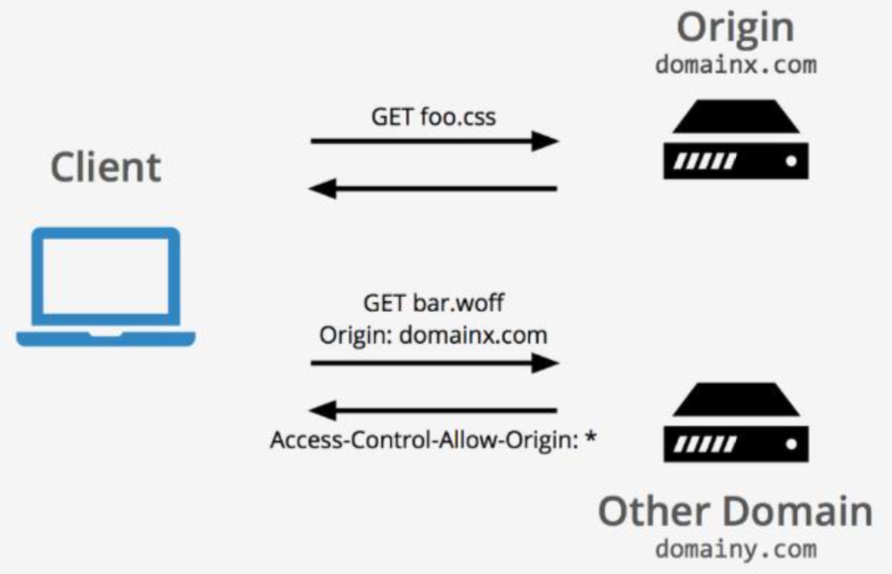

# AWS - Storage - S3, CloudFront, Snow family, Storage Gateway, FSx.

S3, CloudFront, Snow family, Storage Gateway, FSx.

## S3

* Highly scalable, durable and secure **object** storage
* Unlimited storage
* Single file size up to 5 TB; single PUT up to 5 GB
* Offers a range of storage classes designed for different use cases: Standard, Unknown/Changing, Infrequent Access, Archive
* Support Server-Side Encryption (SSE) options to encrypt data stored at rest: SSE-S3, SSE-C, SSE-KMS
* Client-Side Encryption provides options to encrypt data before sending to S3: CMK, Client-side Master Key

### S3 classes

### S3 Versioning

* Keep multiple versions of an object in one bucket
* Protect you from unintended overwrites and deletions
* Archive objects so having access to previous versions
* Use with Object Lifecycle Management to save cost
* By enabling MFA (Multi-factor Authentication) Delete of a bucket, bucket owner must include 2 forms of authentication to delete or change versioning state of the bucket

### S3 Data Security Best Practices

* Manage access to S3 (控制访问)
    * Resource-based : Policies and Access Control Lists (ACL)
    * User-based: Use IAM roles for AWS services to access S3
* Data Encryption at rest: Server-Side and Client-Side(存储数据加密)
* Ensure encryption in transit: SSL/TLS (传输数据加密)
* Use Presigned URL (预签名URL)
* Enable MFA (Multi-factor Authentication) Delete (多重验证删除)
* Use Amazon S3 Object Lock (对象锁)
* Use S3 Cross-Region Replication (CRR) (跨区域复制)
* Use VPC Endpoint for S3 (VPC终端节点)

### S3 Data Encryption

**Server-Side Encryption (SSE)**

* Encrypt when data writes to S3, and decrypt it when you access
* 3 different ways, but only one can be used at a time
* SSE-C is not available in management console but through CLI. The key is not saved in AWS.

**Client-Side Encryption**

* Encrypt data before sending to S3
* 2 exclusive ways to keep the key: KMS or user managed 
* Client-side Master Key never sent to AWS

### S3 Object Lock

S3 can add a lock for a object. Once locked, cannot delete until lock expire.

### S3 Host a website

* S3 can host a static website (只服务静态网页)
* The host bucket must have public read access. (必须可公开访问) 
* S3 website endpoints do NOT support https (S3 URL不支持https) 
* Support custom domain. (支持客户化域名)

### S3 Cross Origin Resource Sharing 跨域资源共享

**Same Origin Policy (同源策略)**

Enforces that documents that interact with each other have the same origin.

**CORS 跨域资源共享**

CORS manages a request for a resource (like an image or a font) outside of the origin which is known as a cross-origin request.

CORS控制跨不同域资源的访问， 比如网站A的网页请求网站B的图片， 字体等等.

* Almost all browsers support CORS (绝大部分浏览器支持CORS)
* Server and client browser work together to use http header (服务端和客户端浏览器共 同使用 http头信息来完成验证)
* Browsers decide whether to send request(浏 览器根据header决定是否发出请求)
* Servers decide who can access the data (服务 器端根据header决定是否给予访问)

### S3 Transfer Acceleration 传输加速

* Enable fast, easy, and secure file transfer over long distance between client and S3 bucket (对长距离的文件传输进行加速) 
* Leverage CloudFront Edge location (利用CF全球Edge节点)
* Used both for data download and upload (可用于下载或上传)
* Bucket name must NOT contain period “.” (bucket名字不可以包 含.)

### S3 Cross Region Replication 跨区域复制

* Automatic, asynchronous data copy in different regions(自动，异步的跨区域的数据复制)
* Source and destination buckets must in different regions(源和目的桶必须在不同区域)
* Source and destination buckets must enable versioning (源和目的桶都要启用版本功能)
* If source bucket enables Object Lock, destination also needs to enable (如果源桶启用对象锁，目的桶也要启用)

### S3 Glacier Archive Retrieval 归档数据还原

* Expedited: For all but the largest archives (250 MB+), data usually available within 1-5 minutes (除了最大归档，归档数据一 般5分钟内可被访问。该选项也是收费最高的)
* Standard: Default option. Typically, complete in 3-5 hours. (默认 还原选项，一般在3-5小时内完成还原)
* Bulk: Lowest cost option for large amounts of data. Typical completion time within 5-12 hours (用于还原大量数据的低成本选项，一般在5-12小时内完成)

## CloudFront

* Content Delivery Network service to fastly deliver data to users (内容分发网络服务)
* 176 Edge Locations + 11 Regional Edge Cache globally (全球有180多个分布基站)
* Support SSL/TLS (支持SSL/TLS协议)
* Works with **S3**, **EC2**, **Lambda** etc. (可以和S3, EC2, Lambda等其他服务一起使用)

* Use S3 to host a website and CloudFront to distribute (S3网站托管并通过CloudFront分发) 
* Block access to S3 bucket (限制S3公开访问)
* OAI: A CF user who has privilege to access S3(可访问S3内容的CloudFront用户) 
* Use https

###  CloudFront – Serve Private Content

Restrict user access to origin server (限制对源服务器的访问) 
 * Use CloudFront Signed URL (签名URL)
 * Use CloudFront Signed Cookies (签名cookies)
 
**Signed URL(签名URL)**

* RTMP distribution (Adobe 的流媒体传输协议)
* Restrict individual files (仅用于限制单个文件)
* Users are using a client rather than a browser (用户使用客户端而非浏览器)

**Signed cookies (签名cookies)**

* Restrict multiple files (用于限制多个文件，如限制整个网站访问) 
* Don’t want to change current URLs (不想更改当前URL)

## Snow Family

* Snowcone
    * Snowcone edge computing 
    * Snowcone data transfer
    * Snowcone edge storage
* Snowball
    * Snowball edge computing
    * Snowball data transfer
    * Snowball edge storage
* Snowmobile
    
    
### Snowcone 
Snowcone is designed for data migration needs up to **8 terabytes** per device and from space-constrained environments where AWS Snowball devices will not fit.

### Snowball
* 50TB/80TB Snowballs have 42TB/72TB usable space 
* Data encrypted (数据加密)
* Data wiped after transfer (传输完成后数据会被清除)

### Snowball Edge 
* Up to 80TB usable space
* 3 Options:
    * Storage Optimized (80TB)
    * Compute Optimized (42TB+7.68 SSD for compute instance) 
    * Compute Optimized with GPU
    
### Snowmobile
* A secure data truck
* Up to 100PB storage capacity/truck
* GPS Tracked
* Need to speak to AWS to order the service

## AWS Storage Gateway

Used to connect an on-premises virtual appliance (gateway) with AWS storage, to provide seamless integration between your on- premises IT environment and AWS storage services. 用于整合本地IT环境和AWS存储的一项服务。 

* File Gateway (文件网关)
* Volume Gateway (卷网关)
* Tape Gateway (磁带网关)

### File Gateway
* Integrate with S3 (支持链接S3的文件接口)
* support NFS/SMB protocol (支持NFS或者SMB协议) 
* Gateway VM runs on ESXi / Hyper-V or EC2

    
### Volume Gateway

**Cache Volumes Architecture 缓存卷架构**

**Stored Volumes Architecture 存储卷架构**

### Tape Gateway

* Gateway acts as a VTL (虚拟网关作为虚拟磁带库使用)
* Each gateway preconfigured with a media changer and tape drives (每个网关预配置虚拟机械手和磁带机) 
* Support iSCSI (支持iSCSI协议)

### Exam tips
* File, NFS, SMB - File Gateway
* Block volume, iSCSI – Volume Gateway 
* Tape backup, archive – Tape Gateway

## FSx 文件存储

* File system storage 文件系统存储
* Fully managed 完全托管
* Integrate with AWS services 整合其他AWS服务 
* Three types of file system service

### Amazon FSx for NetApp ONTAP

### Amazon FSx for Windows File Server

### Amazon FSx for Lustre

Deployment options 部署选项:
* Scratch: Short-term data storage 短期的数据存储，数据不进行copy
* Persistent: Long-term data storage 长期的数据存储，数据copy到其他的文件服务器