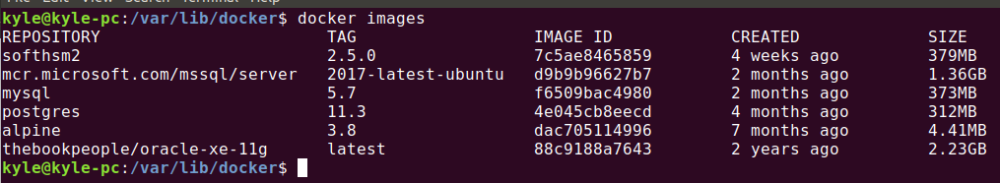
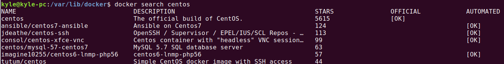

# Docker基础


## 状态查询

* systemctl命令查询服务状态

  ```
  启动docker: systemctl start docker
  停止docker: systemctl stop docker
  重启docker: systemctl restart docker
  查看docker状态: systemctl status docker
  开机自动启动docker: systemctl enable docker
  ```

* 查看当前安装Docker版本

  ```
  docker version
  ```

* Docker概要信息

  ```
  docker info
  ```

  

## 镜像操作


### Docker镜像

- Docker镜像是由文件系统叠加而成(是一种文件的存储形式)。最底端是一个文件引导系统,即bootfs,这
  很像典型的Linux/Unix的引导文件系统。Docker用户几乎永远不会和引导系统有什么交互。实际上,当一个
  容器启动后,它将会被移动到内存中,而引导文件系统则会被卸载,以留出更多的内存供磁盘镜像使用。
  Docker容器启动是需要的一些文件,而这些文件就可以称为Docker镜像。
- 可以把Docker镜像理解为一个Class，这个类是被封装好的。一个镜像可以产生很多的Container（容器）。就好比一个Class可以生成很多Object。
- 大多数用到的镜像都可以从dockerhub获得。

### 列出已经安装的镜像

```dockerfile
docker images
```



- REPOSITORY:镜像所在仓库的名称
- TAG:镜像标签(一般是版本号)
- IMAGE ID:镜像ID
- CREATED:镜像的创建日期
- SIZE:镜像大小

**只显示镜像ID**

```
docker images -q
```

镜像存在位置：

```
/var/lib/docker
```

每个镜像后面都有一个冒号和标签名（REPOSITORY：TAG），如果未指点标签名，默认是latest

### 搜索镜像

```
docker search [OPTIONS] imageName
```

- `docker search centos`

  

  - NAME:仓库名称
  - DESCRIPTION:镜像描述
  - STARS:关注度,反应一个镜像的受欢迎程度
  - OFFICIAL:是否官方
  - AUTOMATED:自动构建,表示该镜像由Docker Hub自动构建流程创建的

- OPTIONS 选项说明:

  - `-s` 列出关注数大于指定值的镜像

    ```
    docker search -s 100 centos
    ```

  - `--no-trunc` 显示完整的镜像描述DESCRIPTION

    ```
    docker search --no-trunc centos
    ```


### 拉取镜像

```
docker pull 镜像名:标签名
docker pull mysql:5.6
```


### 删除镜像

- 删除某一个镜像

  ```
  docker rmi 镜像ID
  ```

  

- 删除全部镜像

  ```dockerfile
  docker rmi `docker images -q`
  ```

  

## 容器操作


### 查看容器

- 查看正在运行的容器

  ```shell
  docker ps
  ```

  | CONTAINER ID | IMAGE | COMMAND  | CREATED  | STATUS   | PORTS  | NAMES    |
  | ------------ | ----- | -------- | -------- | -------- | ------ | -------- |
  | 容器 ID      | 镜像  | 初始命令 | 创建日期 | 容器状态 | 端口号 | 容器名字 |

- 查看所有容器

  ```
  docker ps -a
  ```

- 查看最后一次运行的容器

  ```
  docker ps –l
  ```

- 查看停止的容器

  ```
  docker ps -f status=exited
  ```

  

### 创建容器

- 命令

  ```
  docker run [OPTIONS] 镜像名:标签名
  ```

- 创建容器 [OPTIONS] 常用的参数说明:

  - **-i 表示交互式运行容器(就是创建容器后,马上会启动容器,并进入容器 ),通常与 -t 同时使用 。**
  - **-t 启动后会进入其容器命令行, 通常与 -i 同时使用; 加入 -it 两个参数后,容器创建就能登录进**
    **去。即分配一个伪终端。**
  - --name 为创建的容器指定一个名称 。
  - -d 创建一个守护式容器在后台运行,并返回容器ID;
    这样创建容器后不会自动登录容器,如果加 -i 参数,创建后就会运行容器。
  - -v 表示目录映射, 格式为: -p 宿主机目录:容器目录
    注意:最好做目录映射,在宿主机上做修改,然后共享到容器上。
  - -p 表示端口映射,格式为: -p 宿主机端口:容器端口

#### 交互式容器

> 说明: 就是创建容器后,马上会启动容器,并进入容器

1. 创建一个交互式容器并取名为 mycentos , ( **/bin/bash 是linux中的命令解析器,会进入到容器里面命令行**)

   ```
   docker run -it --name=mycentos centos:7 /bin/bash
   ```

2. 退出并停止当前容器, **注意在容器内部的命令行执行**

   ```
   exit
   ```

3. 退出不停止当前容器

   ```
   按键盘: Ctrl + p + q ,按一次一行,则多按几次,一般是连两次即可
   ```

总结: 同一个镜像, 可运行多个容器

#### 守护式容器

> 如果对于一个需要长期运行的容器来说,我们可以创建一个守护式容器(后台运行的容器)。

- 创建(-d)并运行(-i)守护式容器命令如下(容器名称不能重复):

  ```
  docker run -id --name=mycentos2 centos:7
  ```


### 登录容器

```
docker exec -it 容器名称|容器id /bin/bash
```

注意：

- exit 针对通过 docker exec 进入的容器,只退出但不停止容器
- 交互式容器通过 docker exec 进入容器后,使用 exit 也一样的只退出但不停止容器


### 启动与停止容器

- 启动已运行过的容器

  ```
  docker start 容器名称|容器id
  ```

- 启动所有运行过的容器(注意:反单引号\` \`), `docker ps -a -q` 是查询所有运行过的容器ID

  ```
  docker start `docker ps -a -q`
  ```

- 停止正在运行的容器(正常停止)

  ```
  docker stop 容器名称|容器id
  ```

- 强制停止正在运行的容器(一般不用此,除非卡了)

  ```
  docker kill 容器名称|容器id
  ```

- 停止所有在运行的容器

  ```
  docker stop `docker ps -a -q`
  ```

  

### 文件拷贝

> 如果我们需要将宿主机文件拷贝到容器内可以使用 docker cp 命令,也可以将文件从容器内拷贝到宿主机

- 将宿主机文件拷贝到容器内

  ```
  docker cp 要拷贝的宿主机文件或目录 容器名称:容器文件或目录
  docker cp mengxuegu mycentos2:/opt
  ```

- 从容器内文件拷贝到宿主机

  ```
  docker cp 容器名称:要拷贝的容器文件或目录 宿主机文件或目录
  docker cp mycentos2:/opt/mengxuegu /opt/mengxuegucopy
  ```

注意:文件拷贝 docker cp 命令 均在宿主机中操作


### 目录挂载

> 我们可以在创建容器的时候,将宿主机的目录与容器内的目录进行映射,这样我们就可以通过修改宿主机某
> 个目录的文件从而去影响容器。**使用 -v 选项**

1. 创建容器并挂载映射目录(使用 -v 宿主机目录:容器目录 )

   ```
   e.g: 创建容器时,将 宿主机目录/opt 挂载 容器目录/opt
   docker run -id -v /opt:/opt --name=mycentos3 centos:7
   ```

2. 目录挂载只读(Read-only)权限

   ```
   docker run -id -v /宿主机绝对路径目录:/容器内目录:ro --name=容器名 镜像名
   
   e.g: 
   docker run -id -v /dataHost:/dataContainer:ro --name=mycentos4 centos:7
   ```

3. 查看挂载的目录

   ```bash
   docker inspect --format='{{.Mounts}}' 容器名
   ```

4. **`--privileged=true`**

   ```bash
   有时候目录过长 或 在容器中需要root权限时，可以加上--privileged=true
   
   e.g:
   docker run -id --name=mxg_tomcat_new -p 8081:8080 -v \
   /usr/local/baseproject:/usr/local/tomcat/webapps --privileged=true tomcat_new:1
   ```


### 查看容器

- 查看容器运行内部细节

  ```
  docker inspect mycentos2
  ```

- 直接显示IP地址

  ```
  docker inspect --format='{{.NetworkSettings.IPAddress}}' mycentos2
  ```

  

### 删除容器

- 删除指定的容器 （注：只能删除停止的容器）

  ```
  docker rm 容器名称 | 容器ID
  ```

- 删除所有容器(其中运行中的容器无法删除,所以先停再删)

  ```
  docker rm `docker ps -a -q`
  ```

  

## 备份与迁移

### 容器保存为镜像

> 保存镜像分为2种，有挂载目录和无挂载目录。用下面命令查询容器有无挂载目录
>
> ```
> docker inspect --format='{{.Mounts}}' 容器名
> ```

**通过下面命令将容器保存为镜像**

```
docker commit [-m="提交的描述信息"] [-a="创建者"] 容器名称|容器ID 生成的镜像名[:标签名]
```

1. 无挂载目录， 直接commit

   ```
   docker commit mycentos2 mycentos_new:1.1
   ```

   

2. 有挂载目录

   > 问题： 如果Docker对容器挂载了数据目录, 在将容器保存为镜像时,数据不会被保存到镜像中。
   >
   > 原因：因为宿主机与容器做了路径映射,再commit一个新的镜像时,该路径下的所有数据都会被抛弃,不会
   > 被保存到新镜像中。可通过 `docker inspect --format='{{.Mounts}}' 镜像名` 查看是否有目录挂载.
   >
   > 解决:
   >
   > - **目录挂载方法**：先把在宿主机的数据备份在某个目录下,在 docker run 的时候使用-v参数将宿主机上
   >   的目录映射到容器里的目标路径中(tomcat是 /usr/local/tomcat/webapps ,mysql是var/lib/mysql )
   > - **拷贝方法**：先把在宿主机的数据备份在某个目录下。在容器运行以后，再通过拷贝的方法 docker cp 将备份的数据复制进容器里的目标路径中 (tomcat是 /usr/local/tomcat/webapps ,mysql是 var/lib/mysql )。

### 备份与恢复镜像

- 镜像压缩备份

  ```
  docker save -o mycentos.tar mycentos_new:1.1
  -o 指定输出到的文件
  ```

- 镜像还原

  ```
  docker load -i mycentos.tar
  ```

  

## Dockerfile编写镜像

### 什么是Dockerfile

Dockerfile 用于构建一个新的Docker镜像的脚本文件,是由一系列命令和参数构成的脚本。

- 构建新的镜像步骤:
  1. 编写 Dockerfile 文件
  2. 通过 docker build 命令生成新的镜像
  3. 通过 docker run 命令运行

- 例子

  ```bash
  1 FROM scratch # 基础镜像,scratch相当于java中的Object
  2 ADD centos-7-x86_64-docker.tar.xz /  # centos
  3
  4 LABEL org.label-schema.schema-version="1.0" \ # 标签说明
  5 		org.label-schema.name="CentOS Base Image" \
  6 		org.label-schema.vendor="CentOS" \
  7 		org.label-schema.license="GPLv2" \
  8 		org.label-schema.build-date="20190305"
  9
  10 CMD ["/bin/bash"]	# 默认执行的命令,创建运行容器时最后会加上 /bin/bash,
  11 						# 所以创建容器时,可不加 /bin/bash ,即如下:
  12 						# docker run -it --name=mycentos0 centos:7
  13 						# 如果加了,则在后面采用我们自己加的命令执行/bin/bash
  ```

  

### 语法规则

1. 每条指令的保留字都必须为**大写字母**且后面**至少要有一个参数**
2. 执行顺序按**从上往下**执行。
3. `\#` 用于注释
4. 每条指令都会创建一个新的镜像层,并对镜像进行提交


### 执行流程

1. Docker 从基础镜像运行一个容器
2. 执行每一条指定并对容器作出修改
3. 执行类似 docker commit 的操作提交一个新的镜像层
4. docker 再基于刚提交的镜像运行一个新容器
5. 执行 Dockerfile 中的下一条指令直到所有指令都执行完成


### 常用命令

| 指令(大写的是保留字)                 | 作用                                                         | 参考      |
| ------------------------------------ | ------------------------------------------------------------ | --------- |
| `FROM image_name:tag`                | 基础镜像,基于哪个基础镜像启动构建流程                        |           |
| `MAINTAINER user_name`               | 镜像的创建者的姓名和邮箱地址等                               | contos6.8 |
| `COPY source_dir/file dest_dir/file` | 和ADD相似,但是如果有压缩文件并不能解压                       | contos6.8 |
| `ADD source_dir/file dest_dir/file`  | 将宿主机的文件复制到容器内,如果是一个压缩文件, 将会在复制后自动解压 | contos6.8 |
| `ENV key value`                      | 设置环境变量 (可以写多条)                                    | tomcat7   |
| `RUN command`                        | 是Dockerfile的核心部分(可以写多条),运行到当前行要执行的其他命令(可想象成sout("aaa") ) | tomcat7   |
| `WORKDIR path_dir`                   | 设置工作目录,当创建容器后,命令终端默认登录进来后所在的目录。未指定则为根目录 `/` | tomcat7   |
| `EXPOSE port`                        | 当前对外暴露的端口号,使容器内的应用可以通过端口和外界交互    | tomcat7   |
| `CMD argument`                       | Dockerfile中可以有多个CMD,但是只有最后一个会生效。在构建容器时,会被 docker run 后面指定的参数覆盖。 | tomcat7   |
| `ENTRYPOINT argument`                | 和CMD相似,但是并不会被docker run指定的参数覆盖,而是追加参数  |           |
| `VOLUME`                             | 将宿主机文件夹挂载到容器中                                   |           |


