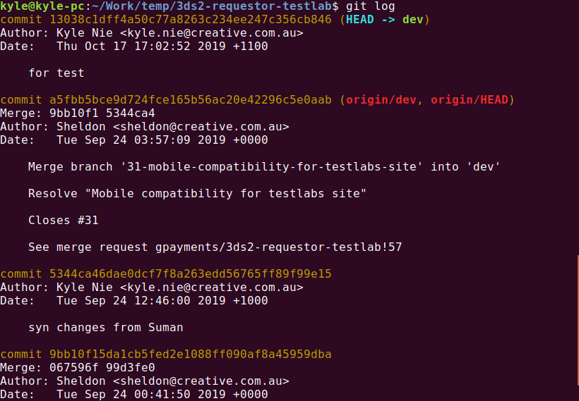

# Git基础

## Git工作区

- Git在本地有三种区域：**工作区, 暂存区 和 本地仓库。**
  - 工作区:表示新增或修改了某个文件,但还没有提交保存;
  - 暂存区:表示把已新增或修改的文件,放在下次提交时要保存的清单中;
  - 本地仓库:文件已经被安全地保存在本地仓库中了。


- Git文件commit文件以后，可以push到远程代码托管平台（github，gitlab）。也可以从远程托管平台clone或pull代码。


## git init

初始化本地仓库： `git init`

- 注意:` .git `目录中存放的是本地库相关核心配置文件,也不要随意删除与修改
- `.git` 目录仓库目录说明:
  - hooks目录: 脚本文件的目录
  - info目录: 保存了不希望在 .gitignore 文件中管理的忽略模式的全局可执行文件
  - logs目录:日志目录
  - objects目录:存储所有数据内容
  - refs目录:存储指向数据(分支)的提交对象的指针
  - config文件包含了项目特有的配置选项
  - description文件仅供 GitWeb 程序使用
  - HEAD文件指向当前分支


## git status

查看工作区状态：`git status`


## git add/git rm

- 文件添加到暂存区：`git add <file name>`


- 恢复，不放到暂存区： `git rm --cached <file name>`


## git commit

将暂存区的内容提交到本地库：`git commit [-m "提交说明信息"] <file name>`


## git log

- 查看日志信息：`git log`

  

  - 如果内容太长, 多屏显示控制方式:
    - 空格键: 向下查看
    - b : 向上查看
    - q : 退出查看

- 以漂亮的格式显示：即每条日志只显示一行：`git log --pretty=oneline`

  

- 简约格式显示：`git log --oneline`

  

- **显示回滚版本步数** [推荐]：`git reflog`

  

- > 基于HEAD指针来移动回滚版本

  - 基于索引值操作[推荐方式]
    - 命令: `git reset --hard <局部索引值>`
    - 举例: git reset --hard 64d3d2a
  - 使用`^` (异或)符号: 只能后退
    - 命令：`git reset --hard HEAD^`
    - 注：一个`^`表示后退1步，n个表示后退n步
  - 使用`~`符号： 只能后退
    - 命令：`git reset --hard HEAD~n`
    - 注： n指定步数，表示后退n步

## git branch

- 查看分支：`git brach`
- 查看所有分支（包括远程库的）：`git branch -a`
- 创建分支（本地）：`git brach <新分支名>`
- 删除分支：`git branch -d <分支名>`


## git checkout

> Git checkout命令用于切换分支

- 切换到本地已有的分支

  ```
  git checkout <本地分支名>
  
  这里的分支名字是本地存在的分支名字
  ```

  

- 切换到远程的分支

  ```
  git checkout <远程分支名>
  
  注：这里可以不创建本地分支名字，直接填写远程分支名。Git会自动在本地创建一个一样的分支名并且自动用于track远程的相应分支。然后switch到本地的新创建的分支。
  注：checkout过去以后，还没有更改本地文件。需要pull才能把远程文件pull到本地。
  ```

  


## git pull

> 拉去远程文件到本地

- `pull`拉去操作其实是两步：`pull` = `fetch` + `merge`

- `fetch` ：只把远程库中的内容下载到本地，但是没有改变本地工作区的文件。

  

- `merge`：把远程代码合并到本地代码中

  

- 针对没有冲突的操作，可以直接用`pull`操作。


## git push

- 命令：`git push [远程库别名] [分支名]`
  - 注：这个命令是把自己所在的本地分支push到远程相应分支上面去
  - 注：如果本地branch已经trach了一个远程的分支，那么可以直接`git push`


