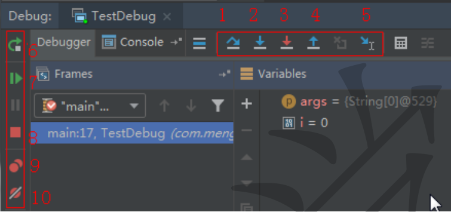
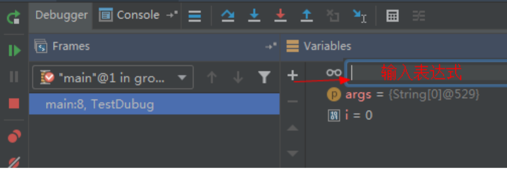

# Intellij Idea基础


## 常用快捷键

| 说明                                         | 快捷键                                  |
| -------------------------------------------- | --------------------------------------- |
| 单行注释                                     | Ctrl + /                                |
| 复制当前行到下一行                           | Ctrl + d                                |
| 删除当前当标所在行                           | Ctrl + y                                |
| 向上移动当前行内容                           | Shift + Alt + ↑  **(Shift + Ctrl + ↑)** |
| **快速开启下一行**                           | Shift + Enter                           |
| **编辑窗口中的上（下）一个页面**             | alt + ← ; alt + →                       |
| 按顺序返回之前进入的页面                     | Shift + alt + ←                         |
| 格式化代码(reformat code)                    | Ctrl + Alt+ L                           |
| **查看可重写的方法**                         | Ctrl + O                                |
| **大写转小写/小写转大写(toggle case)**       | Ctrl + Shift + u （Alt + u）            |
| 生成构造器setter/getter/toString等(generate) | Alt+Insert                              |
| **查看类中的所有方法**                       | Alt + 7                                 |
| **查看类的继承结构**                         | Ctrl+h                                  |
| **查看方法的被哪里引用**                     | Ctrl+Alt+h **（Shift+Alt+7）**          |
| **进入到实现类的方法**                       | Ctrl+Alt+单击方法名                     |
| **抽取方法(Extract Method)**                 | Ctrl+Alt+m                              |
| **打开最近修改的文件(Recently Files)**       | Ctrl+e                                  |
| 生成 try-catch、if (surround with)           | Ctrl+Alt+t  **(Alt+t)**                 |
| 关闭当前打开的文件(close)                    | Ctrl + F4                               |


## 常用代码模板

| 简写       | 生成的模板代码                                               |
| ---------- | ------------------------------------------------------------ |
| `psvm`     | `public static void main(String[] args){ }`                  |
| `sout`     | `System.out.println();`                                      |
| `fori`     | `for (int i = 0; i < ; i++) { }`                             |
| `iter`     | 生成增强 `for` 循环 `for (String s : list) { }`              |
| `list.fo`r | 可生成集合 `list` 的 增强 `for` 循环。 `List<String> list = new ArrayList<String>(); `输入: `list.for` 可输出: `for (String s: list) {}` |
| `ifn`      | `if (var == null) { }`                                       |
| `psf`      | `public static final`                                        |
| `psfs`     | `public static final String`                                 |
| `psfi`     | `public static final int`                                    |


## 断点调试快捷键







## 设置技巧

### 自动删除没用到的包

```
Editor -> General -> Auto Import -> [click]Optimize imports on the fly
```

### 显示行号和方法分隔符

```
Editor -> General -> Appearance -> [click]Show line numbers
```

```
Editor -> General -> Appearance -> [click]Show method separators
```

### 更改软件内存占用

```
Help -> Change memory settings
```


