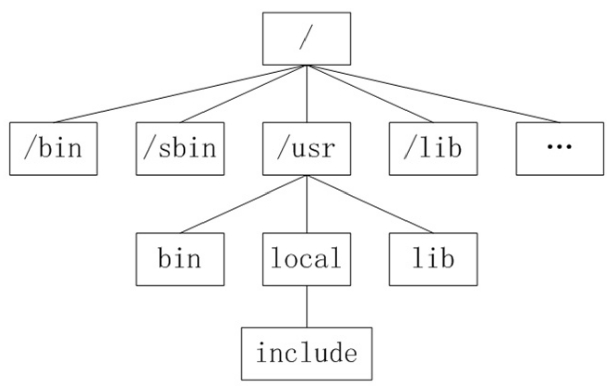

# $Linux基础

## 常用命令

| 命令           | 说明                                  | 例子                                                         |
| :------------- | ------------------------------------- | ------------------------------------------------------------ |
| `cat`          | 查看小文件内容                        | `cat -n 123.txt`                                             |
| `more`         | 查看大文件内容                        | `more System.map-3.10.0-123.el7.x86_64`                      |
| `head`         | 查看文件的前面N行                     | `head -20 System.map-3.10.0-123.el7.x86_64`                  |
| `tail`         | 查看文件的后面N行                     | `tail -f access.log ;tail -20 access.log`                    |
| `touch`        | 创建一个空文件                        | `touch 123.txt`                                              |
| `cp`           | 拷贝文件                              | `cp 123.txt class/ ; cp -a 123.txt class/789.txt`            |
| **`mv`**       | 移动或更名现有的文件或目录            | `mv 123.txt 345.php ;mv 789.txt /home/987.php`               |
| `rm`           | 删除文件或目录                        | `rm 987.php ;rm -rf 456.txt`                                 |
| `diff`         | 对比文件差异                          | `diff 123.txt 456.txt`                                       |
| `ssh`          | 远程安全登录方式                      | `ssh 192.168.226.131`                                        |
| `exit`         | 退出命令                              |                                                              |
| `id`           | 查看用户                              | `id root`                                                    |
| `uname`        | 查询主机信息                          | `uname -a`                                                   |
| `echo`         | 标准输出命令。                        | `echo "this is echo"`                                        |
| **`man`**      | 查看帮助文档                          | `man ls`                                                     |
| `help`         | 查看内部命令帮助                      | `help if`                                                    |
| `who`          | 当前在本地系统上的所有用户的信息      | `whoami ; who`                                               |
| `uptime`       | 查询系统信息                          | 注：`load average: 0.00, 0.01, 0.05` 1分钟的负载,5分钟的负载,15分钟的负载 |
| `w`            | 查询系统信息                          |                                                              |
| `free`         | 查看系统内存                          | `free -h ; free -m`                                          |
| `wc`           | 统计行                                | `wc -l 123.txt`                                              |
| **`grep`**     | 查找文件里符合条件的字符串            | `grep '119.4.253.206' 123.txt`<br> `-n:输出行数 grep -n '80.82.70.187' 123.txt`<br/>`-w:精确匹配 grep -w '113.66.107.198' 123.txt`<br/>`-i:忽略大小写 grep -i 'IP:113.66.107.198' 123.txt`<br/>`-v:反向选择 grep -v '113.66.107.198' 123.txt` |
| `find`         | 查询文件                              | `find / -name -type f 123.txt`                               |
| `uniq`         | 对排序好的内容进行统计                | `uniq -c 123.txt | sort -n`                                  |
| **`df`**       | 文件系统的磁盘使用情况统计            | `df -h`                                                      |
| **`netstat`**  | 查看网络端口的使用情况                | `netstat -tunlp | grep nginx`<br>`-t :显示tcp端口`<br/>`-u :显示UDP端口`<br/>`-n :指明拒绝显示别名`<br/>`-l :指明listen的`<br/>`-p :指明显示建立相关连接的程序名` |
| `hostname`     | 查看主机名                            |                                                              |
| `ps`           | 显示所有进程信息                      | `ps -ef | grep nginx`<br>`ps -aux | grep nginx`              |
| `kill`         | 杀进程                                | `kill -9 top`                                                |
| `top`          | 监控Linux系统状况,比如cpu、内存的使用 | 按住键盘q退出                                                |
| `du`           | 统计大小                              | `du -sh ; du -sm *`                                          |
| `firewall-cmd` | 查看防火墙的状态                      | `firewall-cmd --state`                                       |
| **`echo &?`**  | 判断上一条命令是否正确                |                                                              |
| `cal`          | 查看日历                              | `cal 2008`                                                   |
| **`which`**    | 查看命令执行目录                      | `which mysql`                                                |
| **`whereis`**  | 查看命令的所有安装目录                | `whereis mysql`                                              |
| **`subl`**     | 用Sublime打开文档                     | `subl .`打开Sublime在当前文件夹<br />`subl a.txt`打开a.txt文件 |
|                |                                       |                                                              |


## 目录分类




* /: 根目录,一般根目录下只存放目录,不要存放文件,也不要修改,或者删除目录下的内容
* /mnt: 测试目录
* /root: root用户的家目录
* /home: 普通用户的家目录
* /tmp: 临时目录(比如文件上传时)
* /var: 存放经常修改的数据,比如程序运行的日志文件
* /boot: 存放的启动Linux 时使用的内核文件,包括连接文件以及镜像文件
* /etc: 系统默认放置配置文件的地方
* /bin: 所有用户都能执行的程序
* /sbin: 只有root才能执行的程序
* /usr: 用户自己的软件都可以放到这儿来
* /dev: 存放硬件设备的地方(/dev/cdrom)
* /media: 挂载光盘使用的
  * 挂载光盘: mount /dev/cdrom /media
  * 卸载光盘: umount /dev/cdrom


## vi编辑器

* vi的基本概念:(三种模式)
  * 命令模式
  * 插入模式
  * 底行模式

```
进入插入模式: 按住键盘的 i 或者 o 或者 a
进入命令模式: 按住键盘的左上角esc键
进入底行模式: 前提是得在命令模式,输入 : 进入
```

* 在命令行模式中的操作:

```
$ #移动到这一行的行尾
gg #移动到文档第一行行首
G #移动到文档最后一行行首
x #删除内容,删除一个字符
dd #删除游标所在的那一整行
u #复原原来的操作
v #选中范围按y即复制
p #粘贴
```

* 在底行模式中的操作:

```
n #n为数字。光标移动到第n 行
/ #寻找内容
%s/word1/word2/g #从第一行到最后一行寻找 word1 字符串,并将该字符串取代为 word2
n1,n2s/word1/word2/g #n1 与 n2 为数字。在第 n1 与 n2 行之间寻找 word1 这个字符串,并将该字符串取代
为 word2

set nu= #显示行号
set nonu #取消行号
q! #强制离开不保存
wq #离开并保存
wq! #强制离开并保存
!ls #暂时离开
```


## 文件属性与权限

* 文件的属性: ls -lrti

```
135088935 -rw-------. 1 root root 1778 Oct 1 2020 yum.log
第一列: i节点;i节点可以理解文件id,一个i节点号可以对应多个文件,一个文件只能对应一个i节点号
第二列: 文件的类型与权限
	- #代表的是文件; d #代表是目录; l #软链接文件; b #代表块设备; c #代表的是硬件		设备(键盘)
	r:表示读权限 ;w:表示写权限;x:表示执行权限
	4:表示读权限 ;2:表示写权限;1:表示执行权限
	rw-------:分为三列 rw-  --- ---,
	第一列为所属者的权限,第二列为所属组的权限,第三列为其它的权限
	每一列三个数值（---）分别对应r，w，x；-为没有权限（0），非-为有权限（1）
	也可以用数字表示 r：4，w：2，x：1，及对应（000 - 111）也就是0-7
第三列:有多少文件名链接到这个节点
第四列:文件的所有者
第五列:文件的所有组
第六列:容量大小,单位默认为B
第八列:创建或最近修改的时间
第九列:文件名
```

* 修改文件的权限命令chmod：

  * -R #递归的意思

  * chmod -R 777 /home/XD/*

  * 这里777对应的为（111 111 111）及 （rwx rwx rwx）及读写执行权限

    ```
    eg:
    chmod u+x,g+w,o+w boot.log
    chmod u-x,g-w,o-w boot.log
    chmod 777 boot.log
    ```


## 压缩与解压

* 压缩： tar -zcf  压缩后的文件名(.tar.gz)  被压缩的文件

  ```
  eg: tar -zcf vmware-tools.tar.gz vmware-tools-distrib
  -z #以gzip方式归档压缩 （-J #以xz方式进行归档压缩）
  -c #创建新文件
  -f #指定文件格式
  -v #显示详细过程
  ```

* 解压：tar -xf  文件名

  ```
  eg: tar -xf vmware-tools.tar.xz
  -x #解档解压操作
  -C #指定解压路径
  ```


## telnet与scp

* telnet命令: 主要用于测试到某台机器的某个端口是否畅通
* telnet命令用法:
  * telnet IP地址 端口 （注： 这里的分割符是空格）
  * 应用场景: 测试某个端口是否畅通

* scp命令: 用于服务器之间的文件或者文件目录拷贝

  * 用法1: 从本机拷贝文件到别的机器 scp 本机文件的存放路径 root@服务器IP:服务器目标路径

    ```
    eg:从192.168.72.128这台机器的/root/VMwareTools-10.2.0-7259539.tar.gz文件拷贝到192.168.72.129的/root/下
    scp /root/VMwareTools-10.2.0-7259539.tar.gz root@192.168.72.129:/root/
    ```

  * 用法2: 从别的机器拷贝文件到本地目录 scp root@服务器IP:服务器目标路径 本机文件的存放路径

    ```
  eg:从192.168.72.129这台机器的/root/VMwareTools-10.2.0-7259539.tar.gz文件拷贝到192.168.72.128的/root/下
    scp root@192.168.72.129:/root/VMwareTools-10.2.0-7259539.tar.gz /root/
    ```

  * -r参数: 递归的作用(可以拷贝目录)

    ```
  eg:
    scp -r vmware-tools-distrib root@192.168.72.129:/root/
    ```
  


## Alias

> 设置命令别名

```
临时设置别名:
alias vinet='vi /etc/sysconfig/network-scripts/ifcfg-eno16777728'
查看别名:
alias
取消临时别名:
unalias vinet


永久设置别名:vi /root/.bashrc
alias vinet='vi /etc/sysconfig/network-scripts/ifcfg-eno16777728'
加载使立即生效:
source /root/.bashrc
```


## FTP

- FTP文件服务器概述:

  ```
  是一种文件传输服务器,默认使用TCP协议的20、21端口与客户端进行通信,
  20端口用于建立数据连接,并传输文件数据;
  21端口用于建立控制连接,并传输FTP控制命令;
  ```

- TP数据连接分为主动模式和被动模式:

  ```
  主动模式:服务器向客户端主动发起数据连接(PORT 模式)
  被动模式:客户端向服务器主动发起数据连接(PASV 模式)
  ```

- FTP服务器软件的种类

  ```
  凡是可通过文件传输协议(File Transport Protocol)下载文件服务器上的文件,以实现资源共享的,我们称之为
  ftp服务器
  
  FTP服务器软件包括FileZilla Sener、Serv-U、IIS等。而在Linux系统中,vsftpd是目前在Linux/UNIX领域
  应用比较广泛的一款FTP服务软件,特点是速度快,安全易用,并发量高,可以支持15000个用户并发连接
  ```

- FTP用户类型:

  ```
  匿名用户:就是不需要用户名,密码。就能登录到服务器电脑里面
  
  本地用户:需要帐户名和密码才能登录。而且,这个帐户名和密码,都是在你 linux 系统里面,已经有的用户
  
  虚拟用户:同样需要用户名和密码才能登录。但是和上面的区别就是,在linux 系统中是没有该用户帐号
  ```

- 搭建匿名访问 vsftpd 服务: (默认用户访问目录`/var/ftp`)

  ```
  检查是否已经安装vsftpd软件包:
  rpm -qa vsftpd
  
  yum 安装 vsftpd:
  yum -y install vsftpd
  
  查找 vsftpd 的文件位置:
  whereis vsftpd
  
  启动 ftp 服务:
  systemctl start vsftpd
  
  查看监听的端口号:
  netstat -tunlp | grep vsftpd
  
  查看防火墙的状态:
  firewall-cmd --state
  
  创建测试文件:
  mkdir -p /var/ftp/pub/ && echo "this is ftptest" >test.txt
  
  使用 windows 客户端访问:
  ftp://192.168.10.100/
  
  安装 FTP 客户端工具:
  yum -y install ftp
  
  连接vsftpd:
  ftp 192.168.10.100
  
  下载文件:
  get test.txt
  
  上传文件:
  put test.txt
  
  退出:
  quit 或者 exit
  ```

- 配置本地用户访问 vsftpd 服务:

  ```
  关闭之前的匿名访问:
  vi /etc/vsftpd/vsftpd.conf #编辑配置文件
  anonymous_enable=NO
  
  systemctl restart vsftpd #重新启动服务
  
  mkdir -p /var/ftp/html #创建目录
  
  useradd -g root -M -d /var/ftp/html -s /sbin/nologin ftptest #添加系统用户
  
  chown -R ftptest:root /var/ftp/html #配置权限
  
  passwd ftptest #设置密码
  
  cd /var/ftp/html && echo "this is ftptest" >ftptest.txt #添加测试文件
  
  使用 windows 客户端访问:
  ftp://192.168.10.100/
  ```

- 配置文件`/etc/vsftp/vsftpd.conf `的一些常用权限解释:

  ```
  anonymous_enable=YES 允许匿名用户访问
  write_enable=YES 允许登录用户有写权限。属于全局设置
  anon_root=var/ftp 指定匿名用户登录的目录
  anon_upload_enable=YES 允许匿名用户有上传文件的权限
  anon_mkdir_write_enable=YES 允许匿名用户有新增目录的权限
  chown_username=username 设置匿名用户上传文件的属主名
  ```

  

### Ubuntu配置

> 配置Ubuntu匿名用户


- 安装`vsftpd`

  ```
  apt-get安装：
  sudo apt-get update
  sudo apt-get install vsftpd
  
  echo $? #查看上一步结果，0为运行正确
  ```

  

- 查找`vsftpd`文件属性

  ```
  whereis vsftpd #查看vsftpd安装路径
  
  eg：whereis vsftpd
  vsftpd: /usr/sbin/vsftpd /etc/vsftpd.conf /usr/share/man/man8/vsftpd.8.gz
  ```

  

- 开启`vsftpd`服务

  ```
  sudo systemctl start vsftpd #开启服务
  
  ps -ef | grep vsftpd #查看进程
  sudo netstat -tunlp | grep vsftpd #查看监听端口
  
  sudo systemctl status vsftpd #查看服务状态
  
  sudo systemctl restart vsftpd #重启服务
  
  注意：
  这里不调用sudo systemctl enable vsftpd 来开机启动这个服务
  这里传输完成，可以关闭服务sudo systemctl stop vsftpd
  ```

- 开启匿名登录

  ```
  sudo vi /etc/vsftpd.conf
  更改为：anonymous_enable=YES
  
  注意：
  1. 这里匿名用户默认文件地址是 /srv/ftp
  2. 这里若改动默认文件地址（anon_root=var/ftp），可能导致服务启动出错
  ```

- 重启服务`sudo systemctl restart vsftpd`

- 创建共享pub文件夹并赋予权限

  ```
  cd /srv/ftp/
  sudo mkdir pub
  sudo chmod 777 /srv/ftp/pub
  
  ll /srv/ftp #查看权限
  drwxrwxrwx 2 root root 4096 Oct 19 01:46 pub/
  ```

- 查看IP地址并登录

  ```
  ip addr #找到IP地址
  链接网址：ftp://ip
  ```

- 可以用cp命令拷贝文件到上面pub目录，然后用client端链接下载


# Shell


## 简介

Shell是一种脚本语言,又是一种命令语言。可以通俗一点来讲,Shell脚本就是一系列命令的集合,可以在
Unix/linux上面直接使用,并且直接调用大量系统内部的功能来解释执行程序把一些重复性工作交给shell做,来实
现自动化运维。

Shell 虽然没有C/C++、Java、Python等强大,但也支持了基本的编程元素。例如:if、for、while、case等循
环,还有变量、数组、字符串、注释、加减乘除逻辑运算等。

其他脚本语言包括`perl, php, python`

- shell的优点:
  - 易用 #直接在linux系统上使用,不需要编译
  - 高效 #程序开发的效率非常高,依赖于功能强大的命令可以迅速地完成开发任务
  - 简单 #语法和结构比较简单,易于掌握
- shell应用场景:
  - 监控linux系统的健康度
  - 数据的处理 #日志的切割、分析、统计等
  - 与数据库交互 #对数据库进行增,删,改,查等操作
  - 监控进程,自动化启停服务
  - 完成一些重复性的工作

## 简单例子

- 编写: `vi first.sh`

  ```
  #!/bin/bash
  # 作者:小C
  # 编写时间:2019-08-20
  # 功能:this is my first shell !
  echo "this is my first shell !"
  ```

  > 这里shell脚本声明用`#!/bin/bash`，这是声明这个脚本的语言是`shell`（`#！`是声明，不是注释）
  >
  > 声明bash有3种：
  >
  > - ```bash
  >   #!/usr/bin/env bash
  >   ```
  > ```
  > 
  > - ```
  > #!/usr/bin/bash 
  > ```
  >
  > - ```
  >   #!/bin/bash
  >   ```
  > ```
  > 
  > `#!/usr/bin/env bash`声明用的是环境变量中的bash，`#!/usr/bin/bash`声明用的是`/usr/bin/`目录下的`bash`，`#!/bin/bash`声明用的是`/bin/`目录下的bash。`#!/usr/bin/env bash`比较灵活，只要系统设置了环境变量，就可以用到。`#!/usr/bin/bash`限制了用户可以用，更安全，但是有可能有些用户没有`bash`。`#!/bin/bash`是一定存在的。
  > 
  > 
  > 
  > 注意：
  > 
  > `#!/bin/bash`是默认解释器，除此之外，还有：`#!/bin/ksh`，`#!/bin/bsh`，`#!/bin/sh`
  > ```

- 执行：

  ```
  sh first.sh
  
  chmod 755 first.sh
  ./first.sh
  ```

   

## 变量

变量可以直接赋值

```
a=15
echo $a
```

常见变量：

- `$?`: 上一条命令是否执行正确，0为正确，其余为错误
- `$0`: 返回脚本的文件名称
- `$1-$9`: 返回对应的参数值
- `$*`: 返回所有的参数值是什么
- `$#`: 返回参数的个数和

```
#!/bin/bash
# by xiao C 2018-12
# test
echo "脚本:$0"
echo "第一个参数是:$1"
echo "第二个参数是:$2"
echo "所有参数是什么:$*"
echo "一共有多少参数:$#"
```


## 符号

```bash
- >：输出重定向到指定文件，#会覆盖原有的内容
- >>: 输出重定向到指定文件, #不会覆盖原有的内容
- ;: 执行多条命令
- |: 管道符
- &&: 前面的命令执行成功,后面的才可以执行 #特别注意：这里的&&和||符号与编程语言中的意思不太一样？？
- ||: 前面的命令执行失败,后面的才可以执行
- "": 会输出变量值 #在里面写$a会返回对应的值
- '': 输出本身 #在里面写什么就会输出什么。比如，写$a就会打印出$a
- ``: 输出命令结果 eg:a=`date`;echo $a #注：这里符号可以是`` 也可以是$()
- 2>/dev/null: 错误输出到无底洞
- 1>/dev/null: 正确输出到无底洞
```


## 运算符

> 整数

```bash
整数运算语法有三种：
1. expr 12 + 6  #用expr表达式 注：expr表达式数字与符号之间必须要有空格
2. echo $[12 + 6] #用方括号$[]，里面可以直接写表达式
3. echo $((12 + 6)) #$(()),同$[]，里面也可以直接写表达式

e.g:
	加:	expr 12 + 6 		expr $a + $b
		 echo $[12 + 6] 	 echo $[a + b]
		 echo $((12 + 6)) 		echo $((a + b))
		 
	减:	expr 12 - 6			expr $a - $b
		echo $[12 - 6] 		echo $[a - b]
		echo $((12 - 6))	 echo $((a - b))
		
	乘:	expr 12 \* 6		expr $a \* $b
		echo $[12 * 6] 		echo $[a * b]
		echo $((12 * 6)) 	echo $((a * b))
		
	除:	expr 12 / 6			expr $a / $b
		echo $((12 / 6)) 	echo $((a / b))
		echo $[12 / 6] 		echo $[a / b]
		
	求余:	expr 12 % 6			expr $a % $b
		echo $((12 % 6)) 	echo $((a % b))
		echo $[12 % 6] 		echo $[a % b]
```

> 小数：小数不能用上面的运算方法，需要用到linux自带的bc运算器

```bash
bc计算器：
e.g： echo "0.2+0.3" | bc
	  .5  #注：bc运算器结果会默认省略小数点前面的0
	  
保留多少位小数可以通过scale
但是scale只对除法,取余数,乘幂 有效,对加减没有效。
echo "scale=2;(0.2+0.3)/1" | bc #计算出0.2+0.3的和并保留俩位小数,此时bc计算器会省略掉个位数的0
echo "scale=2;(1.2+1.3)/1" | bc #计算出1.2+1.3的和并保留俩位小数
```


## 条件判断

- 语法： `[ 表达式 ]`  #注：这里表达式要写到方括号内，并且方括号内部两侧要**有空格**

  ```
  文件(夹)或者路径:
  -e 目标是否存在(exist)
  -d 是否为路径(directory)
  -f 是否为文件(file)
  
  [ -e foer.sh ] || touch foer.sh
  #判断当前目录下是否有foer.sh这个文件,假如没有就创建出foer.sh文件
  ```

  

- 权限:

  ```
  -r 是否有读取权限(read)
  -w 是否有写入权限(write)
  -x 是否有执行权限(excute)
  
  [ -x 123.txt ] && echo '有执行权限'
  ```

  

- 整数值(int型):

  ```bash
  -eq 等于(equal)
  -ne 不等于(not equal)
  -gt 大于(greater than)
  -lt 小于(lesser than)
  -ge 大于或者等于(greater or equal)
  -le 小于或者等于(lesser or equal)
  
  [ 9 -gt 8 ] && echo '大于'
  
  #注：方括号表达式里面，判断大于小于，需要用上述-eq方法，不能用 > or < 等符号。如果需要用符号，可以用(())表达式。
  #e.g： [ 9 -gt 8 ] 等于 (( 9>8 ))
  ```

  

- 小数(浮点型):

  ```
  用bc计算器来判断
  bc计算器判断大于小于 1=true 0=false
  
  [ `echo '1.2 < 1.3' | bc` -eq 1 ] && echo '小于'
  ```

  

- 字符串:

  ```
  = 相等
  != 不相等
  [ 'kkkkk' != 'kkkk' ] && echo '不等于'
  ```

  

## 输入输出

- 输入read

  ```
  read [-p] "提示" 存储变量
  
  -p:给出提示符。默认不支持"\n"换行
  -s:隐藏输入的内容
  -t:给出等待的时间,超时会退出read
  -n:限制读取字符的个数,触发到临界值会自动执行
  
  e.g:
  #!/bin/bash
  read -p "请输入您的密码:" pass
  echo $pass
  ```

  

- 输出echo

  ```
  语法: echo -e "\033[字背景颜色;字体颜色;特效字符串\033[关闭属性"
  
  #字体色范围:30-37
  echo -e "\033[30m 黑色字 \033[0m"
  echo -e "\033[31m 红色字 \033[0m"
  echo -e "\033[32m 绿色字 \033[0m"
  echo -e "\033[33m 黄色字 \033[0m"
  echo -e "\033[34m 蓝色字 \033[0m"
  echo -e "\033[35m 紫色字 \033[0m"
  echo -e "\033[36m 天蓝字 \033[0m"
  echo -e "\033[37m 白色字 \033[0m"
  #字背景颜色范围:40-47
  echo -e "\033[40;37m 黑底白字 \033[0m"
  echo -e "\033[41;30m 红底黑字 \033[0m"
  echo -e "\033[42;34m 绿底蓝字 \033[0m"
  echo -e "\033[43;34m 黄底蓝字 \033[0m"
  echo -e "\033[44;30m 蓝底黑字 \033[0m"
  echo -e "\033[45;30m 紫底黑字 \033[0m"
  echo -e "\033[46;30m 天蓝底黑字 \033[0m"
  echo -e "\033[47;34m 白底蓝字 \033[0m"
  # 特效范围
  echo -e "\033[0m 无任何特效 \033[0m"
  echo -e "\033[1m 高亮度 \033[0m"
  echo -e "\033[4m 下划线 \033[0m"
  echo -e "\033[5m 闪烁 \033[0m"
  
  
  e.g:
  #!/bin/bash
  # by xiao C 2018-12
  # test
  
  # 字体色范围:30-37
  echo -e "\033[30m 黑色字 \033[0m"
  echo -e "\033[31m 红色字 \033[0m"
  echo -e "\033[32m 绿色字 \033[0m"
  echo -e "\033[33m 黄色字 \033[0m"
  echo -e "\033[34m 蓝色字 \033[0m"
  echo -e "\033[35m 紫色字 \033[0m"
  echo -e "\033[36m 天蓝字 \033[0m"
  echo -e "\033[37m 白色字 \033[0m"
  # 字背景颜色范围:40-47
  echo -e "\033[40;37m 黑底白字 \033[0m"
  echo -e "\033[41;30m 红底黑字 \033[0m"
  echo -e "\033[42;34m 绿底蓝字 \033[0m"
  echo -e "\033[43;34m 黄底蓝字 \033[0m"
  echo -e "\033[44;30m 蓝底黑字 \033[0m"
  echo -e "\033[45;30m 紫底黑字 \033[0m"
  echo -e "\033[46;30m 天蓝底黑字 \033[0m"
  echo -e "\033[47;34m 白底蓝字 \033[0m"
  # 特效范围
  echo -e "\033[0m 无任何特效 \033[0m"
  echo -e "\033[1m 高亮度 \033[0m"
  echo -e "\033[4m 下划线 \033[0m"
  echo -e "\033[5m 闪烁 \033[0m"
  ```

  

## 数据处理

### grep

- 对数据进行 行的提取

- 语法: grep [选项]...[内容]...[file]

  ```
  -v #对内容进行取反提取
  -n #对提取的内容显示行号
  -w #精确匹配
  -i #忽略大小写
  ^ #匹配开头行首
  -E #正则匹配
  
  e.g:
  grep -n 'user' /ect/passwd
  grep -niv 'user' /ect/passwd
  ```

  

### cut

- 对数据的列 进行提取

- 语法：cut [选项] ... [file]

  ```
  -d #指定分割符
  -f #指定截取区域
  -c #以字符为单位进行分割
  
  
  注意:不加-d选项,默认为制表符（Tab）,不是空格
  /bin/bash #代表可以登录的用户
  /sbin/nologin #代表不可以登录的用户
  
  -d与-f
  eg:
  以':'为分隔符,截取出/etc/passwd的第一列跟第三列
  cut -d ':' -f 1,3 /etc/passwd
  
  eg:
  以':'为分隔符,截取出/etc/passwd的第一列到第三列
  cut -d ':' -f 1-3 /etc/passwd
  
  eg:
  以':'为分隔符,截取出/etc/passwd的第二列到最后一列
  cut -d ':' -f 2- /etc/passwd
  
  -c
  eg:
  截取/etc/passwd文件从第二个字符到第九个字符
  cut -c 2-9 /etc/passwd
  
  eg:比如领导想叫你截取linux上面所有可登陆普通用户
  grep '/bin/bash' /etc/passwd | cut -d ':' -f 1 | grep -v root
  ```

  

### awk

> awk的简介:其实一门编程语言,支持条件判断,数组,循环等功能,与grep,sed被称为linux三剑客
> 之所以叫AWK是因为取其三位创始人 Alfred Aho,Peter Weinberger, 和 Brian Kernighan 的Family Name的
> 首字符

- awk的应用场景:通常对数据进行列的提取

- 语法:

  ```
  awk '条件 {执行动作}'文件名
  awk '条件1 {执行动作} 条件2 {执行动作} ...' 文件名
  或awk [选项] '条件1 {执行动作} 条件2 {执行动作} ...' 文件名
  ```

- 特殊要点与举例说明:

  ```bash
  printf #格式化输出,不会自动换行。
  		%s:字符串型; #%ns n代表有多少个字符
  	 	%ni:整型; #%ni n代表输出几个数字
  	 	%.nf:浮点型,n代表的是小数点后有多少个小数
  		
  
  print #打印出内容,默认会自动换行
  
  \t #制表符
  \n #换行符
  eg:printf '%s\t%s\t%s\t%s\t%s\t%s\n' 1 2 3 4 5 6
  
  eg:df -h |grep /dev/sda5 | awk '{printf "/dev/sda5的使用率是:"} {print $5}'
  
  小数:echo "scale=2; 0.13 + 0.1" | bc | awk '{printf "%.2f\n", $0}'
  
  $1 #代表第一列
  $2 #代表第二列
  $0 #代表一整行
  eg: df -h | grep /dev/sda5 | awk '{print $5}'
  
  -F #指定分割符
  eg:cat /etc/passwd | awk -F":" '{print $1}'
  
  BEGIN #在读取所有行内容前就开始执行,常常被用于修改内置变量的值
  FS #BEGIN时定义分割符
  eg:cat /etc/passwd | awk 'BEGIN {FS=":"} {print $1}'
  
  END #结束的时候 执行
  eg:cat /etc/passwd | awk -F":" '{print $1} END {printf "以上为执行结果\n"}'
  
  NR #行号
  eg:df -h | awk 'NR==2 {print $5}'
  eg:df -h | awk '(NR>2 $$ NR<5) {print $5}'
  awk '(NR>=20 && NR<=30) {print $1}' /etc/passwd
  ```

  

### sed

- sed的应用场景:主要对数据进行处理(选取,新增,替换,删除,搜索)

- sed语法: sed [选项] [动作] 文件名

  ```bash
  常见的选项与参数:
  -n #把匹配到的行输出打印到屏幕
  p #以行为单位进行查询,通常与-n一起使用
  eg:df -h | sed -n '2p'
  
  d
  #删除
  eg: sed '2d' df.txt
  
  a
  #在行的下面插入新的内容
  eg: sed '2a 1234567890' df.txt
  
  i
  #在行的上面插入新的内容
  eg: sed '2i 1234567890' df.txt
  
  c
  #替换
  eg: sed '2c 1234567890' df.txt
  
  s/要被取代的内容/新的字符串/g #指定内容进行替换
  eg: sed 's/0%/100%/g' df.txt
  
  -i
  #对源文件进行修改(高危操作,慎用,用之前需要备份源文件)
  #上面的增删改查都是对显示内容的，没有对源文件进行更改
  
  '/内容/p'
  搜索:在文件中搜索内容
  eg: sed -n '/100%/p' df.txt
  eg: cat -n df.txt | sed -n '/100%/p' 
  
  
  -e #表示可以执行多条动作
  eg:cat -n df.txt | sed -n -e 's/100%/100%-----100%/g' -e '/100%-----100%/p'
  ```

  

## 循环控制语句


### if循环控制

- 单个判断（单分支循环）

  ```bash
  if [ 条件判断 ];
  	then
  	执行动作
  fi
  
  if [ 条件判断 ];
  	then
  	执行动作
  else
  	执行动作
  fi
  
  e.g:
  #单分支循环
  #!/bin/bash
  # 判断文件是否存在
  if [ -e 1.txt ];
  	then
  	echo '存在'
  fi
  
  e.g:
  #单分支循环
  #!/bin/bash
  # 判断文件是否存在
  if [ -e /home/$1 ];
  	then
  	echo '存在'
  else
  	echo '不存在'
  fi
  ```

  

- 多个判断(多分支循环)

  ```bash
  if [条件判断];
  	then
  	执行动作
  elif [条件判断];
  	then
  	执行动作
  elif [条件判断];
  	then
  	执行动作
  fi
  
  e.g:
  #多分支循环:
  #!/bin/bash
  # 判断输入的数字是否大于10
  echo '请输入一个数字:'
  read number
  if [ $number -eq 10 ];
  	then
  	echo '等于10'
  elif [ $number -lt 10 ]
  	then
  	echo '小于10'
  elif [ $number -gt 10 ]
  	then
  	echo '大于10'
  fi
  ```

  

### for循环控制

- 语法

  ```bash
  (1)for 变量名 in 值1 值2 值3
  	do
  	执行动作
  	done
  	
  (2)for 变量名 in `命令`
  	do
  	执行动作
  	done
  	
  (3)for ((条件))
  	do
  	执行动作
  	done
  ```

  

- 例子

  ```bash
  #!/bin/bash
  # 依次打印1-10这10个数字
  for i in 1 2 3 4 5 6 7 8 9 10
  do
  echo $i
  sleep 2
  done
  
  #!/bin/bash
  # 依次打印1-10这10个数字
  for i in `seq 1 10`
  do
  echo $i
  sleep 2
  done
  
  a.txt>>
  www.baidu.com
  www.taobao.com
  www.taobaooooo.com
  www.qq.com
  
  #!/bin/bash
  # ping 网站是否通
  for i in $(cat a.txt)
  do
  ping -c 2 $i
  echo -e "\n"
  done
  
  #!/bin/bash
  # 依次打印1-10这10个数字
  for (( i=1;i<11;i++ ))
  do
  echo $i
  sleep 2
  done
  ```

  

### case循环控制

> 应用场景:case循环常使用于多重分支,与if不同的是,if可以判断多个条件,case一次只能判断一种条件

- 语法

  ```bash
  case 变量 in
  值1 )
  执行动作1
  ;;
  值2 )
  执行动作2
  ;;
  值3 )
  执行动作3
  ;;
  ....
  esac
  ```

  

- 例子

  ```bash
  #!/bin/bash
  # 程序选择
  echo '请输入你要查询天气的城市:'
  read city
  case $city in
  '广州')
  echo '广州多云,温度:23~25摄氏度'
  ;;
  '上海')
  echo '上海下雨,温度:12~17摄氏度'
  ;;
  '北京')
  echo '北京下雪,温度:1~14摄氏度'
  ;;
  '深圳')
  echo '深圳多云,温度:22~26摄氏度'
  ;;
  * )
  echo '输入有误请重新输入'
  ;;
  esac
  ```

  

### while循环控制

> while循环是条件循环也是不定循环,只要条件判断式成立,循环就会一直进行着。直到判断式不成立 或者 选择跳出循环才会结束

- 语法

  ```bash
  while [ 条件判断式 ]
  do
  执行动作
  done
  ```

  

- 例子

  ```bash
  #!/bin/bash
  # 计算你从0加到输入的数字的总和一共是多少?
  i=0
  sum=0
  while [ $i -lt $1 ]
  do
  sum=$(($sum+$i))
  i=$(($i+1))
  done
  echo 'the sum is:'$sum
  ```

  

## Corntab

- crond服务:

  以守护进程方式在无需人工干预的情况下来处理着一系列作业和指令的服务

- crond服务的启停命令:

  ```
  启动: systemctl start crond.service
  查看状态: systemctl status crond.service
  停止: systemctl stop crond.service
  重新启动: systemctl restart crond.service
  ```

- crontab定时器的使用

  > crond是一个定时器，会定时的执行命令。crontab是操作crond的指令集。

  ```
  语法:crontab 【选项】
  crontab -l #列出crontab有哪些任务
  crontab -e #编辑crontab任务
  crontab -r #删除crontab里的所有任务
  内容格式:
   * *  *  * * 级别 命令
  分 时 日 月 周
  
  e.g:
  */1 * * * * [root] sh /root/first.sh
  每一分钟[以root权限]执行一下/root/first.sh
  ```

  


