# 消息队列Message Queue基础

> 文章来自网络：https://www.jianshu.com/p/689ce4205021

## 一、 消息队列概述

消息队列不知道大家看到这个词的时候，会不会觉得它是一个比较高端的技术，反正我是觉得它好像是挺牛逼的。

> 消息队列，一般我们会简称它为MQ(Message Queue)，嗯，就是很直白的简写。
>

消息队列中间件是分布式系统中重要的组件，主要解决应用耦合、异步消息、流量削锋等问题。实现高性能、高可用、可伸缩和最终一致性架构。是大型分布式系统不可缺少的中间件。

目前在生产环境，使用较多的消息队列有ActiveMQ、RabbitMQ、ZeroMQ、Kafka、MetaMQ、RocketMQ等。

## 二、 消息队列应用场景

下面详细介绍一下消息队列在实际应用中常用的使用场景。场景分为异步处理、应用解耦、流量削锋和消息通讯四个场景。

### 2.1 异步处理

> 场景说明：用户注册后，需要发送注册邮件和发送注册信息，传统的做法有两种：串行方式、并行方式

#### 串行方式

将注册信息写入数据库成功后，发送注册邮件，然后发送注册短信，而所有任务执行完成后，返回信息给客户端

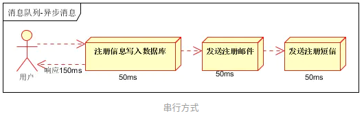

#### 并行方式

将注册信息写入数据库成功后，同时进行发送注册邮件和发送注册短信的操作。而所有任务执行完成后，返回信息给客户端。同串行方式相比，并行方式可以提高执行效率，减少执行时间。

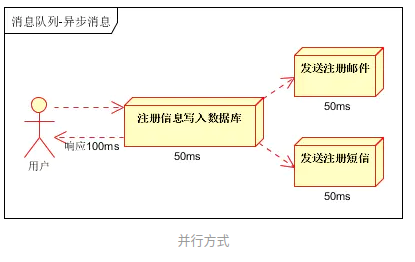

上面的比较可以发现，假设三个操作均需要50ms的执行时间，排除网络因素，则最终执行完成，串行方式需要150ms，而并行方式需要100ms。

因为cpu在单位时间内处理的请求数量是一致的，假设：CPU每1秒吞吐量是100此，则串行方式1秒内可执行的请求量为1000/150，不到7次；并行方式1秒内可执行的请求量为1000/100，为10次。

由上可以看出，传统串行和并行的方式会受到系统性能的局限，那么如何解决这个问题？
我们需要引入消息队列，将不是必须的业务逻辑，异步进行处理，由此改造出来的流程为

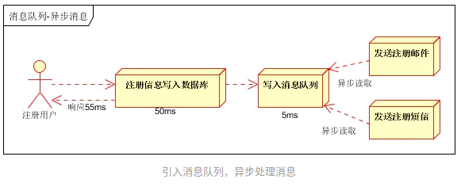

根据上述的流程，用户的响应时间基本相当于将用户数据写入数据库的时间，发送注册邮件、发送注册短信的消息在写入消息队列后，即可返回执行结果，写入消息队列的时间很快，几乎可以忽略，也有此可以将系统吞吐量提升至20QPS，比串行方式提升近3倍，比并行方式提升2倍。

### 2.2 应用解耦

> 场景说明：用户下单后，订单系统需要通知库存系统。

传统的做法为：订单系统调用库存系统的接口。如下图所示：

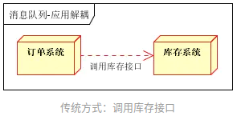

传统方式具有如下缺点：
 -1. 假设库存系统访问失败，则订单减少库存失败，导致订单创建失败
 -2. 订单系统同库存系统过度耦合

如何解决上述的缺点呢？需要引入消息队列，引入消息队列后的架构如下图所示：

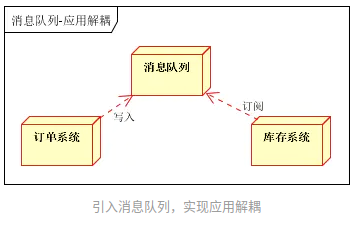

- 订单系统：用户下单后，订单系统进行数据持久化处理，然后将消息写入消息队列，返回订单创建成功
- 库存系统：使用拉/推的方式，获取下单信息，库存系统根据订单信息，进行库存操作。

假如在下单时库存系统不能正常使用。也不影响正常下单，因为下单后，订单系统写入消息队列就不再关心其后续操作了。由此实现了订单系统与库存系统的应用解耦。

### 2.3 流量削锋

流量削锋也是消息队列中的常用场景，一般在秒杀或团抢活动中使用广泛。

> 应用场景：秒杀活动，一般会因为流量过大，导致流量暴增，应用挂掉。为解决这个问题，一般需要在应用前端加入消息队列。

1. 可以控制参与活动的人数；
2. 可以缓解短时间内高流量对应用的巨大压力；

流量削锋处理方式系统图如下：

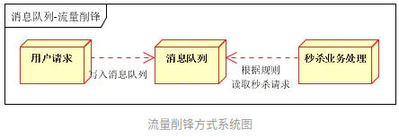

1. 服务器在接收到用户请求后，首先写入消息队列。这时如果消息队列中消息数量超过最大数量，则直接拒绝用户请求或返回跳转到错误页面；
2. 秒杀业务根据秒杀规则读取消息队列中的请求信息，进行后续处理。

### 2.4 日志处理

日志处理是指将消息队列用在日志处理中，比如Kafka的应用，解决大量日志传输的问题。架构简化如下：

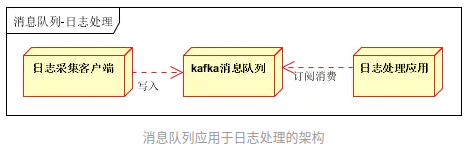

- 日志采集客户端：负责日志数据采集，定时写受写入Kafka队列；
- Kafka消息队列：负责日志数据的接收，存储和转发；
- 日志处理应用：订阅并消费kafka队列中的日志数据；

这种架构在实际开发中的应用，可以参照案例：[新浪技术分享：我们如何扛下32亿条实时日志的分析处理](https://link.jianshu.com?t=http://cloud.51cto.com/art/201507/484338.htm)

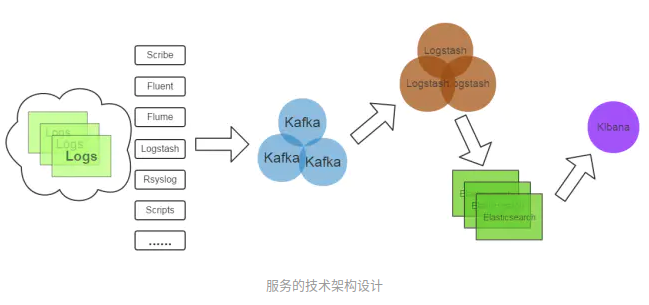

1. Kafka：接收用户日志的消息队列。
2. Logstash：做日志解析，统一成JSON输出给Elasticsearch。
3. Elasticsearch：实时日志分析服务的核心技术，一个schemaless，实时的数据存储服务，通过index组织数据，兼具强大的搜索和统计功能。
4. Kibana：基于Elasticsearch的数据可视化组件，超强的数据可视化能力是众多公司选择ELK stack的重要原因。

### 2.5 消息通讯

消息通讯是指，消息队列一般都内置了高效的通信机制，因此也可以用在纯的消息通讯。比如实现点对点消息队列、聊天室等。

#### 点对点通讯

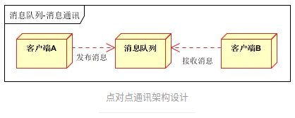

在点对点通讯架构设计中，客户端A和客户端B共用一个消息队列，即可实现消息通讯功能。

#### 聊天室通讯

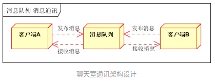

客户端A、客户端B、直至客户端N订阅同一消息队列，进行消息的发布与接收，即可实现聊天通讯方案架构设计。

## 三、 消息中间件示例

### 3.1 电商系统

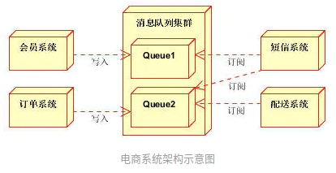

消息队列采用高可用、可持久化的消息中间件。比如Active MQ，Rabbit MQ，Rocket MQ。

- 应用将主干逻辑处理完成后，写入消息队列。消息发送是否成功可以开启消息的确认模式。（消息队列返回消息接收成功状态后，应用再返回，这样保障消息的完整性）
- 扩展流程（发短信、配送处理）订阅队列消息。采用推或拉的方式获取消息并处理。
- 消息将应用解耦的同时，带来了数据一致性问题，可以采用最终一致性方式解决。比如主数据写入数据库，扩展应用根据消息队列，并结合数据库方式实现基于消息队列的后续处理。

### 3.2 日志收集系统

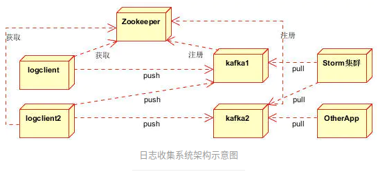

分为Zookeeper注册中心，日志收集客户端，Kafka集群和Storm集群（OtherApp）四部分组成。

- Zookeeper注册中心，提出负载均衡和地址查找服务；
- 日志收集客户端，用于采集应用系统的日志，并将数据推送到kafka队列；
- Kafka集群：接收，路由，存储，转发等消息处理；
- Storm集群：与OtherApp处于同一级别，采用拉的方式消费队列中的数据；

## 四、JMS消息服务

讲消息队列就不得不提JMS 。JMS（Java Message Service,Java消息服务）API是一个消息服务的标准/规范，允许应用程序组件基于JavaEE平台创建、发送、接收和读取消息。它使分布式通信耦合度更低，消息服务更加可靠以及异步性。
 在EJB架构中，有消息bean可以无缝的与JM消息服务集成。在J2EE架构模式中，有消息服务者模式，用于实现消息与应用直接的解耦。

### 4.1 消息模型

在JMS标准中，有两种消息模型P2P（Point to Point）,Publish/Subscribe(Pub/Sub)。

#### 4.1.1 P2P模式

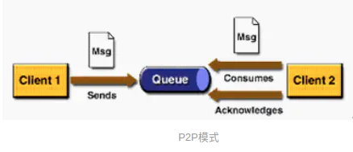

P2P模式包含三个角色：消息队列（Queue），发送者(Sender)，接收者(Receiver)。每个消息都被发送到一个特定的队列，接收者从队列中获取消息。队列保留着消息，直到他们被消费或超时。

P2P的特点

- 每个消息只有一个消费者（Consumer）(即一旦被消费，消息就不再在消息队列中)
- 发送者和接收者之间在时间上没有依赖性，也就是说当发送者发送了消息之后，不管接收者有没有正在运行，它不会影响到消息被发送到队列
- 接收者在成功接收消息之后需向队列应答成功

如果希望发送的每个消息都会被成功处理的话，那么需要P2P模式。

####  4.1.2 Pub/Sub模式

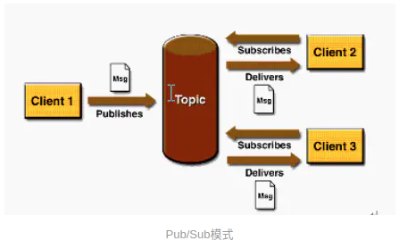

包含三个角色：主题（Topic），发布者（Publisher），订阅者（Subscriber） 。多个发布者将消息发送到Topic,系统将这些消息传递给多个订阅者。

Pub/Sub的特点

- 每个消息可以有多个消费者
- 发布者和订阅者之间有时间上的依赖性。针对某个主题（Topic）的订阅者，它必须创建一个订阅者之后，才能消费发布者的消息。
- 为了消费消息，订阅者必须保持运行的状态。

为了缓和这样严格的时间相关性，JMS允许订阅者创建一个可持久化的订阅。这样，即使订阅者没有被激活（运行），它也能接收到发布者的消息。
 如果希望发送的消息可以不被做任何处理、或者只被一个消息者处理、或者可以被多个消费者处理的话，那么可以采用Pub/Sub模型。

### 4.2消息消费

在JMS中，消息的产生和消费都是异步的。对于消费来说，JMS的消息者可以通过两种方式来消费消息。

1. 同步
    订阅者或接收者通过receive方法来接收消息，receive方法在接收到消息之前（或超时之前）将一直阻塞；
2. 异步
    订阅者或接收者可以注册为一个消息监听器。当消息到达之后，系统自动调用监听器的onMessage方法。

JNDI：Java命名和目录接口,是一种标准的Java命名系统接口。可以在网络上查找和访问服务。通过指定一个资源名称，该名称对应于数据库或命名服务中的一个记录，同时返回资源连接建立所必须的信息。
 JNDI在JMS中起到查找和访问发送目标或消息来源的作用。

### 4.3JMS编程模型

1. ConnectionFactory：创建Connection对象的工厂，针对两种不同的JMS消息模型，分别有QueueConnectionFactory和TopicConnectionFactory两种。可以通过JNDI来查找ConnectionFactory对象。
2. Destination： Destination的意思是消息生产者的消息发送目标或者说消息消费者的消息来源。对于消息生产者来说，它的Destination是某个队列（Queue）或某个主题（Topic）;对于消息消费者来说，它的Destination也是某个队列或主题（即消息来源）。
    所以，Destination实际上就是两种类型的对象：Queue、Topic可以通过JNDI来查找Destination。
3. Connection：Connection表示在客户端和JMS系统之间建立的链接（对TCP/IP Socket的包装）。Connection可以产生一个或多个Session。跟ConnectionFactory一样，Connection也有两种类型：QueueConnection和TopicConnection。
4. Session：Session是操作消息的接口。可以通过session创建生产者、消费者、消息等。Session提供了事务的功能。当需要使用session发送/接收多个消息时，可以将这些发送/接收动作放到一个事务中。同样，也分QueueSession和TopicSession。
5. 消息的生产者：消息生产者由Session创建，并用于将消息发送到Destination。同样，消息生产者分两种类型：QueueSender和TopicPublisher。可以调用消息生产者的方法（send或publish方法）发送消息。
6. 消息消费者：消息消费者由Session创建，用于接收被发送到Destination的消息。两种类型：QueueReceiver和TopicSubscriber。可分别通过session的createReceiver(Queue)或createSubscriber(Topic)来创建。当然，也可以session的creatDurableSubscriber方法来创建持久化的订阅者。
7. MessageListener：消息监听器。如果注册了消息监听器，一旦消息到达，将自动调用监听器的onMessage方法。EJB中的MDB（Message-Driven Bean）就是一种MessageListener。

深入学习JMS对掌握JAVA架构、EJB架构有很好的帮助，消息中间件也是大型分布式系统必须的组件。本次分享主要做全局性介绍，具体的深入需要大家学习，实践，总结，领会。

## 五、常用消息队列

一般商用的容器，比如WebLogic，JBoss，都支持JMS标准，开发上很方便。但免费的比如Tomcat，Jetty等则需要使用第三方的消息中间件。本部分内容介绍常用的消息中间件（Active MQ，Rabbit MQ，Zero MQ，Kafka）以及他们的特点。

### 5.1 ActiveMQ

ActiveMQ 是Apache出品，最流行的，能力强劲的开源消息总线。ActiveMQ 是一个完全支持JMS1.1和J2EE 1.4规范的 JMS Provider实现，尽管JMS规范出台已经是很久的事情了，但是JMS在当今的J2EE应用中间仍然扮演着特殊的地位。
 ActiveMQ特性如下：

1. 多种语言和协议编写客户端。
    语言: Java,C,C++,C#,Ruby,Perl,Python,PHP。
    应用协议： OpenWire,Stomp REST,WS Notification,XMPP,AMQP
2. 完全支持JMS1.1和J2EE 1.4规范 （持久化，XA消息，事务)
3. 对Spring的支持。
    ActiveMQ可以很容易内嵌到使用Spring的系统里面去，而且也支持Spring2.0的特性
4. 通过了常见J2EE服务器（如 Geronimo,JBoss 4,GlassFish,WebLogic)的测试，其中通过JCA 1.5 resource adaptors的配置，可以让ActiveMQ可以自动的部署到任何兼容J2EE 1.4 商业服务器上
5. 支持多种传送协议：in-VM,TCP,SSL,NIO,UDP,JGroups,JXTA
6. 支持通过JDBC和journal提供高速的消息持久化
7. 从设计上保证了高性能的集群，客户端-服务器，点对点
8. 支持Ajax
9. 支持与Axis的整合
10. 可以很容易得调用内嵌JMS provider，进行测试

### 5.2 RabbitMQ

RabbitMQ是流行的开源消息队列系统，用erlang语言开发。RabbitMQ是AMQP（高级消息队列协议）的标准实现。支持多种客户端，如：Python、Ruby、.NET、Java、JMS、C、PHP、ActionScript、XMPP、STOMP等，支持AJAX，持久化。用于在分布式系统中存储转发消息，在易用性、扩展性、高可用性等方面表现不俗。

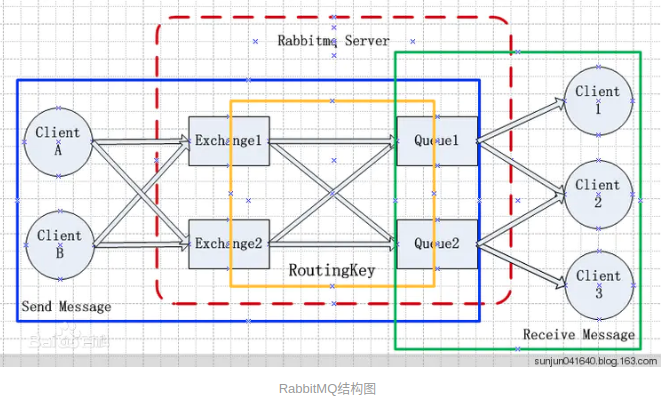

上图中有几个重要概念：

- Broker：简单来说就是消息队列服务器实体。
- Exchange：消息交换机，它指定消息按什么规则，路由到哪个队列。
- Queue：消息队列载体，每个消息都会被投入到一个或多个队列。
- Binding：绑定，它的作用就是把Exchange和Queue按照路由规则绑定起来。
- Routing Key：路由关键字，Exchange根据这个关键字进行消息投递。
- vhost：虚拟主机，一个broker里可以开设多个vhost，用作不同用户的权限分离。
- producer：消息生产者，就是投递消息的程序。
- consumer：消息消费者，就是接受消息的程序。
- channel：消息通道，在客户端的每个连接里，可建立多个channel，每个channel代表一个会话任务。

消息队列的使用过程，如下：

1. 客户端连接到消息队列服务器，打开一个channel。
2. 客户端声明一个exchange，并设置相关属性。
3. 客户端声明一个queue，并设置相关属性。
4. 客户端使用routing key，在exchange和queue之间建立好绑定关系。
5. 客户端投递消息到exchange。

exchange接收到消息后，就根据消息的key和已经设置的binding，进行消息路由，将消息投递到一个或多个队列里。

### 5.3 ZeroMQ

号称史上最快的消息队列，它实际类似于Socket的一系列接口，他跟Socket的区别是：普通的socket是端到端的（1:1的关系），而ZMQ却是可以N：M 的关系，人们对BSD套接字的了解较多的是点对点的连接，点对点连接需要显式地建立连接、销毁连接、选择协议（TCP/UDP）和处理错误等，而ZMQ屏蔽了这些细节，让你的网络编程更为简单。ZMQ用于node与node间的通信，node可以是主机或者是进程。
 引用官方的说法： “ZMQ(以下ZeroMQ简称ZMQ)是一个简单好用的传输层，像框架一样的一个socket library，他使得Socket编程更加简单、简洁和性能更高。是一个消息处理队列库，可在多个线程、内核和主机盒之间弹性伸缩。ZMQ的明确目标是“成为标准网络协议栈的一部分，之后进入Linux内核”。现在还未看到它们的成功。但是，它无疑是极具前景的、并且是人们更加需要的“传统”BSD套接字之上的一层封装。ZMQ让编写高性能网络应用程序极为简单和有趣。”

特点是：

- 高性能，非持久化；
- 跨平台：支持Linux、Windows、OS X等。
- 多语言支持； C、C++、Java、.NET、Python等30多种开发语言。
- 可单独部署或集成到应用中使用；
- 可作为Socket通信库使用。

与RabbitMQ相比，ZMQ并不像是一个传统意义上的消息队列服务器，事实上，它也根本不是一个服务器，更像一个底层的网络通讯库，在Socket API之上做了一层封装，将网络通讯、进程通讯和线程通讯抽象为统一的API接口。支持“Request-Reply “，”Publisher-Subscriber“，”Parallel Pipeline”三种基本模型和扩展模型。

ZeroMQ高性能设计要点：

1. 无锁的队列模型
    对于跨线程间的交互（用户端和session）之间的数据交换通道pipe，采用无锁的队列算法CAS；在pipe两端注册有异步事件，在读或者写消息到pipe的时，会自动触发读写事件。
2. 批量处理的算法
    对于传统的消息处理，每个消息在发送和接收的时候，都需要系统的调用，这样对于大量的消息，系统的开销比较大，zeroMQ对于批量的消息，进行了适应性的优化，可以批量的接收和发送消息。
3. 多核下的线程绑定，无须CPU切换
    区别于传统的多线程并发模式，信号量或者临界区， zeroMQ充分利用多核的优势，每个核绑定运行一个工作者线程，避免多线程之间的CPU切换开销。

## 5.4 Kafka

Kafka是一种高吞吐量的分布式发布订阅消息系统，它可以处理消费者规模的网站中的所有动作流数据。 这种动作（网页浏览，搜索和其他用户的行动）是在现代网络上的许多社会功能的一个关键因素。 这些数据通常是由于吞吐量的要求而通过处理日志和日志聚合来解决。 对于像Hadoop的一样的日志数据和离线分析系统，但又要求实时处理的限制，这是一个可行的解决方案。Kafka的目的是通过Hadoop的并行加载机制来统一线上和离线的消息处理，也是为了通过集群机来提供实时的消费。
 Kafka是一种高吞吐量的分布式发布订阅消息系统，有如下特性：

- 通过O(1)的磁盘数据结构提供消息的持久化，这种结构对于即使数以TB的消息存储也能够保持长时间的稳定性能。（文件追加的方式写入数据，过期的数据定期删除）
- 高吞吐量：即使是非常普通的硬件Kafka也可以支持每秒数百万的消息。
- 支持通过Kafka服务器和消费机集群来分区消息。
- 支持Hadoop并行数据加载。

Kafka相关概念

- Broker：Kafka集群包含一个或多个服务器，这种服务器被称为broker
- Topic：每条发布到Kafka集群的消息都有一个类别，这个类别被称为Topic。（物理上不同Topic的消息分开存储，逻辑上一个Topic的消息虽然保存于一个或多个broker上但用户只需指定消息的Topic即可生产或消费数据而不必关心数据存于何处）
- Partition：Parition是物理上的概念，每个Topic包含一个或多个Partition.
- Producer：负责发布消息到Kafka Broker
- Consumer：消息消费者，向Kafka Broker读取消息的客户端。
- Consumer Group：每个Consumer属于一个特定的Consumer Group（可为每个Consumer指定group name，若不指定group name则属于默认的group）。

Kafka一般应用在大数据日志处理或对实时性（少量延迟），可靠性（少量丢数据）要求稍低的场景使用。

## 六、参考资料

 以下是本次分享参考的资料和推荐大家参考的资料。

JMS

[点对点和发布订阅模型的对比](https://link.jianshu.com?t=http://blog.sina.com.cn/s/blog_3fba24680100r777.html)
 [深入浅出JMS(一)--JMS基本概念](https://link.jianshu.com?t=http://blog.csdn.net/jiuqiyuliang/article/details/46701559)

RabbitMQ

[百度百科－RabbitMQ](https://link.jianshu.com?t=http://baike.baidu.com/link?url=s2cU-QgOsXan7j0AM5qxxlmruz6WEeBQXX-Bbk0O3F5jt9Qts2uYQARxQxl7CBT2SO2NF2VkzX_XZLqU-CTaPa)
 [柯南君：看大数据时代下的IT架构（2）消息队列之RabbitMQ-基础概念详细介绍](https://link.jianshu.com?t=http://blog.csdn.net/sun305355024sun/article/details/41913105)

Zero MQ

[高性能的通讯库-zeroMQ的几个高性能特征](https://link.jianshu.com?t=http://blog.csdn.net/yangbutao/article/details/8498790)
 [百度文库－ZeroMQ使用环境和结构详细分析](https://link.jianshu.com?t=http://wenku.baidu.com/link?url=yYoiZ_pYPCuUxEsGQvMMleY08bcptZvwF3IMHo2W1i-ti66YXXPpLLJBGXboddwgGBnOehHiUdslFhtz7RGZYkrtMQQ02DV5sv9JFF4LZnK)

Kafka

[百度百科－Kafka](https://link.jianshu.com?t=http://baike.baidu.com/link?url=qQXyqvPQ1MVrw9WkOGSGEfSX1NHy4unsgc4ezzJwU94SrPuVnrKf2tbm4SllVaN3ArGGxV_N5hw8JTT2-lw4QK)
 [Apache Kafka：下一代分布式消息系统](https://link.jianshu.com?t=http://www.infoq.com/cn/articles/apache-kafka/)
 [kafka：一个分布式消息系统](https://link.jianshu.com?t=http://www.mincoder.com/article/3942.shtml)

参考：

[大型网站架构系列：分布式消息队列（一）](https://link.jianshu.com?t=http://www.cnblogs.com/itfly8/p/5155983.html)
 [大型网站架构系列：消息队列（二）](https://link.jianshu.com?t=http://www.cnblogs.com/itfly8/p/5156155.html)

作者：步积
链接：https://www.jianshu.com/p/689ce4205021
来源：简书
著作权归作者所有。商业转载请联系作者获得授权，非商业转载请注明出处。

