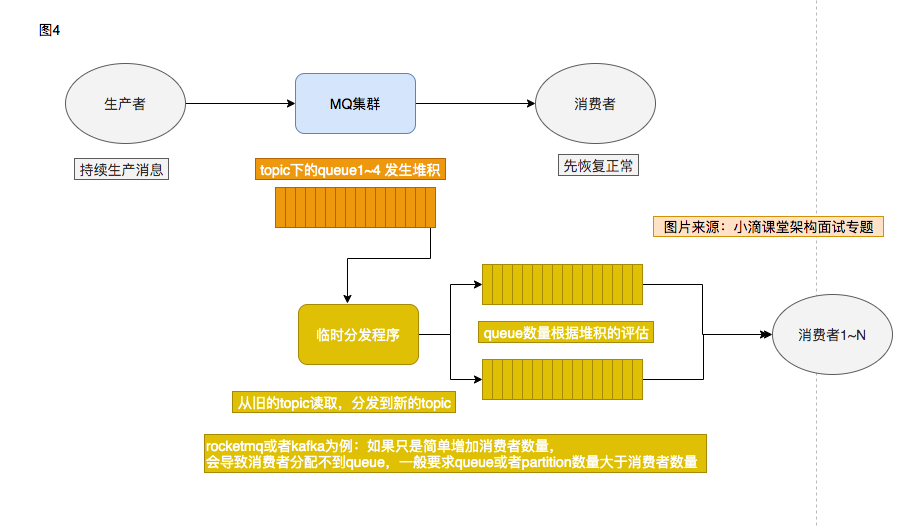

# 消息队列面试考点

> 来自：小滴课堂（https://xdclass.net/）

## 消息队列优缺点

- 优点：解耦系统、异步化、削峰
- 缺点: 系统可用性降低、复杂度增高、维护成本增高

## 主流消息队列对比

主流消息队列Apache ActiveMQ、Kafka、RabbitMQ、RocketMQ

- ActiveMQ：http://activemq.apache.org/

  - Apache出品，历史悠久，支持多种语言的客户端和协议，支持多种语言Java, .NET, C++ 等，基于JMS Provider的实现

  缺点：吞吐量不高，多队列的时候性能下降，存在消息丢失的情况，比较少大规模使用

- Kafka：http://kafka.apache.org/

  - 是由Apache软件基金会开发的一个开源流处理平台，由Scala和Java编写。Kafka是一种高吞吐量的分布式发布订阅消息系统，它可以处理大规模的网站中的所有动作流数据(网页浏览，搜索和其他用户的行动)，副本集机制，实现数据冗余，保障数据尽量不丢失；支持多个生产者和消费者

  缺点：不支持批量和广播消息，运维难度大，文档比较少, 需要掌握Scala

- RabbitMQ：http://www.rabbitmq.com/

  - 是一个开源的AMQP实现，服务器端用Erlang语言编写，支持多种客户端，如：Python、Ruby、.NET、Java、JMS、C、用于在分布式系统中存储转发消息，在易用性、扩展性、高可用性等方面表现不错

  缺点：使用Erlang开发，阅读和修改源码难度大

- RocketMQ：http://rocketmq.apache.org/

  - 阿里开源的一款的消息中间件, 纯Java开发，具有高吞吐量、高可用性、适合大规模分布式系统应用的特点, 性能强劲(零拷贝技术)，支持海量堆积, 支持指定次数和时间间隔的失败消息重发,支持consumer端tag过滤、延迟消息等，在阿里内部进行大规模使用，适合在电商，互联网金融等领域使用
  - 缺点：成熟的资料相对不多，社区处于新生状态但是热度高

## 消息队列的发送方式

发送方式一般分三种

- SYNC 同步发送
  应用场景：重要通知邮件、报名短信通知、营销短信系统等

- ASYNC 异步发送
  应用场景：对RT时间敏感,可以支持更高的并发，回调成功触发相对应的业务，比如注册成功后通知积分系统发放优惠券

- ONEWAY 无需要等待响应
  应用场景：主要是日志收集，适用于某些耗时非常短，但对可靠性要求并不高的场景, 也就是LogServer, 只负责发送消息，不等待服务器回应且没有回调函数触发，即只发送请求 不等待应答

发送方式汇总对比

| 发送方式 | 发送 TPS | 发送结果反馈 | 可靠性   |
| :------- | :------- | :----------- | :------- |
| 同步发送 | 快       | 有           | 不丢失   |
| 异步发送 | 快       | 有           | 不丢失   |
| 单向发送 | 最快     | 无           | 可能丢失 |

### 延迟消息

什么是延迟消息：
	Producer 将消息发送到消息队列 broker服务端，但并不期望这条消息立马投递，而是推迟到在当前时间点之后的某一个时间投递到 Consumer 进行消费

使用场景一：通过消息触发一些定时任务，比如在某一固定时间点向用户发送提醒消息
使用场景二：消息生产和消费有时间窗口要求，比如在天猫电商交易中超时未支付关闭订单的场景，在订单创建时会发送一条 延时消息。这条消息将会在 30 分钟以后投递给消费者，消费者收到此消息后需要判断对应的订单是否已完成支付。 如支付未完成，则关闭订单。如已完成支付则忽略


## 如何保证消息队列的消息生成和消费的顺序性

什么是顺序消息：消息的生产和消费顺序一致
	全局顺序：topic下面全部消息都要有序(少用)，性能要求不高，所有的消息严格按照 FIFO 原则进行消息发布和消费的	场景，并行度成为消息系统的瓶颈, 吞吐量不够
	使用场景：在证券处理中，以人民币兑换美元为例子，在价格相同的情况下，先出价者优先处理，则可以通过全局顺序的方式按照 FIFO 的方式进行发布和消费
	
	局部顺序：只要保证一组消息被顺序消费即可，性能要求高
	使用场景：电商的订单创建，同一个订单相关的创建订单消息、订单支付消息、订单退款消息、订单物流消息、订单交易成功消息 都会按照先后顺序来发布和消费
	（阿里巴巴集团内部电商系统均使用局部顺序消息，既保证业务的顺序，同时又能保证业务的高性能）

下面是用RocketMQ举例(用kafka或rabbitmq类似)，一个topic下面有多个queue。

顺序发布：对于指定的一个 Topic，客户端将按照一定的先后顺序发送消息

举例：订单的顺序流程是：创建、付款、物流、完成，订单号相同的消息会被先后发送到同一个队列中，

根据MessageQueueSelector里面自定义策略，根据同个业务id放置到同个queue里面，如订单号取模运算再放到selector中，同一个模的值都会投递到同一条queue

```java
   public MessageQueue select(List<MessageQueue> mqs, Message msg, Object arg) {
            //如果是订单号是字符串，则进行hash,得到一个hash值
          Long id = (Long) arg;
          long index = id % mqs.size();
          return mqs.get((int)index);
   }
```

顺序消费：对于指定的一个 Topic，按照一定的先后顺序接收消息，即先发送的消息一定会先被客户端接收到。

举例：消费端要在保证消费同个topic里的同个队列，不应该用MessageListenerConcurrently，应该使用MessageListenerOrderly，自带单线程消费消息，不能再Consumer端再使用多线程去消费，消费端分配到的queue数量是固定的，集群消费会锁住当前正在消费的队列集合的消息，所以会保证顺序消费。

注意：

- 顺序消息暂不支持广播模式
- 顺序消息在生产端不支持异步发送方式，否则将无法严格保证顺序
- 不能在Consumer端再使用多线程去消费


## 怎么样可以避免重复消费

- 幂等性：一个请求，不管重复来多少次，结果是不会改变的。

- RabbitMQ、RocketMQ、Kafka等任何队列不保证消息不重复，如果业务需要消息不重复消费，则需要消费端处理业务消息要保持幂等性

  - 方式一：Redis的setNX() , 做消息id去重 java版本目前不支持设置过期时间

  ```java
  //Redis中操作，判断是否已经操作过 TODO
  //Redis Setnx（SET if Not eXists） 命令在指定的 key 不存在时，为 key 设置指定的值。
  boolean flag =  jedis.setNX(key);
  if(flag){
          //消费
  }else{
          //忽略，重复消费
  }
  ```

   

  - 方式二：redis的 Incr 原子操作：key自增，大于0 返回值大于0则说明消费过，(key可以是消息的md5取值, 或者如果消息id设计合理直接用id做key)

  ```java
  //Redis Incr 命令将 key 中储存的数字值增一。
  //如果 key 不存在，那么 key 的值会先被初始化为 0 ，然后再执行 INCR 操作。
  int num =  jedis.incr(key);
  if(num == 1){
  	//消费
  }else{
  	//忽略，重复消费
  }
  ```

  

  - 方式三：数据库去重表

    - 设计一个去重表，某个字段使用Message的key做唯一索引，因为存在唯一索引，所以重复消费会失败

      ```sql
      CREATE TABLE `message_record` ( `id` int(11) unsigned NOT NULL AUTO_INCREMENT, `key` varchar(128) DEFAULT NULL, `create_time` datetime DEFAULT NULL, PRIMARY KEY (`id`), UNIQUE KEY `key` (`key`) ) ENGINE=InnoDB DEFAULT CHARSET=utf8mb4;
      ```

注意：这里如果用Redis，要保证消费的逻辑和Redis储存逻辑在一个事物（transaction）内，及保证原子性。要么都成功，要么都失败。在Mysql中，只要把业务逻辑和数据库存储写道一个transaction中就可以了。


## 如何保证消费的可靠性传输

消息可靠性传输，是非常重要，消息如果丢失，可能带来严重后果，一般要从各个角度去分析

producer端：
	不采用oneway发送，使用同步或者异步方式发送，做好重试，但是重试的Message key必须唯一
	投递的日志需要保存，关键字段，投递时间、投递状态、重试次数、请求体、响应体

broker端：
	多主多从架构，需要多机房
	同步双写、异步刷盘 (同步刷盘则可靠性更高，但是性能差点，根据业务选择)
	机器断电重启：异步刷盘，消息丢失；同步刷盘消息不丢失
	硬件故障：可能存在丢失，看队列架构
	
consumer端
	消息队列一般都提供的ack机制，发送者为了保证消息肯定消费成功，只有消费者明确表示消费成功，队列才会认为消息消费成功，中途断电、抛出异常等都不	会认为成功——即都会重新投递，每次在确保处理完这个消息之后，在代码里调用ack，告诉消息队列消费成功
	消费端务必做好幂等性处理
	消息消费务必保留日志，即消息的元数据和消息体，


## 消息发生大量堆积应该怎么处理

线上故障了，怎么处理

- 消息堆积了10小时，有几千万条消息待处理，现在怎么办?
- 修复consumer, 然后慢慢消费？也需要几小时才可以消费完成，新的消息怎么办？

核心思想：紧急临时扩容，更快的速度去消费数据

- 修复Consumer不消费问题，使其恢复正常消费，根据业务需要看是否要暂停

- 临时topic队列扩容，并提高消费者能力，但是如果增加Consumer数量，但是堆积的topic里面的message queue数量固定，过多的consumer不能分配到message queue


- 编写临时处理分发程序，从旧topic快速读取到临时新topic中，新topic的queue数量扩容多倍，然后再启动更多consumer进行在临时新的topic里消费

- 直到堆积的消息处理完成，再还原到正常的机器数量


