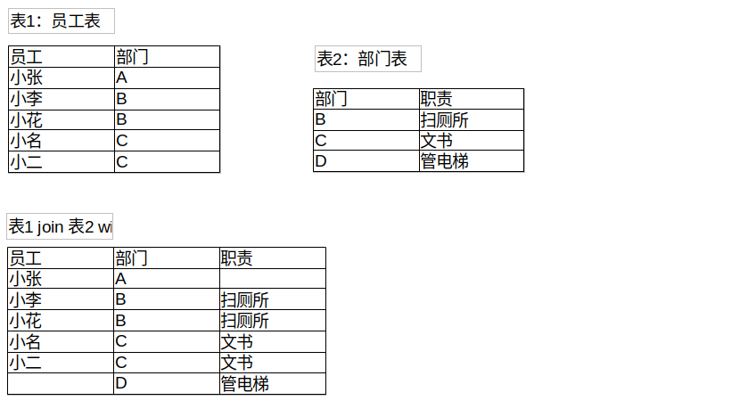
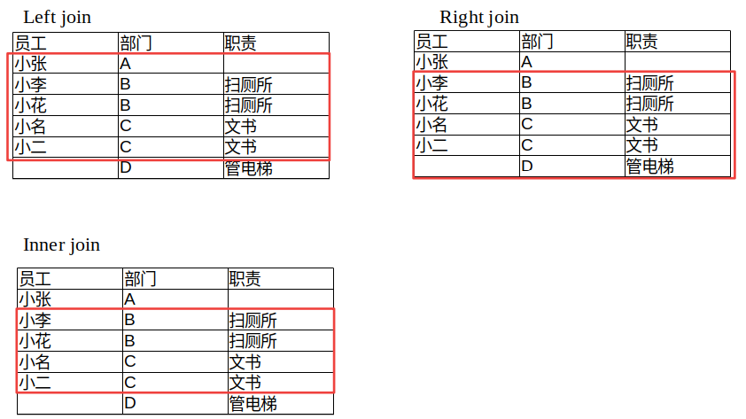

# MySQL基础


## 状态查询

在安装的Mysql软件包以后，mysql会以服务的形式存在。下面命令可以开启，查看，停止mysql服务（注：停止服务不等于卸载软件包）：

* 以service命令查看

  ```
  启动命令: service mysql start
  关闭命令: service mysql stop
  重新启动命令: service mysql restart
  查看状态命令: service mysql status
  ```

* 以systemctl命令查看

  ```
  启动命令: systemctl start mysql 
  关闭命令: systemctl stop mysql 
  重新启动命令: systemctl restart mysql 
  查看状态命令: systemctl status mysql 
  开机自动启动: systemctl enable mysql 
  ```

* 注：可以理解为service命令管理各种service，而systemctl比service更强大


```mysql
查看mysql服务进程: ps -ef | grep mysql
```

```mysql
登录命令:mysql -uroot -p
默认端口号:3306
```

```
配置文件:/etc/my.cnf
```


## SQL语言

* MySQL操作语句分为四类:
  1. DDL 数据定义语言 (Data Definition Language) 例如:建库,建表
  2. DML 数据操纵语言(Data Manipulation Language) 例如:对表中的数据进行增删改操作
  3. DQL 数据查询语言(Data Query Language) 例如:对数据进行查询
  4. DCL 数据控制语言(Data Control Language) 例如:对用户的权限进行设置


## 数据定义语言

### 创建数据库

| 描述                          | 命令                                             |
| ----------------------------- | ------------------------------------------------ |
| 创建数据库                    | `create database db1;`                           |
| 查看当前在哪个库里边          | `select database();`                             |
| 进入库                        | `use 库名;`                                      |
| 创建数据库if不存在            | `create database if not exists db2;`             |
| 创建数据库并指定字符集为 gbk  | `create database db3 default character set gbk;` |
| **查看某个库是什么字符集**    | `show create database XD;`                       |
| **查看当前mysql使用的字符集** | `show variables like 'character%';`              |

### 数据类型

**<1>整数型**

| 类型      | 大小   | 范围(有符号)              | 范围(无符号unsigned) | 用途       |
| --------- | ------ | ------------------------- | -------------------- | ---------- |
| TINYINT   | 1 字节 | (-128, 127)               | (0, 255)             | 小整数值   |
| SMALLINT  | 2 字节 | (-32768, 32767)           | (0, 65535)           | 大整数值   |
| MEDIUMINT | 3 字节 | (-8388608, 8388607)       | (0, 16777215)        | 大整数值   |
| **INT**   | 4 字节 | (-2147483648, 2147483647) | (0, 4294967295)      | 大整数值   |
| BIGINT    | 8 字节 |                           | (0, 2^64-1)          | 极大整数值 |

**<2>浮点型**

| 类型        | 大小   | 精度         | 备注                         |
| ----------- | ------ | ------------ | ---------------------------- |
| FLOAT(m,d)  | 4 字节 | 单精度浮点型 | m代表总个数, d代表小数位个数 |
| DOUBLE(m,d) | 8 字   | 双精度浮点型 | m代表总个数, d代表小数位个数 |

**<3>定点型**

| 类型         | 说明           | 备注                        |
| ------------ | -------------- | --------------------------- |
| DECIMAL(m,d) | 依赖于M和D的值 | m代表总个数,d代表小数位个数 |

**<4>字符串类型**

| 类型        | **大小**         | **用途**         |
| ----------- | ---------------- | ---------------- |
| **CHAR**    | 0-255字节        | **定长字符串**   |
| **VARCHAR** | 0-65535字节      | **变长字符串**   |
| TINYTEXT    | 0-255字节        | 短文本字符串     |
| TEXT        | 0-65535字节      | 长文本数据       |
| MEDIUMTEXT  | 0-16777215字节   | 中等长度文本数据 |
| LONGTEXT    | 0-4294967295字节 | 极大文本数据     |

```
char的优缺点: 存取速度比varchar更快,但是比varchar更占用空间
varchar的优缺点: 比char省空间。但是存取速度没有char快
```

**<5>时间型**

| 类型      | 大小  | 格式                | 备注                     |
| --------- | ----- | ------------------- | ------------------------ |
| date      | 3字节 | yyyy-MM-dd          | 存储日期值               |
| time      | 3字节 | HH:mm:ss            | 存储时分秒               |
| year      | 1字节 | yyyy                | 存储年                   |
| datetime  | 8字节 | yyyy-MM-dd HH:mm:ss | 存储日期+时间            |
| timestamp | 4字节 | yyyy-MM-dd HH:mm:ss | 存储日期+时间,可作时间戳 |

### 创建表

* 语法:

  ```mysql
  CREATE TABLE 表名 (
  					字段名1 字段类型1 约束条件1 说明1,
  					字段名2 字段类型2 约束条件2 说明2,
  					字段名3 字段类型3 约束条件3 说明3
  					);
  ```

  * 创建一个新表使之与一个旧表的架构相同，但是没有数据

    ```mysql
    1. create table 新表名 as select * from 旧表名 where 1=2;(注意:建议这种创建表的方式用于日常测试,因为可能索引什么的会复制不过来)
    2. create table 新表名 like 旧表名;
    ```

  * 创建一个新表使之与一个旧表的架构相同，并且复制旧表数据

    ```mysql
    create table 新表名 as select * from 旧表名
    ```

* 约束条件:

  ```mysql
  comment ----说明解释
  not null ----不为空
  default ----默认值
  unsigned ----无符号(即正数)
  auto_increment ----自增
  zerofill ----自动填充
  unique key ----唯一值
  ```


### 查看表结构

* 查看数据库中的所有表: show tables;
* 查看表结构: **desc 表名;**
* 查看创建表的sql语句: **show create table 表名**;
  * \G :有结束sql语句的作用,还有把显示的数据纵向旋转90度
  * \g :有结束sql语句的作用

### 修改表结构

* 改名

  ```mysql
  rename table 旧表名 to 新表名;
  rename table student to user;
  ```

* 添加列

  ```mysql
  给表添加一列:
  alter table 表名 add 列名 类型;
  alter table user add addr varchar(50);
  
  alter table 表名 add 列名 类型 comment '说明';
  alter table user add famliy varchar(50) comment '学生父母';
  
  给表最前面添加一列:
  alter table 表名 add 列名 类型 first;
  alter table user add job varchar(10) first;
  
  给表某个字段后添加一列:
  alter table 表名 add 列名 类型 after 字段名;
  alter table user add servnumber int(11)
  
  注意:没有给表某个字段前添加一列的说法。
  ```

* 修改列类型

  ```mysql
  alter table 表名 modify 列名 新类型;
  alter table user modify servnumber varchar(20);
  ```

* 修改列名

  ```mysql
  alter table 表名 change 旧列名 新列名 类型;
  alter table user change servnumber telephone varchar(20);
  ```

* 删除列

  ```mysql
  alter table 表名 drop 列名;
  alter table user drop famliy;
  ```

* 修改字符集

  ```mysql
  alter table 表名 character set 字符集;
  alter table user character set GBK;
  ```

* mysql表的删除

  ```mysql
  drop table 表名;
  drop table user;
  
  看表是否存在,若存在则删除表:drop table if exists 表名;
  drop table if exists teacher;
  ```

  

## 数据操作语言

### 写入数据

* 普通的插入表数据		

  ```mysql
  insert into 表名(字段名) values(字段对应值);
  insert into employee (empno,ename,job,mgr,hiredate,sal,deptnu) values ('1000','小明','经理','10001','2019-03-03','12345.23','10');
  
  insert into 表名 values(所有字段对应值);
  insert into employee values ('1001','小明','经理','10001','2019-03-03','12345.23','10');
  ```

* 蠕虫复制(将一张表的数据复制到另一张表中)

  ```mysql
  insert into 表名1 select * from 表名2;
  insert into 表名1(字段名1,字段名2) select 字段名1,字段名2 from 表名2;
  insert into emp (empno,ename) select empno,ename from employee;
  ```

* 建表复制

  ```mysql
  create table 表名1 as select 字段名1,字段名2 from 表名2;
  create table emp as select empno ,ename from employee;
  ```

* 一次性插入多个数据

  ```mysql
  insert into 表名(字段名) values (对应值1),(对应值2),(对应值3);
  ```

### 修改数据

* 修改(更新):

  ```mysql
  update 表名 set 字段名1=值1 where 字段名=值;
  update 表名 set 字段名1=值1,字段名2=值2 where 字段名=值;
  ```

### 删除数据

* 删除一行或几行数据:

  ```mysql
  delete from 表名 where 字段名=值;
  ```

* 删除整张表数据

  ```mysql
  truncate table 表名;
  delete from 表名;
  drop table 表名;
  ```

  ```
  注意：
  在删改数据之前,你会怎么做?
  答案:会对数据进行备份操作,以防万一,可以进行数据回退
  
  delete与truncate与drop 这三种删除数据的共同点都是删除数据,他们的不同点是什么?
  delele 会把删除的操作记录给记录起来,以便数据回退,不会释放空间,而且不会删除定义。
  truncate不会记录删除操作,会把表占用的空间恢复到最初,不会删除定义
  drop会删除整张表,释放表占用的空间。
  
  删除速度: drop > truncate > delete
  ```

### 修改字符集

* 查看当前mysql使用的字符集: `show variables like 'character%';`

  ```
  mysql> show variables like 'character%';
  +--------------------------+----------------------------------+
  | Variable_name				| Value							  |
  +--------------------------+----------------------------------+
  | character_set_client		| utf8 							  |
  | character_set_connection  | utf8 							  |
  | character_set_database 	| utf8							  | 
  | character_set_filesystem  | binary 						  |
  | character_set_results  	| utf8 							  |
  | character_set_server 		| utf8 							  |
  | character_set_system 		| utf8 							  |
  | character_sets_dir 		| /usr/local/mysql/share/charsets/|
  +--------------------------+----------------------------------+
  ```

  character_set_client:客户端请求数据的字符集
  character_set_connection:客户端与服务器连接的字符集
  character_set_database:数据库服务器中某个库使用的字符集设定,如果建库时没有指明,将默认使用配置
  上的字符集
  character_set_results:返回给客户端的字符集(从数据库读取到的数据是什么编码的)
  character_set_server:为服务器安装时指定的默认字符集设定。
  character_set_system:系统字符集(修改不了的,就是utf8)
  character_sets_dir:mysql字符集文件的保存路径

* 修改mysql使用的字符集

  * 临时: `set names gbk;`

  * 永久:修改配置文件my.cnf里边的

    ```
    [client]
    default-character-set=gbk
    作用于外部的显示
    
    [mysqld]
    character_set_server=gbk
    作用于内部,会作用于创建库表时默认字符集
    ```

* 修改库的字符集

  ```mysql
  alter database xiaoxiao default character set gbk;
  ```

* 修改表的字符集

  ```mysql
  alter table employee default character set utf8;
  ```


## 数据查询语言

### where条件语句

* 简单查询

  ```mysql
  select * from employee;
  select empno,ename,job as ename_job from employee;
  ```

* 精确条件查询

  ```mysql
  select * from employee where ename='后裔';
  select * from employee where sal != 50000;
  select * from employee where sal <> 50000; （不等于）
  select * from employee where sal > 10000;
  ```

* 模糊条件查询

  ```mysql
  show variables like '%aracter%';
  select * from employee where ename like '林%';
  ```

* 范围查询

  ```mysql
  select * from employee where sal between 10000 and 30000;
  select * from employee where hiredate between '2011-01-01' and '2017-12-1';
  ```

* 离散查询

  ```mysql
  select * from employee where ename in ('猴子','林俊杰','小红','小胡');
  ```

* 清除重复值

  ```mysql
  select distinct(job) from employee;
  ```

* 统计查询(聚合函数):

  ```mysql
  count(code)或者count(*)
      select count(*) from employee;
  	select count(ename) from employee;
  
  sum()计算总和
  	select sum(sal) from employee;
  
  max()计算最大值
  	select * from employee where sal= (select max(sal) from employee);
  
  avg()计算平均值
  	select avg(sal) from employee;
  
  min()计算最低值
  	select * from employee where sal= (select min(sal) from employee);
  
  concat函数: 起到连接作用
  	select concat(ename,' 是 ',job) as aaaa from employee;
  ```

### group by语句

* 作用:把行 按 字段 分组
* 语法:group by 列1,列2....列N
* 适用场合:常用于统计场合,一般和聚合函数连用

```mysql
eg:
	select deptnu,count(*) from employee group by deptnu;
	select deptnu,job,count(*) from employee group by deptnu,job;
	select job,count(*) from employee group by job;
```

### having语句

* 作用:对查询的结果进行筛选操作
* 语法:having 条件 或者 having 聚合函数 条件
* 适用场合:一般跟在group by之后

```mysql
eg:
	select job,count(*) from employee group by job having job ='文员';
	select deptnu,job,count(*) from employee group by deptnu,job having count(*)>=2;
	select deptnu,job,count(*) as 总数 from employee group by deptnu,job having 总数>=2;
```

### order by语句

* 作用:对查询的结果进行排序操作
* 语法:order by 字段1,字段2 .....
* 适用场合:一般用在查询结果的排序

```mysql
eg:
	select * from employee order by sal;
	select * from employee order by hiredate;
	select deptnu,job,count(*) as 总数 from employee group by deptnu,job having 总数>=2
order by deptnu desc;
	select deptnu,job,count(*) as 总数 from employee group by deptnu,job having 总数>=2
order by deptnu asc;
	select deptnu,job,count(*) as 总数 from employee group by deptnu,job having 总数>=2
order by deptnu;

顺序:where ---- group by ----- having ------ order by
```

### limit语句

* 作用:对查询结果起到限制条数的作用
* 语法:limit n,m n:代表起始条数值,不写默认为0;m代表:取出的条数
* 适用场合:数据量过多时,可以起到限制作用

```mysql
eg:
	select * from XD.employee limit 4,5;
```

### exists语句

* exists型子查询后面是一个受限的select查询语句
* exists子查询,如果exists后的内层查询能查出数据,则返回 TRUE 表示存在;为空则返回 FLASE则不存在。

```mysql
分为俩种:exists跟 not exists
select 1 from employee where 1=1;
select * from 表名 a where exists (select 1 from 表名2 where 条件);

eg:查询出公司有员工的部门的详细信息
select * from dept a where exists (select 1 from employee b where a.deptnu=b.deptnu);
select * from dept a where not exists (select 1 from employee b where a.deptnu=b.deptnu);
```

### 连接

**左右连接**

* 左连接称之为左外连接 右连接称之为右外连接 这俩个连接都是属于外连接
* 左连接关键字:left join 表名 on 条件 / left outer 表名 join on 条件 右连接关键字:right join 表名 on 条件/
  right outer 表名 join on 条件
* 左连接说明: left join 是left outer join的简写,左(外)连接,左表(a_table)的记录将会全部表示出来, 而右表
  (b_table)只会显示符合搜索条件的记录。右表记录不足的地方均为NULL。
* 右连接说明:right join是right outer join的简写,与左(外)连接相反,右(外)连接,左表(a_table)只会显示符合
  搜索条件的记录,而右表(b_table)的记录将会全部表示出来。左表记录不足的地方均为NULL。

```mysql
eg:列出部门名称和这些部门的员工信息,同时列出那些没有的员工的部门
	dept,employee
	select a.dname,b.* from dept a left join employee b on a.deptnu=b.deptnu;
	select b.dname,a.* from employee a right join dept b on b.deptnu=a.deptnu;
```

**内连接**

* 内连接: 获取两个表中字段匹配关系的记录
* 主要语法: INNER JOIN 表名 ON 条件;

```mysql
eg:想查出员工张飞的所在部门的地址
	select a.addr from dept a inner join employee b on a.deptnu=b.deptnu and b.ename='张
飞';
	select a.addr from dept a,employee b where a.deptnu=b.deptnu and b.ename='张飞';
```

左右连接与内连接示意图（自己的理解）

* 首先，不管是那种连接，必须是两个表基于某一列的连接
  * 比如员工表和部门表都有同一列（部门名称）
* 左连接：就是以左表为基准，右表的数据填充到左表来，因此对应左表中右表没有的数据为null
* 右连接与左连接相反
* 内连接：两表基于基准列，敲定共用拥有的数据组成一个表






**联合查询**

* 就是把多个查询语句的查询结果结合在一起

主要语法1: ... UNION ... (去除重复) 

主要语法2: ... UNION ALL ...(不去重复)

* union查询的注意事项:

```
(1)两个select语句的查询结果的“字段数”必须一致;
(2)通常,也应该让两个查询语句的字段类型具有一致性;
(3)也可以联合更多的查询结果;
(4)用到order by排序时,需要加上limit(加上最大条数就行),需要对子句用括号括起来
```

```mysql
eg:对销售员的工资从低到高排序,而文员的工资从高到低排序
(select * from employee a where a.job = '销售员' order by a.sal limit 999999 )
union (select * from employee b where b.job = '文员' order by b.sal desc limit 999999);
```


## 数据控制语言

什么是DCL数据控制语言?

* 数据控制语言(DCL:Data Control Language)是用来设置或者更改数据库用户或角色权限的语句,这些语句
  包括GRANT、DENY、REVOKE等语句


## 事物(Transaction)

### 什么是事务?

* 数据库事务通常指对数据库进行读或写的一个操作过程。
* 有两个目的：
  * 第一个是为数据库操作提供了一个从失败中恢复到正常状态的方法,同时提供了数据库即使在异常状态下仍能保持一致性的方法;
  * 第二个是当多个应用程序在并发访问数据库时,可以在这些应用程序之间提供一个隔离方法,以防止彼此的操作互相干扰。

### 事务的开启与提交

事务的开启: `begin; start transaction;`
事务的提交: `commit;`
事务的回滚: `rollback;`

### 视图

什么是视图?视图的作用是什么?

* 视图(view)是一种虚拟存在的表,是一个逻辑表,它本身是不包含数据的。作为一个select语句保存在数据字典中的
* 通过视图,可以展现基表(用来创建视图的表叫做基表base table)的部分数据
* 说白了视图的数据就是来自于基表

### 触发器

什么是触发器?

* 触发器就是监视某种情况,并触发某种操作

### 存储过程

什么是存储过程?

* 存储过程就是把复杂的一系列操作,封装成一个过程。类似于shell,python脚本等。


## 索引

### 储存引擎

MyISAM与InnoDB的区别：

```
MyISAM:	支持全文索引(full text);
		不支持事务;
		表级锁;
		保存表的具体行数;
		奔溃恢复不好

Innodb:	支持事务;
		以前的版本是不支持全文索引,但在5.6之后的版本就开始支持这个功能了;
		行级锁(并非绝对,当执行sql语句时不能确定范围时,也会进行锁全表例如: update table set id=3 	
			where name like 'a%';);
		不保存表的具体行数;
		奔溃恢复好
```

什么时候选择什么引擎比较好

```
MyISAM:
• 一般来说MyISAM不需要用到事务的时候
• 做很多count计算

InnoDB:
• 可靠性要求高的,或者要求支持事务
• 想要用到外键约束的时候(讲外键的时候会讲)

推荐:
• 推荐用InnoDB
```


### 索引简介

* 什么是索引?

  ```
  索引是一个单独的,存储在磁盘中上的数据库结构,它们包含着对数据表里的所有记录的引用指针。使用索引可以快速的找出在某列或多列中有特定值的行。
  ```

* 索引的优点

  ```
  • 通过创建唯一索引,来保证数据库表中的每一行数据的唯一性
  • 可以加快数据的检索速度
  • 可以保证表数据的完整性与准确性
  ```

* 索引的缺点

  ```
  • 索引需要占用物理空间。
  • 对表中的数据进行改动时,索引也需要跟着动态维护,降低了数据的维护速度。
  ```

* **索引的常见类型**

  ```
  • index: 普通索引
  • unique: 唯一索引
  • primary key: 主键索引
  • foreign key: 外键索引
  • fulltext: 全文索引
  • 组合索引
  ```

* 普通索引与唯一索引

  * 普通索引(index)顾名思义就是各类索引中最为普通的索引,主要任务就是提高查询速度。其特点是允许出现相同的索引内容,允许空(null)值
  * 唯一索引:(unique)顾名思义就是不可以出现相同的索引内容,但是可以为空(null)值

### 添加索引

* 如何创建普通索引或者唯一索引?

  * 创建表的时候创建

    ```mysql
    create table test (
    						id int(7) zerofill auto_increment not null,
    						username varchar(20),
    						servnumber varchar(30),
    						password varchar(20),
    						createtime datetime,
    						unique (id)
    					)DEFAULT CHARSET=utf8;
    ```

  * 直接为表添加索引

    ```mysql
    语法:
    	alter table 表名 add index 索引名称 (字段名称);
    eg:
    	alter table test add unique unique_username (username);
    注意:假如没有指定索引名称时,会以默认的字段名为索引名称
    ```

  * 直接创建索引

    ```mysql
    语法:create index 索引 on 表名 (字段名);
    eg:create index index_createtime on test (createtime);
    ```

* 查看索引

  ```mysql
  语法:show index from 表名\G
  eg: show index from test\G
  ```

* 删除索引

  ```mysql
  语法:drop index 索引名称 on 表名;
  eg:drop index unique_username on test;
  
  语法:alter table 表名 drop index 索引名;
  eg:alter table test drop index createtime;	
  ```

### 主键索引

* 什么是主键索引?

  * 把主键添加索引就是主键索引,它是一种特殊的唯一索引,不允许有空值

  * 指定为“PRIMARY KEY”

    ```
    注：区别于唯一索引（unique是允许为空值的）
    ```

* 创建主键:

  ```mysql
  1)创建表的时候创建
  
  2)直接为表添加主键索引
  	语法:alter table 表名 add primary key (字段名);
  	eg:alter table test add primary key (id);
  ```

* 删除主键:

  ```mysql
  语法:
  alter table 表名 drop primary key;
  eg:
  alter table test drop primary key;
  
  注意:在有自增的情况下,必须先删除自增,才可以删除主键
  删除自增:alter table test change id id int(7) unsigned zerofill not null;
  ```

  

### 全文索引

* 什么是全文索引?
  * 全文索引是将存储在数据库中的文章或者句子等任意内容信息查找出来的索引,单位是词。
  * 全文索引也是目前搜索引擎使用的一种关键技术。指定为 fulltex
* 注意点总结:
  1. 一般情况下创建全文索引的字段数据类型为 char、varchar、text 。其它字段类型不可以
  2. 全文索引不针对非常频繁的词做索引。比如is,no,not,you,me,yes这些,我们称之为停止词
  3. 对英文检索时忽略大小写

### 外键

* 什么是外键?

  * 外键就是作用于两个表数据之间的链接的一列或多列,用来保证表与表之间的数据的完整性和准确性。

    ```
    表A的一列#3作为外键关连到表B的主键#1，那么A.#3与B.#1的字段类型一定要一样。
    1. 在插入A表数据时，A.#3的值必须是B.#1中的某一个
    2. 在删除B.#1中的数据时，必须确保A.#3中没有相应的值
    ```

* 添加外键约束:

  ```mysql
  语法:foreign key (字段名) references 关联的表名(关联表的字段名)
  
  注意:主键跟外键的字段类型一定要相
  
  create table的方法:
  
  CREATE TABLE `employee` (
  	`empno` int(11) NOT NULL COMMENT '雇员编号',
  	`ename` varchar(50) DEFAULT NULL COMMENT '雇员姓名',
  	`job` varchar(30) DEFAULT NULL,
  	`mgr` int(11) DEFAULT NULL COMMENT '雇员上级编号',
  	`hiredate` date DEFAULT NULL COMMENT '雇佣日期',
  	`sal` decimal(7,2) DEFAULT NULL COMMENT '薪资',
  	`deptnu` int(11) DEFAULT NULL COMMENT '部门编号',
  	PRIMARY KEY (`empno`),
  	foreign key (deptnu) references dept(deptnu)
  ) ENGINE=InnoDB DEFAULT CHARSET=utf8;
  
  alter table的方法:
  alter table employee add foreign key (deptnu) references dept(deptnu);
  ```

* 删除外键约束:

  ```mysql
  注意:在干掉外键索引之前必须先把外键约束删除,才能删除索引
  mysql> alter table employee drop index deptnu;
  ERROR 1553 (HY000): Cannot drop index 'deptnu': needed in a foreign key constraint
  
  mysql>
  mysql> alter table employee drop foreign key employee_ibfk_1;
  Query OK, 0 rows affected (0.01 sec)
  Records: 0 Duplicates: 0 Warnings: 0
  
  mysql>
  mysql> alter table employee drop index deptnu;
  Query OK, 0 rows affected (0.01 sec)
  Records: 0 Duplicates: 0 Warnings: 0
  ```

* 注意点总结:

  * 俩个表,主键跟外键的字段类型一定要相同
  * 要使用外键约束表的引擎一定得是InnoDB引擎,MyISAM是不起作用的
  * 在干掉外键索引之前必须先把外键约束删除,才能删除索引


### 联合索引

* 什么是联合索引?

  * 联合索引又称组合索引或者复合索引,是建立在俩列或者多列以上的索引。

* 怎么来创建联合索引?

  ```mysql
  alter table 表名 add index(字段1,字段2,字段3);
  alter table test add index(username,servnumber,password);
  ```

* 怎么删除联合索引?

  ```mysql
  alter table test drop index username;
  ```

* 为什么要使用联合索引,而不使用多个单列索引?

  * 联合索引的效率远远高于单列索引

* 联合索引的最左原则

  * 使用联合索引查询数据时候， 必须要提供最左一列的数据查询目标


### 索引总结

* 索引并非越多越好,过多的索引会增加数据的维护速度还有磁盘空间的浪费。
* 当表的数据量很大的时候,可以考虑建立索引。
* 表中经常查数据的字段,可以考虑建立索引。
* 想要保证表中数据的唯一性,可以考虑建立唯一索引。
* 想要保证俩张表中的数据的完整性跟准确性,可以考虑建立外键约束。
* 经常对多列数据进行查询时,可以考虑建立联合索引。

## SQL语句优化

1. 尽量避免使用 `select *from` ,尽量精确到想要的结果字段
2. 尽量避免条件使用 `or`
3. 记得加上 `limit` 限制行数,避免数据量过大消耗性能
4. 使用模糊查询时, `%`放在前面是会使索引失效
5. 要小心条件字段类型的转换
