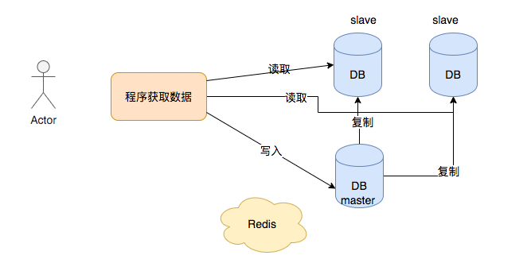

# MySQL进阶知识

> 来自：小滴课堂（https://xdclass.net/）

## Mysql事务的四大特性(ACID)

事务的四大特性ACID

- 原子性Atomicity：一个事务必须被事务不可分割的最小工作单元，整个操作要么全部成功，要么全部失败，一般就是通过commit和rollback来控制
- 一致性Consistency: 数据库总能从一个一致性的状态转换到另一个一致性的状态，比如小滴课堂下单支付成功后，开通视频播放权限，只要有任何一方发生异常就不会成功提交事务
- 隔离性Isolation: 一个事务相对于另一个事务是隔离的，一个事务所做的修改是在最终提交以前，对其他事务是不可见的
- 持久性Durability: 一旦事务提交，则其所做的修改就会永久保存到数据库中。此时即使系统崩溃，修改的数据也不会丢失

## 脏读-不可重复读-幻读

- 脏读: 事务中的修改即使没有提交，其他事务也能看见，事务可以读到未提交的数据称为脏读。脏读又称无效数据读出（读出了脏数据）。一个事务读取另外一个事务还没有提交的数据叫脏读。

  例如：事务T1修改了某个表中的一行数据，但是还没有提交，这时候事务T2读取了被事务T1修改后的数据，之后事务T1因为某种原因回滚（Rollback）了，那么事务T2读取的数据就是脏的（无效的）。

- 不可重复读: 同个事务前后多次读取，不能读到相同的数据内容，中间另一个事务也操作了该同一数据。不可重复读是指在同一个事务内，两次相同的查询返回了不同的结果。

  例如：事务T1会读取两次数据，在第一次读取某一条数据后，事务T2修改了该数据并提交了事务，T1此时再次读取该数据，两次读取便得到了不同的结果。

- 幻读：当某个事务在读取某个范围内的记录时，另外一个事务又在该范围内插入了新的记录，当之前的事务再次读取该范围的记录时，发现两次不一样，产生幻读。幻读也是指当事务不独立执行时，插入或者删除另一个事务当前影响的数据而发生的一种类似幻觉的现象。

  例如：系统事务A将数据库中所有数据都删除的时候，但是事务B就在这个时候新插入了一条记录，当事务A删除结束后发现还有一条数据，就好像发生了幻觉一样。这就叫幻读。

幻读和不可重复读的区别是：前者是一个范围，后者是本身，从总的结果来看, 两者都表现为两次读取的结果不一致。

不可重复读出现多是因为修改；幻读重点是新增、删除。mysql中的REPEATABLE_READ模式引入了间隙锁（GAP），解决了幻读的问题。不论是什么方式解决幻读，都会付出一定代价的性能让步。所以说在业务需求和技术方案之间权衡也是技术人员最需要掌握得技能之一。

## 常见的隔离级

事务的隔离级别越高，事务越安全，但是并发能力越差。

- Read Uncommitted(未提交读，读取未提交内容)

  事务中的修改即使没有提交，其他事务也能看见，事务可以读到为提交的数据称为脏读，也存在不可重复读、幻读问题

  例子：
    小滴课堂运营小姐姐配置了一个课程活动，原价500元的课程，配置成50元，但是事务没提交。 
    你刚好看到这个课程那么便宜准备购买，但是Anna小姐姐马上回滚了事务，重新配置并提交了事务，你准备下单的时候发现价格变回了500元

- Read Committed(提交读，读取提交内容)
  一个事务开始后只能看见已经提交的事务所做的修改，在事务中执行两次同样的查询可能得到不一样的结果，也叫做不可重复读(前后多次读取，不能读到相同的数据内容)，也存幻读问题

  例子：
    老王在小滴课堂有1000积分，准备去兑换《面试专题课程》，查询数据库确实有1000积分。但是老王的女友同时也在别的地方登录，把1000积分兑换了《SpringCloud微服务专题课程》，且在老王之前提交事务；当系统帮老王兑换《面试专题课程》是发现积分预计没了，兑换失败。老王事务A事先读取了数据，他女友事务B紧接了更新了数据且提交了事务，事务A再次读取该数据时，数据已经发生了改变。

  

- Repeatable Read(可重复读,mysql默认的事务隔离级别)
  解决脏读、不可重复读的问题，存在幻读的问题，使用 MMVC机制 实现可重复读

  例子：
    老王在小滴课堂有1000积分，准备去兑换《面试专题课程》，查询数据库确实有1000积分
    老王的女友同时也在别的地方登录先兑换了这个《面试专题课程》，老王的事务提交的时候发现存在了，之前读取的没用了，像是幻觉

  幻读问题：MySQL的InnoDB引擎通过MVCC自动帮我们解决,即多版本并发控制

- Serializable(可串行化)
    解决脏读、不可重复读、幻读，可保证事务安全，但强制所有事务串行执行，所以并发效率低


## Mysql的存储引擎

常见的有多类，InnoDB、MyISAM、MEMORY、MERGE、ARCHIVE、CSV等。一般比较常用的有InnoDB、MyISAM。

MySQL 5.5以上的版本默认是InnoDB，5.5之前默认存储引擎是MyISAM。


|  区别项  |                     Innodb                      |          myisam          |
| :------: | :---------------------------------------------: | :----------------------: |
|   事务   |                      支持                       |          不支持          |
|  锁粒度  |                行锁，适合高并发                 |    表锁，不适合高并发    |
| 是否默认 |                      默认                       |          非默认          |
| 支持外键 |                    支持外键                     |          不支持          |
| 适合场景 |         读写均衡,写大于读场景，需要事务         | 读多写少场景，不需要事务 |
| 全文索引 | 不支持，可以通过插件实现, 更多使用ElasticSearch |       支持全文索引       |


## Mysql数据库索引

| 索引名称 |                             特点                             |                           创建语句                           |
| :------: | :----------------------------------------------------------: | :----------------------------------------------------------: |
| 普通索引 |                   最基本的索引,仅加速查询                    |      `CREATE INDEX idx_name ON table_name(filed_name)`       |
| 唯一索引 | 加速查询，列值唯一，允许为空； 组合索引则列值的组合必须唯一  | `CREATE UNIQUE INDEX idx_name ON table_name(filed_name_1,filed_name_2)` |
| 主键索引 |       加速查询，列值唯一， 一个表只有1个，不允许有空值       |   `ALTER TABLE table_name ADD PRIMARY KEY ( filed_name )`    |
| 组合索引 |                   加速查询，多条件组合查询                   | `CREATE INDEX idx_name ON table_name(filed_name_1,filed_name_2);` |
| 覆盖索引 | 索引包含所需要的值，不需要“回表”查询， 比如查询 两个字段，刚好是 组合索引 的两个字段 |                                                              |
| 全文索引 | 对内容进行分词搜索，仅可用于Myisam， 更多用ElasticSearch做搜索 |    `ALTER TABLE table_name ADD FULLTEXT ( filed_name ) `     |

**索引的使用场景和注意事项**

```
中型公司或者业务发展好的公司，一天新增几百万数据量

业务核心数据存储在Mysql里面，针对业务创建合适的索引

打点数据、日志等存储在ElasticSearch或者MongoDB里面
```

- 考虑点：结合实际的业务场景，在哪些字段上创建索引，创建什么类型的索引


- 索引好处：

  ​	快速定位到表的位置，减少服务器扫描的数据

  ​	有些索引存储了实际的值，特定情况下只要使用索引就能完成查询

- 索引缺点：

  ​	索引会浪费磁盘空间，不要创建非必要的索引

  ​	插入、更新、删除需要维护索引，带来额外的开销

  ​	索引过多，修改表的时候重构索引性能差

- 索引优化实践

  ​	前缀索引，特别是TEXT和BLOG类型的字段，只检索前面几个字符，提高检索速度

  ​	尽量使用数据量少的索引，索引值过长查询速度会受到影响

  ​	选择合适的索引列顺序

  ​	内容变动少，且查询频繁，可以建立多几个索引

  ​	内容变动频繁，谨慎创建索引

  ​	根据业务创建适合的索引类型，比如某个字段常用来做查询条件，则为这个字段建立索引提高查询速度

  ​	组合索引选择业务查询最相关的字段

## 数据库常用指令书写/执行顺序

顺序： select->from->where->group by->having->order by

```sql
select 查看哪些结果字段
from 从哪个表查询
where 初步过滤条件
group by 过滤后进行分组[重点]
having 对分组后的数据进行二次过滤[重点]
order by 按照怎样的顺序进行排序返回[重点]
```

例子：

```sql
select video_id,count(id) num from chapter where name="***" group by video_id  having num >10
order by video_id desc
```

## varchar(len) 和char(len)

注意：varchar(len) 和char(len)这两个数据类型在Mysql里面，储存的都是字符。字符的占用几个字节根据系统的不同而不同。但是varchar(len) 和char(len)中说到的长度指的是字符个数，不是字节个数。

区别：

|    对比项    |                     char(16)                      |                  varchar(16)                   |
| :----------: | :-----------------------------------------------: | :--------------------------------------------: |
|   长度特点   |                长度固定，存储字符                 |               长度可变，存储字符               |
| 长度不足情况 |      插入的长度小于定义长度时，则用空格填充       |       小于定义长度时，按实际插入长度存储       |
|     性能     |              存取速度比varchar快得多              |              存取速度比char慢得多              |
|   使用场景   | 适合存储很短的,固定长度的字符串,如手机号，MD5值等 | 适合用在长度不固定场景，如收货地址，邮箱地址等 |

## datetime和timestamp

区别：

| 类型      | 占据字节 | 范围                                       | 时区问题                                     |      |
| :-------- | :------- | :----------------------------------------- | :------------------------------------------- | :--- |
| datetime  | 8 字节   | 1000-01-01 00:00:00到 9999-12-31 23:59:59  | 存储与时区无关，不会发生改变                 |      |
| timestamp | 4 字节   | 1970-01-01 00:00:01 到 2038-01-19 11:14:07 | 存储的是与时区有关，随数据库的时区而发生改变 |      |

- 为什么timestamp只能到2038年

```
MySQL的timestamp类型是4个字节，最大值是2的31次方减1，结果是2147483647，
转换成北京时间就是2038-01-19 11:14:07
```

系统中使用timestamp的话，要提前想好或提前作出应对，否则到2038年就会出错

## 千万级Mysql数据表分页查询优化

- 线上数据库的一个商品表数据量过千万，做深度分页的时候性能很慢，有什么优化思路

```sql
现象：千万级别数据很正常，比如数据流水、日志记录等，数据库正常的深度分页会很慢
慢的原因：select * from product limit N,M
MySQL执行此类SQL时需要先扫描到N行，然后再去取M行,N越大,MySQL扫描的记录数越多，SQL的性能就会越差

1、后端、前端缓存

2、使用ElasticSearch分页搜索

3、合理使用 mysql 查询缓存，覆盖索引进行查询分页
  select title,cateory from product limit 1000000,100
  
4、如果id是自增且不存在中间删除数据，使用子查询优化，定位偏移位置的 id
select * from oper_log where type='BUY' limit 1000000,100; //5.秒
      
select id from oper_log where type='BUY' limit 1000000,1; // 0.4秒 

select * from oper_log where type='BUY' and  id>=(select id from oper_log where type='BUY' limit 1000000,1) limit 100; //0.8秒 
```


## 数据库上线流程


## 线上数据库监控，业务性能 + 数据安全分析

大厂一般都有数据库监控后台，里面指标很多，但是开发人员也必须知道

**业务性能**

1. 应用上线前会审查业务新增的sql，和分析sql执行计划，比如是否存在 select * ，索引建立是否合理
2. 开启慢查询日志，定期分析慢查询日志
3. 监控CPU/内存利用率，读写、网关IO、流量带宽 随着时间的变化统计图
4. 吞吐量QPS/TPS，一天内读写随着时间的变化统计图

**数据安全**

1. 短期增量备份，比如一周一次。 定期全量备份，比如一月一次
2. 检查是否有非授权用户，是否存在弱口令，网络防火墙检查
3. 导出数据是否进行脱敏，防止数据泄露或者黑产利用
4. 数据库 全量操作日志审计，防止数据泄露
5. 数据库账号密码 业务独立，权限独立控制，防止多库共用同个账号密码
6. 高可用 主从架构，多机房部署

## Mysql有常见的日志

- redo 重做日志
    作用：确保事务的持久性，防止在发生故障，脏页未写入磁盘。重启数据库会进行redo log执行重做，到达事务一致性

- undo 回滚日志
    作用：保证数据的原子性，记录事务发生之前的数据的一个版本，用于回滚。
    innodb事务的可重复读和读取已提交 隔离级别就是通过mvcc+undo实现

- errorlog 错误日志
    作用：Mysql本身启动、停止、运行期间发生的错误信息

- slow query log 慢查询日志
    作用：记录执行时间过长的sql，时间阈值可以配置，只记录执行成功

- binlog 二进制日志
    作用：用于主从复制，实现主从同步

- relay log 中继日志
    作用：用于数据库主从同步，将主库发送来的binlog先保存在本地，然后从库进行回放

- general log 普通日志
    作用：记录数据库操作明细，默认关闭，开启会降低数据库性能

## 数据库多节点

### 主从复制流程


### 主从复制的目的

容灾使用，用于故障切换
业务需要，进行读写分离减少主库压力

### 同步延迟

搭建了主从同步，且你们日增量数据量也不少，有没遇到同步延迟问题？为什么会有同步延迟问题，怎么解决？

```
保证性能第一情况下，不能百分百解决主从同步延迟问题，只能增加缓解措施。

现象：主从同步，大数据量场景下，会发现写入主库的数据，在从库没找到。

原因：
  1、主从复制是单线程操作，当主库TPS高，产生的超过从库sql线程执行能力

  2、从库执行了大的sql操作，阻塞等待
  
  3、服务器硬件问题，如磁盘，CPU,还有网络延迟等
  
解决办法：
  1、业务需要有一定的容忍度，程序和数据库直接增加缓存，降低读压力

  2、业务适合的话，写入主库后，再写缓存，读的时候可以读缓存，没命中再读从库

  3、读写分离，一主多从，分散主库和从库压力
  
  4、提高硬件配置，比如使用SSD固态硬盘、更好的CPU和网络
  
  5、进行分库分表，减少单机压力
```



### 主从复制一致性

- 什么场景下会出现主从数据不一致

```
1、本身复制延迟导致
2、主库宕机或者从库宕机都会导致复制中断
3、把一个从库提升为主库，可能导致从库和主库的数据不一致性
```

- 是否有做过主从一致性校验，你是怎么做的，如果没做过，你计划怎么做
- 如果不一致你会怎么修复

```
Mysql主从复制是基于binlog复制，难免出现复制数据不一致的风险，引起用户数据访问前后不一致的风险
所以要定期开展主从复制数据一致性的校验并修复，避免这些问题

解决方案之一，使用Percona公司下的工具

pt-table-checksum工具进行一致性校验

  原理：
  主库利用表中的索引，将表的数据切割成一个个chunk(块)，然后进行计算得到checksum值。
  从库也执相应的操作，并在从库上计算相同数据块的checksum，然后对比主从中各个表的checksum是否一致并存储到数据库，最后通过存储校验结果的表就可以判断出哪些表的数据不一致


pt-table-sync(在从库执行)工具进行修复不一致数据，可以修复主从结构数据的不一致，也可以修复非主从结构数据表的数据不一致

  原理：在主库上执行数据的更改，再同步到从库上，不会直接更改成从的数据。在主库上执行更改是基于主库现在的数据，也不会更改主库上的数据，可以同步某些表或整个库的数据，但它不同步表结构、索引，只同步不一致的数据


注意：
  默认主库要检查的表在从库都存在，并且同主库表有相同的表结构
  如果表中没有索引，pt-table-checksum将没法处理，一般要求最基本都要有主键索引
  pt-table-sync工具会修改数据，使用前最好备份下数据，防止误操作
```

- pt-table-checksum怎么保证某个chunk的时候checksum数据一致性？

```
当pt工具在计算主库上某chunk的checksum时，主库可能在更新且从库可能复制延迟，那该怎么保证主库与从库计算的是”同一份”数据，答案把要checksum的行加上for update锁并计算，这保证了主库的某个chunk内部数据的一致性
```

## 参考

https://www.cnblogs.com/vinter/p/12581238.html

https://www.jianshu.com/p/0cef4c68b8f3